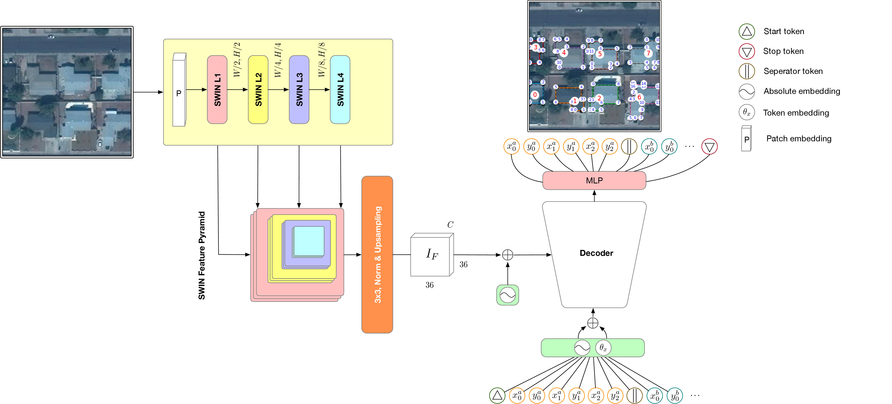

# ContextForge Compilation: GeoFormer

## Compilation Metadata

- Compilation Date: 2025-02-19T22:21:32.221142
- Total Files: 121
- Processed Files: 121
- Ignored Files: 0
- Compilation Time: 0.46 seconds
- Total Tokens: 80151

## File Contents

## File: .git/ORIG_HEAD

Location: `/home/adiba/Documents/upwork/omdena/hotosm_building/GeoFormer/.git/ORIG_HEAD`

```
a7eef2b0fd643b3e4f515a3b454fad3f478db7d8

```

## File: .git/HEAD

Location: `/home/adiba/Documents/upwork/omdena/hotosm_building/GeoFormer/.git/HEAD`

```
ref: refs/heads/main

```

## File: .git/FETCH_HEAD

Location: `/home/adiba/Documents/upwork/omdena/hotosm_building/GeoFormer/.git/FETCH_HEAD`

```
ac410a48248f4b3039782a1d111da2092fc26e20		branch 'main' of https://github.com/geogeek11/GeoFormer

```

## File: .git/index

Location: `/home/adiba/Documents/upwork/omdena/hotosm_building/GeoFormer/.git/index`

```
Binary file, content not displayed.
```

## File: .git/config

Location: `/home/adiba/Documents/upwork/omdena/hotosm_building/GeoFormer/.git/config`

```
[core]
	repositoryformatversion = 0
	filemode = true
	bare = false
	logallrefupdates = true
[remote "origin"]
	url = https://github.com/geogeek11/GeoFormer
	fetch = +refs/heads/*:refs/remotes/origin/*
[branch "main"]
	remote = origin
	merge = refs/heads/main
	vscode-merge-base = origin/main

```

## File: .git/packed-refs

Location: `/home/adiba/Documents/upwork/omdena/hotosm_building/GeoFormer/.git/packed-refs`

```
# pack-refs with: peeled fully-peeled sorted 
662beaa89aff45cd47a99454aae09df2c26d9d2e refs/remotes/origin/main

```

## File: .git/description

Location: `/home/adiba/Documents/upwork/omdena/hotosm_building/GeoFormer/.git/description`

```
Unnamed repository; edit this file 'description' to name the repository.

```

## File: .git/COMMIT_EDITMSG

Location: `/home/adiba/Documents/upwork/omdena/hotosm_building/GeoFormer/.git/COMMIT_EDITMSG`

```
fix geojson

```

## File: .git/info/exclude

Location: `/home/adiba/Documents/upwork/omdena/hotosm_building/GeoFormer/.git/info/exclude`

```
# git ls-files --others --exclude-from=.git/info/exclude
# Lines that start with '#' are comments.
# For a project mostly in C, the following would be a good set of
# exclude patterns (uncomment them if you want to use them):
# *.[oa]
# *~

```

## File: .git/logs/HEAD

Location: `/home/adiba/Documents/upwork/omdena/hotosm_building/GeoFormer/.git/logs/HEAD`

```
0000000000000000000000000000000000000000 662beaa89aff45cd47a99454aae09df2c26d9d2e abdelilah adiba <abdelilahadiba@gmail.com> 1739968010 +0100	clone: from https://github.com/geogeek11/GeoFormer
662beaa89aff45cd47a99454aae09df2c26d9d2e 5190098661c16259ad78dbd6a87768db9aa67144 abdelilah adiba <abdelilahadiba@gmail.com> 1739968637 +0100	commit: - add geojson dataset
5190098661c16259ad78dbd6a87768db9aa67144 5d19e8c3eb2c520fdfef31c5e33b033ac40b062f abdelilah adiba <abdelilahadiba@gmail.com> 1739980550 +0100	commit: - fix path
5d19e8c3eb2c520fdfef31c5e33b033ac40b062f b5f696099cd64d331cebb56b8d3018991cb752cd abdelilah adiba <abdelilahadiba@gmail.com> 1739980778 +0100	commit: - fix geojson dataloader
b5f696099cd64d331cebb56b8d3018991cb752cd f59132905404dadd1e147f4075ba51ea00b9b521 abdelilah adiba <abdelilahadiba@gmail.com> 1739980961 +0100	commit: - fix GeoJSONDataset
f59132905404dadd1e147f4075ba51ea00b9b521 ac410a48248f4b3039782a1d111da2092fc26e20 abdelilah adiba <abdelilahadiba@gmail.com> 1739995496 +0100	commit: update geojson dataloder
ac410a48248f4b3039782a1d111da2092fc26e20 a7eef2b0fd643b3e4f515a3b454fad3f478db7d8 abdelilah adiba <abdelilahadiba@gmail.com> 1739999549 +0100	commit: fix geojson

```

## File: .git/logs/refs/remotes/origin/HEAD

Location: `/home/adiba/Documents/upwork/omdena/hotosm_building/GeoFormer/.git/logs/refs/remotes/origin/HEAD`

```
0000000000000000000000000000000000000000 662beaa89aff45cd47a99454aae09df2c26d9d2e abdelilah adiba <abdelilahadiba@gmail.com> 1739968010 +0100	clone: from https://github.com/geogeek11/GeoFormer

```

## File: README.md

Location: `/home/adiba/Documents/upwork/omdena/hotosm_building/GeoFormer/README.md`

<h1>GeoFormer:  A Multi-Polygon Segmentation Transformer</h1>

<p>This is the official repository for the paper: <a href="https://arxiv.org/abs/2411.16616">GeoFormer: A Multi-Polygon Segmentation Transformer</a> presented at the <a href="https://bmvc2024.org/">British Machine Vision Conference 2024</a> in Glasgow.  </p>

<p>[[arxiv](https://arxiv.org/abs/2411.16616)][[paper](https://bmva-archive.org.uk/bmvc/2024/papers/Paper_217/paper.pdf)][<a href="https://bmva-archive.org.uk/bmvc/2024/papers/Paper_217/poster.pdf">poster</a>]  </p>

<p>GeoFormer is designed to predict the set of vertices that encapsulate buildings in an image, eliminating the need for additional post-processing by directly modeling the polygon vertices.</p>

<p></p>

<p>If you find this work useful, please consider citing our paper:
<code>
@article{khomiakov2024geoformer,
  title={GeoFormer: A Multi-Polygon Segmentation Transformer},
  author={Khomiakov, Maxim and Andersen, Michael Riis and Frellsen, Jes},
  journal={arXiv preprint arXiv:2411.16616},
  year={2024}
}
</code></p>

<h2>Getting setup</h2>

<p><em>Developed with Python 3.8.6</em></p>

<ol>
<li><code>pip install -r requirements.txt</code></li>
<li>We rely on <a href="https://wandb.ai/">Weights &amp; Biases</a> for logging purposes, ensure to <code>wandb login</code> prior running the training or inference scripts.</li>
</ol>

<h2>Training the model</h2>

<p>Download the <a href="https://www.aicrowd.com/challenges/mapping-challenge">AiCrowd Mapping Challenge</a> dataset, and extract to the folder <code>./data/aicrowd_mapping_challenge/&lt;train|val&gt;</code>. Alternatively modify the data paths found in <code>./config/dataset/aicrowd.yaml</code></p>

<p>Then simply run:
<code>python train.py</code></p>

<h2>Inference</h2>

<p>Adapt relevant arguments in <code>./config/inference.yaml</code> if necessary and run:</p>

<ol>
<li>To generate inference samples: <code>python inference.py meta.task='produce_inference_samples'</code></li>
<li>Compute COCO evals: <code>python inference.py meta.task='compute_metrics'</code></li>
</ol>

<h2>Pre-trained checkpoints</h2>

<p>The trained model checkpoint is available for download <a href="https://drive.google.com/drive/folders/1PGmvggZGDLfQvWtw39v4DeCoXB2ExR2U?usp=sharing">here</a>. </p>

<h2>Acknowledgements</h2>

<p>We would like to thank the authors of the influential prior work upon which this work is built, including: <a href="https://github.com/woodfrog/heat">HEAT: Holistic Edge Attention Transformer for Structured Reconstruction</a>, <a href="https://github.com/fidler-lab/polyrnn-pp">PolygonRNN++</a> as well as the frameworks of <a href="https://github.com/lucidrains/x-transformers">x-transformers</a> and <a href="https://github.com/huggingface/pytorch-image-models">pytorch image models</a>.</p>


## File: inference.py

Location: `/home/adiba/Documents/upwork/omdena/hotosm_building/GeoFormer/inference.py`

```python
import hydra
from omegaconf import DictConfig, OmegaConf
import time
import os
from uuid import uuid4
import torch
from torch.utils.data import DataLoader
from src.dataloader import common
from src.pipelines.inference import load_model_from_chkpt
import datetime
import logging
from src.utils import data_utils
from src.utils.utils import AggregatedPredictionWriterCallback, exists, load_pickle
from src.pipelines.inference import compute_map
from hydra.utils import get_original_cwd
import wandb
from torch import distributed as dist

from pytorch_lightning import Trainer
from pytorch_lightning.loggers import WandbLogger
from pytorch_lightning import seed_everything


@hydra.main(config_path="./config/", config_name="inference.yaml")
def main(cfg: DictConfig) -> None:

    ########################################################
    ########### Configuration initialization ###############
    ########################################################
    logger = logging.getLogger(__name__)
    logger.setLevel(logging.INFO)  

    console_handler = logging.StreamHandler()
    console_handler.setLevel(logging.INFO)

    formatter = logging.Formatter(
        "[%(asctime)s - %(name)s - %(levelname)s - %(message)s]"
    )
    console_handler.setFormatter(formatter)

    logger.addHandler(console_handler)

    print(OmegaConf.to_yaml(cfg))
    wconf = OmegaConf.to_container(cfg, resolve=[True | False])

    os.environ["WANDB_START_METHOD"] = "thread"

    wandb_logger = None

    # Check if distributed is available and get the rank
    is_distributed = (
        torch.distributed.is_available() and torch.distributed.is_initialized()
    )
    rank = dist.get_rank() if is_distributed else 0


    ########################################################
    ############## Dataset initialization ##################
    ########################################################

    seed_everything(cfg.meta.seed)

    root_path = get_original_cwd()

    os.environ["WANDB_DIR"] = "./wandb/"

    collate_fn = data_utils.collate_fn_multipolygon

    ########################################################
    ######### Task to perform (training/test) ##############
    ########################################################

    if rank == 0:
        unq_str = str(uuid4())[:8]

        mod = [x for x in cfg.model.keys()][0]
        run_name = (
            next(iter(cfg.dataset))
            + "-"
            + unq_str
            + "-"
            + mod
            + "-"
            + cfg.meta.appendix
        )

        # Create a new directory with the name of the run
        outckpt_dir = f"./ckpts/{cfg.meta.chkpt_local_path_name}"
        if not os.path.exists(outckpt_dir):
            os.mkdir(outckpt_dir)

    if not exists(wandb_logger):

        # Only initialize WandbLogger on rank 0
        if rank == 0:
            wandb.init(
                project="BMVC-2024",
                name=run_name,
                group="INFERENCE-METRICS",
                job_type=cfg.meta.task,
                config=wconf,
                reinit=True,
            )

            wandb_logger = WandbLogger(
                log_model=False,
                project="BMVC-2024",
                name=run_name,
                group="INFERENCE-METRICS",
                job_type=cfg.meta.task,
                config=wconf,
                reinit=True,
            )

    logger.info(f"LOADING MODEL FROM CHECKPOINT {cfg.meta.chkpt_local_path_name}")
    if cfg.meta.task == "produce_inference_samples":
        plyformer, model_config = load_model_from_chkpt(
            out_ckpt_dir="./ckpts/",
            model_id=cfg.meta.chkpt_local_path_name,
            use_latest=cfg.meta.chkpt_use_latest,
            cfg=cfg if cfg.meta.use_untrained_config else None,
        )
        cfg.model = model_config.model
        plyformer.greedy = cfg.meta.inf_type

    logger.info(f"INFERENCE TYPE: {cfg.meta.inf_type}")

    ext_embedings = cfg.model.transformer_xformer.get("custom_embeddings_params").get(
        "type_of_embeddings"
    )

    if "global" in ext_embedings and cfg.model.transformer_xformer.get(
        "custom_embeddings"
    ):
        global_context = True
    else:
        global_context = False

    _, _, test_dataset = common.dataset_loader(cfg, module_root_path=root_path)

    test_dataset = DataLoader(
        test_dataset,
        batch_size=cfg.meta.valid_batch_size,
        collate_fn=collate_fn,
        shuffle=False,
        drop_last=False,  
        pin_memory=True,
        num_workers=int(cfg.meta.num_workers),
    )

    ## Defining writer callback
    ds_name = next(iter(cfg.dataset))
    inf_samples = (
        cfg.meta.max_num_inf_samples
        if cfg.meta.max_num_inf_samples
        else len(test_dataset)
    )
    predictions_save_path = f"{outckpt_dir}/{cfg.meta.chkpt_local_path_name}_{ds_name}_{inf_samples}_{cfg.meta.inf_type}_{cfg.meta.seed}_inference_samples.pkl"

    prediction_writer = AggregatedPredictionWriterCallback(
        save_path=predictions_save_path
    )

    # Initialize the trainer
    trainer = Trainer(
        devices=cfg.meta.num_gpus,
        logger=wandb_logger,
        precision=cfg.meta.precision,
        limit_predict_batches=cfg.meta.max_num_inf_samples,
        callbacks=[prediction_writer],
    )

    single_batch = next(iter(test_dataset))

    if not cfg.meta.max_num_inf_samples:
        cfg.meta.max_num_inf_samples = len(test_dataset)

    if cfg.meta.task == "produce_inference_samples":

        logger.info(
            f"\n Computing inference for {cfg.meta.max_num_inf_samples} batches \n"
        )

        t0 = time.time()

        plyformer.greedy = cfg.meta.inf_type == "greedy"
        ## Running the inference
        _ = trainer.predict(
            model=plyformer,
            dataloaders=test_dataset,
        )
        logger.info(f"Inference completed in {time.time()-t0} seconds")

    elif cfg.meta.task == "compute_metrics":
        logger.info("COMPUTING MAP SCORES")

        t0 = time.time()
        provided_save_path = cfg.meta.get("provided_save_path", False)
        if not provided_save_path:
            preds_array = load_pickle(predictions_save_path)
        else:
            logger.info(f"Loading provided predictions from {provided_save_path}")
            preds_array = load_pickle(cfg.meta.provided_save_path)

        metrics_computed = compute_map(
            preds_array,
            image_size=single_batch["image"].shape[-1],
            compute_by_object=True,
            device="cuda" if torch.cuda.is_available() else "cpu",
        )

        metrics_computed["model"] = run_name  # cfg.meta.chkpt_local_path_name
        metrics_computed["dataset"] = next(iter(cfg.dataset))
        metrics_computed["inference_type"] = cfg.meta.inf_type
        metrics_computed["time_taken"] = time.time() - t0
        metrics_computed["num_samples"] = len(
            _
        )  # cfg.meta.max_num_inf_samples if cfg.meta.max_num_inf_samples else len(test_dataset)
        metrics_computed["timestamp"] = datetime.datetime.now().strftime(
            "%Y-%m-%d %H:%M:%S"
        )

        # Convert the DataFrame to a wandb Table
        table = wandb.Table(dataframe=metrics_computed)

        # Log the table
        wandb.log({"metrics": table})

        for i in range(cfg.meta.num_visual_inference_samples):
            pass  # Not implemented yet

        wandb.finish()


if __name__ == "__main__":
    main()

```

## File: .git/logs/refs/remotes/origin/main

Location: `/home/adiba/Documents/upwork/omdena/hotosm_building/GeoFormer/.git/logs/refs/remotes/origin/main`

```
662beaa89aff45cd47a99454aae09df2c26d9d2e 5190098661c16259ad78dbd6a87768db9aa67144 abdelilah adiba <abdelilahadiba@gmail.com> 1739968643 +0100	update by push
5190098661c16259ad78dbd6a87768db9aa67144 5d19e8c3eb2c520fdfef31c5e33b033ac40b062f abdelilah adiba <abdelilahadiba@gmail.com> 1739980560 +0100	update by push
5d19e8c3eb2c520fdfef31c5e33b033ac40b062f b5f696099cd64d331cebb56b8d3018991cb752cd abdelilah adiba <abdelilahadiba@gmail.com> 1739980823 +0100	update by push
b5f696099cd64d331cebb56b8d3018991cb752cd f59132905404dadd1e147f4075ba51ea00b9b521 abdelilah adiba <abdelilahadiba@gmail.com> 1739980964 +0100	update by push
f59132905404dadd1e147f4075ba51ea00b9b521 ac410a48248f4b3039782a1d111da2092fc26e20 abdelilah adiba <abdelilahadiba@gmail.com> 1739995500 +0100	update by push
ac410a48248f4b3039782a1d111da2092fc26e20 a7eef2b0fd643b3e4f515a3b454fad3f478db7d8 abdelilah adiba <abdelilahadiba@gmail.com> 1739999554 +0100	update by push

```

## File: .git/logs/refs/heads/main

Location: `/home/adiba/Documents/upwork/omdena/hotosm_building/GeoFormer/.git/logs/refs/heads/main`

```
0000000000000000000000000000000000000000 662beaa89aff45cd47a99454aae09df2c26d9d2e abdelilah adiba <abdelilahadiba@gmail.com> 1739968010 +0100	clone: from https://github.com/geogeek11/GeoFormer
662beaa89aff45cd47a99454aae09df2c26d9d2e 5190098661c16259ad78dbd6a87768db9aa67144 abdelilah adiba <abdelilahadiba@gmail.com> 1739968637 +0100	commit: - add geojson dataset
5190098661c16259ad78dbd6a87768db9aa67144 5d19e8c3eb2c520fdfef31c5e33b033ac40b062f abdelilah adiba <abdelilahadiba@gmail.com> 1739980550 +0100	commit: - fix path
5d19e8c3eb2c520fdfef31c5e33b033ac40b062f b5f696099cd64d331cebb56b8d3018991cb752cd abdelilah adiba <abdelilahadiba@gmail.com> 1739980778 +0100	commit: - fix geojson dataloader
b5f696099cd64d331cebb56b8d3018991cb752cd f59132905404dadd1e147f4075ba51ea00b9b521 abdelilah adiba <abdelilahadiba@gmail.com> 1739980961 +0100	commit: - fix GeoJSONDataset
f59132905404dadd1e147f4075ba51ea00b9b521 ac410a48248f4b3039782a1d111da2092fc26e20 abdelilah adiba <abdelilahadiba@gmail.com> 1739995496 +0100	commit: update geojson dataloder
ac410a48248f4b3039782a1d111da2092fc26e20 a7eef2b0fd643b3e4f515a3b454fad3f478db7d8 abdelilah adiba <abdelilahadiba@gmail.com> 1739999549 +0100	commit: fix geojson

```

## File: requirements.txt

Location: `/home/adiba/Documents/upwork/omdena/hotosm_building/GeoFormer/requirements.txt`

```
absl-py==2.0.0
affine==2.4.0
aiohttp==3.8.6
aiosignal==1.3.1
albumentations==1.3.1
antlr4-python3-runtime==4.9.3
appdirs==1.4.4
asttokens==2.4.1
async-timeout==4.0.3
attrs==23.1.0
backcall==0.2.0
blessed==1.20.0
cachetools==5.3.2
certifi==2023.7.22
charset-normalizer==3.3.2
clearml==1.13.1
click-plugins==1.1.1
click==8.1.7
cligj==0.7.2
contourpy==1.1.1
cycler==0.12.1
decorator==5.1.1
deformable-attention==0.0.18
descartes==1.1.0
dill==0.3.7
docker-pycreds==0.4.0
einops==0.7.0
executing==2.0.1
filelock==3.13.1
fonttools==4.44.0
frozenlist==1.4.0
fsspec==2023.10.0
furl==2.1.3
gitdb==4.0.11
gitpython==3.1.40
google-auth-oauthlib==1.0.0
google-auth==2.23.4
gpustat==1.1.1
grpcio==1.59.2
huggingface-hub==0.18.0
hydra-core==1.3.2
hydra-joblib-launcher==1.2.0
idna==3.4
imageio==2.32.0
importlib-metadata==6.8.0
importlib-resources==6.1.1
ipython==8.12.3
jedi==0.19.1
jinja2==3.1.2
joblib==1.3.2
jsmin==3.0.1
jsonschema-specifications==2023.7.1
jsonschema==4.19.2
kiwisolver==1.4.5
kornia==0.7.0
lazy-loader==0.3
lightning-utilities==0.9.0
markdown==3.5.1
markupsafe==2.1.3
matplotlib-inline==0.1.6
matplotlib==3.7.3
mpmath==1.3.0
multidict==6.0.4
multiprocess==0.70.15
munch==4.0.0
networkx==3.1
numpy==1.24.4
nvidia-cublas-cu12==12.1.3.1
nvidia-cuda-cupti-cu12==12.1.105
nvidia-cuda-nvrtc-cu12==12.1.105
nvidia-cuda-runtime-cu12==12.1.105
nvidia-cudnn-cu12==8.9.2.26
nvidia-cufft-cu12==11.0.2.54
nvidia-curand-cu12==10.3.2.106
nvidia-cusolver-cu12==11.4.5.107
nvidia-cusparse-cu12==12.1.0.106
nvidia-ml-py==12.535.133
nvidia-nccl-cu12==2.18.1
nvidia-nvjitlink-cu12==12.3.52
nvidia-nvtx-cu12==12.1.105
oauthlib==3.2.2
omegaconf==2.3.0
opencv-python-headless==4.8.1.78
orderedmultidict==1.0.1
packaging==23.2
pandas==2.0.3
parso==0.8.3
pathlib2==2.3.7.post1
pathtools==0.1.2
pexpect==4.8.0
pickleshare==0.7.5
pillow==10.0.1
pip==23.3.2
pkgutil-resolve-name==1.3.10
prompt-toolkit==3.0.40
protobuf==4.25.0
psutil==5.9.6
ptyprocess==0.7.0
pure-eval==0.2.2
pyasn1-modules==0.3.0
pyasn1==0.5.0
pycocotools==2.0.7
pygments==2.16.1
pyjwt==2.4.0
pyparsing==3.1.1
python-dateutil==2.8.2
pytorch-lightning==2.1.3
pytz==2023.3.post1
pywavelets==1.4.1
pyyaml==6.0.1
qudida==0.0.4
rasterio==1.3.9
referencing==0.30.2
requests-oauthlib==1.3.1
requests==2.31.0
rpds-py==0.12.0
rsa==4.9
safetensors==0.4.0
scikit-image==0.21.0
scikit-learn==1.3.2
scipy==1.10.1
sentry-sdk==1.34.0
setproctitle==1.3.3
setuptools==67.7.2
shapely==2.0.2
six==1.16.0
smmap==5.0.1
snuggs==1.4.7
stack-data==0.6.3
sympy==1.12
tensorboard-data-server==0.7.2
tensorboard==2.14.0
threadpoolctl==3.2.0
tifffile==2023.7.10
timm==0.9.10
torch==2.1.0
torchaudio==2.1.0
torchmetrics==1.2.0
torchvision==0.16.0
tqdm==4.66.1
traitlets==5.13.0
triton==2.1.0
typing-extensions==4.8.0
tzdata==2023.3
urllib3==1.26.18
wandb==0.16.2
wcwidth==0.2.9
werkzeug==3.0.1
wheel==0.40.0
x-transformers==1.24.5
yarl==1.9.2
zipp==3.17.0

```

## File: .git/hooks/pre-merge-commit.sample

Location: `/home/adiba/Documents/upwork/omdena/hotosm_building/GeoFormer/.git/hooks/pre-merge-commit.sample`

```
#!/bin/sh
#
# An example hook script to verify what is about to be committed.
# Called by "git merge" with no arguments.  The hook should
# exit with non-zero status after issuing an appropriate message to
# stderr if it wants to stop the merge commit.
#
# To enable this hook, rename this file to "pre-merge-commit".

. git-sh-setup
test -x "$GIT_DIR/hooks/pre-commit" &&
        exec "$GIT_DIR/hooks/pre-commit"
:

```

## File: .git/hooks/update.sample

Location: `/home/adiba/Documents/upwork/omdena/hotosm_building/GeoFormer/.git/hooks/update.sample`

```
#!/bin/sh
#
# An example hook script to block unannotated tags from entering.
# Called by "git receive-pack" with arguments: refname sha1-old sha1-new
#
# To enable this hook, rename this file to "update".
#
# Config
# ------
# hooks.allowunannotated
#   This boolean sets whether unannotated tags will be allowed into the
#   repository.  By default they won't be.
# hooks.allowdeletetag
#   This boolean sets whether deleting tags will be allowed in the
#   repository.  By default they won't be.
# hooks.allowmodifytag
#   This boolean sets whether a tag may be modified after creation. By default
#   it won't be.
# hooks.allowdeletebranch
#   This boolean sets whether deleting branches will be allowed in the
#   repository.  By default they won't be.
# hooks.denycreatebranch
#   This boolean sets whether remotely creating branches will be denied
#   in the repository.  By default this is allowed.
#

# --- Command line
refname="$1"
oldrev="$2"
newrev="$3"

# --- Safety check
if [ -z "$GIT_DIR" ]; then
	echo "Don't run this script from the command line." >&2
	echo " (if you want, you could supply GIT_DIR then run" >&2
	echo "  $0 <ref> <oldrev> <newrev>)" >&2
	exit 1
fi

if [ -z "$refname" -o -z "$oldrev" -o -z "$newrev" ]; then
	echo "usage: $0 <ref> <oldrev> <newrev>" >&2
	exit 1
fi

# --- Config
allowunannotated=$(git config --type=bool hooks.allowunannotated)
allowdeletebranch=$(git config --type=bool hooks.allowdeletebranch)
denycreatebranch=$(git config --type=bool hooks.denycreatebranch)
allowdeletetag=$(git config --type=bool hooks.allowdeletetag)
allowmodifytag=$(git config --type=bool hooks.allowmodifytag)

# check for no description
projectdesc=$(sed -e '1q' "$GIT_DIR/description")
case "$projectdesc" in
"Unnamed repository"* | "")
	echo "*** Project description file hasn't been set" >&2
	exit 1
	;;
esac

# --- Check types
# if $newrev is 0000...0000, it's a commit to delete a ref.
zero=$(git hash-object --stdin </dev/null | tr '[0-9a-f]' '0')
if [ "$newrev" = "$zero" ]; then
	newrev_type=delete
else
	newrev_type=$(git cat-file -t $newrev)
fi

case "$refname","$newrev_type" in
	refs/tags/*,commit)
		# un-annotated tag
		short_refname=${refname##refs/tags/}
		if [ "$allowunannotated" != "true" ]; then
			echo "*** The un-annotated tag, $short_refname, is not allowed in this repository" >&2
			echo "*** Use 'git tag [ -a | -s ]' for tags you want to propagate." >&2
			exit 1
		fi
		;;
	refs/tags/*,delete)
		# delete tag
		if [ "$allowdeletetag" != "true" ]; then
			echo "*** Deleting a tag is not allowed in this repository" >&2
			exit 1
		fi
		;;
	refs/tags/*,tag)
		# annotated tag
		if [ "$allowmodifytag" != "true" ] && git rev-parse $refname > /dev/null 2>&1
		then
			echo "*** Tag '$refname' already exists." >&2
			echo "*** Modifying a tag is not allowed in this repository." >&2
			exit 1
		fi
		;;
	refs/heads/*,commit)
		# branch
		if [ "$oldrev" = "$zero" -a "$denycreatebranch" = "true" ]; then
			echo "*** Creating a branch is not allowed in this repository" >&2
			exit 1
		fi
		;;
	refs/heads/*,delete)
		# delete branch
		if [ "$allowdeletebranch" != "true" ]; then
			echo "*** Deleting a branch is not allowed in this repository" >&2
			exit 1
		fi
		;;
	refs/remotes/*,commit)
		# tracking branch
		;;
	refs/remotes/*,delete)
		# delete tracking branch
		if [ "$allowdeletebranch" != "true" ]; then
			echo "*** Deleting a tracking branch is not allowed in this repository" >&2
			exit 1
		fi
		;;
	*)
		# Anything else (is there anything else?)
		echo "*** Update hook: unknown type of update to ref $refname of type $newrev_type" >&2
		exit 1
		;;
esac

# --- Finished
exit 0

```

## File: train.py

Location: `/home/adiba/Documents/upwork/omdena/hotosm_building/GeoFormer/train.py`

```python
import hydra
from omegaconf import DictConfig, OmegaConf
import time
import os
from uuid import uuid4
import torch

torch.backends.cudnn.deterministic = False
torch.backends.cudnn.benchmark = True

from torch.utils.data import DataLoader

from src.dataloader import common
from src.utils import data_utils
from src.utils.utils import exists, load_pickle, AggregatedPredictionWriterCallback
from src.models.pl_modules import InferencePredictionsLoggerXFormer
from src.pipelines import initializer
from src.models.xtransformer import XTransformerTrainer
from src.pipelines.inference import compute_map,load_model_from_chkpt

import logging
from hydra.utils import get_original_cwd

import wandb
import torch
from torch import distributed as dist

from pytorch_lightning import Trainer
from pytorch_lightning.loggers import WandbLogger
from pytorch_lightning.callbacks import ModelCheckpoint, EarlyStopping
import datetime
from pytorch_lightning import seed_everything

import torch


@hydra.main(config_path="./config/", config_name="geoformer_meta.yaml")
def main(cfg: DictConfig) -> None:
    ########################################################
    ############## Logging initialization ##################
    ########################################################

    logger = logging.getLogger(__name__)
    logger.setLevel(logging.INFO)  # Set the logging level to INFO
    # Create a console handler and set its level to INFO
    console_handler = logging.StreamHandler()
    console_handler.setLevel(logging.INFO)

    # Create a formatter and add it to the handler
    formatter = logging.Formatter(
        "%(asctime)s - %(name)s - %(levelname)s - %(message)s"
    )
    console_handler.setFormatter(formatter)

    # Add the handler to the logger
    logger.addHandler(console_handler)

    ########################################################
    ########### Configuration initialization ###############
    ########################################################

    print(OmegaConf.to_yaml(cfg))
    wconf = OmegaConf.to_container(cfg, resolve=[True | False])

    os.environ["WANDB_START_METHOD"] = "thread"

    wandb_logger = None

    # Check if distributed is available and get the rank
    is_distributed = (
        torch.distributed.is_available() and torch.distributed.is_initialized()
    )
    rank = dist.get_rank() if is_distributed else 0

    ########################################################
    ############## Dataset initialization ##################
    ########################################################

    seed_everything(cfg.meta.seed)

    root_path = get_original_cwd()
    os.environ["WANDB_DIR"] = "./wandb/"

    ds, valid_ds, _ = common.dataset_loader(cfg, module_root_path=root_path)

    collate_fn = data_utils.collate_fn_multipolygon

    if cfg.meta.subset_training:
        ds = common.get_subset_dataset(ds, num_samples=cfg.meta.num_examples_in_subset)
        valid_ds = common.get_subset_dataset(valid_ds, num_samples=1000)

    # Random shuffle the dataset
    ds_key = next(iter(cfg.dataset))
    random_shuffle_dataset = cfg.dataset.get(ds_key).get("random_shuffle", False)
    random_cycle_dataset = cfg.dataset.get(ds_key).get("cycle_start_token", False)

    if not cfg.meta.task == "inference":
        logger.info(
            f"SHUFFING DATASET: {random_shuffle_dataset}, CYCLE START TOKEN: {random_cycle_dataset}"
        )

        ds = DataLoader(
            ds,
            batch_size=cfg.meta.batch_size,
            collate_fn=lambda x: (
                collate_fn(
                    x,
                    random_shuffle=random_shuffle_dataset,
                    cycle_start_token=random_cycle_dataset,
                    max_seq_len=cfg.model.transformer_xformer.decoder.get(
                        "max_seq_len", None),
                )
            ),
            shuffle=True,
            drop_last=False,
            pin_memory=True,
            num_workers=cfg.meta.num_workers,
        )

        valid_ds = DataLoader(
            valid_ds,
            batch_size=cfg.meta.valid_batch_size,
            collate_fn=lambda x: (
                collate_fn(
                    x,
                    max_seq_len=cfg.model.transformer_xformer.decoder.get(
                        "max_seq_len", None))),
            shuffle=False,
            drop_last=False,
            pin_memory=True,
            num_workers=int(cfg.meta.num_workers // 2),
        )

        train_batch = next(iter(ds))
        val_batch = next(iter(valid_ds))

    ########################################################
    ############## Model initialization ####################
    ########################################################

    encoder, decoder = initializer.get_model(cfg)

    ext_embedings = cfg.model.transformer_xformer.get("custom_embeddings_params").get(
        "type_of_embeddings"
    )

    if "global" in ext_embedings and cfg.model.transformer_xformer.get(
        "custom_embeddings", False
    ):
        print(f"Using global context embeddings: {ext_embedings} \n")
    if "global" in ext_embedings and cfg.model.transformer_xformer.get(
        "custom_embeddings"
    ):
        global_context = True
    else:
        global_context = False

    plyformer = XTransformerTrainer(
        encoder=encoder,
        decoder=decoder,
        lr=cfg.meta.learning_rate,
        warmup_steps=cfg.meta.warmup_steps,
        encoder_backbone=cfg.model.transformer_xformer.backbone,
        global_context=global_context,
        normalize_images=cfg.model.transformer_xformer.get("normalize_images", False),
    )

    ########################################################
    ######### Task to perform (training/test) ##############
    ########################################################

    unq_str = str(uuid4())[:8]

    mod = [x for x in cfg.model.keys()][0]
    dataset_name = next(iter(cfg.dataset))
    run_name = (
        unq_str
        + "-"
        + str(dataset_name)
        + "-"
        + mod
        + "-"
        + cfg.model.get(mod).backbone
        + "-"
        + str(cfg.model.get(mod).swin_params.output_hidden_dims)
        + "-"
        + "pyramid_"
        + str(cfg.model.get(mod).swin_params.pyramidal_ft_maps)
        + "-"
        + "spatial_"
        + str(cfg.model.get(mod).decoder.custom_spatial_abs_embedding)
        + "-"
        + "num_layers_"
        + str(cfg.model.get(mod).dec_attnlayers.depth)
        + "-"
        + "num_heads_"
        + str(cfg.model.get(mod).dec_attnlayers.heads)
        + "-"
        + "alibi_heads_"
        + str(cfg.model.get(mod).dec_attnlayers.alibi_num_heads)
        + "-"
        + "rope_"
        + str(cfg.model.get(mod).dec_attnlayers.rotary_pos_emb)
        + "-"
        + "mask_"
        + str(cfg.model.get(mod).misc_params.mask_prob)
        + "-"
        + str(cfg.meta.appendix)
    )

    outckpt_dir = f"./ckpts/{run_name}"
    os.mkdir(outckpt_dir)

    # save config for future reference
    with open(f"{outckpt_dir}/{run_name}.yaml", "w") as f:
        f.write(OmegaConf.to_yaml(cfg))

    if "train" in cfg.meta.task:
        early_stop_callback = EarlyStopping(
            monitor="val_loss",
            patience=cfg.meta.patience,
        )

        checkpoint_callback = ModelCheckpoint(
            monitor="val_loss",
            save_top_k=5,
            save_last=True,
            save_weights_only=False,
            verbose=True,
            mode="min",
            every_n_epochs=1,
            dirpath=outckpt_dir,
            filename="{epoch}-{val_loss:.4f}",
        )

        # Only initialize WandbLogger on rank 0
        if rank == 0:
            wandb_logger = WandbLogger(
                log_model=True,
                project="BMVC-2024",
                name=run_name,
                group=cfg.meta.group,
                job_type=cfg.meta.job_type,
                config=wconf,
                reinit=True,
            )
            wandb_logger.watch(plyformer)
        else:
            wandb_logger = None

        grad_clip = cfg.meta.grad_clipping_val

        trainer = Trainer(
            max_epochs=cfg.meta.num_epochs,
            devices=cfg.meta.num_gpus,
            check_val_every_n_epoch=cfg.meta.check_val_n_epochs,
            strategy=cfg.meta.distributed_backend,
            enable_checkpointing=checkpoint_callback,
            callbacks=[
                early_stop_callback,
                InferencePredictionsLoggerXFormer(
                    val_batch=val_batch,
                    train_batch=train_batch,
                    greedy=cfg.meta.inf_type,
                    external_embeddings=cfg.model.transformer_xformer.get(
                        "custom_embeddings"
                    ),
                    multi_object_visuals=True,
                    multi_object_embeddings=global_context,
                    stop_token=3,
                    max_seq_len=cfg.model.transformer_xformer.decoder.get(
                        "max_seq_len", 100
                    ),
                    num_obj_embeds=cfg.model.transformer_xformer.get(
                        "custom_embeddings_params"
                    ).get("num_obj_embeds", 0),
                ),
                checkpoint_callback,
            ],
            logger=wandb_logger,
            gradient_clip_val=grad_clip,
            gradient_clip_algorithm="norm",
            precision=cfg.meta.precision,
            max_steps=cfg.meta.get("max_steps", -1),
        )

        
        if cfg.meta.restore_from_checkpoint:
            plyformer, model_config = load_model_from_chkpt(
                out_ckpt_dir="./ckpts/",
                model_id=cfg.meta.chkpt_local_path_name,
                use_latest=cfg.meta.chkpt_use_latest,
                cfg=cfg if cfg.meta.use_untrained_config else None,
            )
            cfg.model = model_config.model
            plyformer.greedy = cfg.meta.inf_type

            trainer.fit(plyformer, ds, valid_ds)
        else:
            trainer.fit(plyformer, ds, valid_ds)

        run_name = run_name

        
        trainer.save_checkpoint(f"{outckpt_dir}/{run_name}.ckpt")

        if "test" not in cfg.meta.task:
            wandb.finish()

        #####################################################
        ## Commands from "Improving Hydra+DDP support #11617"
        if dist.is_initialized():
            dist.destroy_process_group()

        envs = (
            "LOCAL_RANK",
            "NODE_RANK",
            "WORLD_SIZE",
            "MASTER_ADDR",
            "MASTER_PORT",
            "PL_GLOBAL_SEED",
            "PL_SEED_WORKERS",
        )

        for name in envs:
            os.environ.pop(name, None)

    if "test" in cfg.meta.task:
        logger.info(
            f"PROCEEDING WITH INFERENCE ON TEST SET {cfg.meta.chkpt_local_path_name}"
        )

        if not exists(wandb_logger):
            # Only initialize WandbLogger on rank 0
            if rank == 0:
                wandb.init(
                    project="BMVC-2024",
                    name=run_name,
                    group="INFERENCE-METRICS",
                    job_type=cfg.meta.task,
                    config=wconf,
                    reinit=True,
                )

                wandb_logger = WandbLogger(
                    log_model=False,
                    project="BMVC-2024",
                    name=run_name,
                    group="INFERENCE-METRICS",
                    job_type=cfg.meta.task,
                    config=wconf,
                    reinit=True,
                )

        logger.info(f"INFERENCE TYPE: {cfg.meta.inf_type}")

        _, _, test_dataset = common.dataset_loader(cfg, module_root_path=root_path)

        test_dataset = DataLoader(
            test_dataset,
            batch_size=cfg.meta.valid_batch_size,
            collate_fn=collate_fn,
            shuffle=False,
            drop_last=False,
            pin_memory=True,
            num_workers=int(cfg.meta.num_workers),
        )

        inf_samples = (
            cfg.meta.max_num_inf_samples
            if cfg.meta.max_num_inf_samples
            else len(test_dataset)
        )
        predictions_save_path = f"{outckpt_dir}/{run_name}_{inf_samples}_{cfg.meta.inf_type}_{cfg.meta.seed}_inference_samples.pkl"

        prediction_writer = AggregatedPredictionWriterCallback(
            save_path=predictions_save_path
        )

        # Initialize the trainer
        trainer = Trainer(
            devices=cfg.meta.num_gpus,
            logger=wandb_logger,
            precision=cfg.meta.precision,
            limit_predict_batches=cfg.meta.max_num_inf_samples,
            callbacks=[prediction_writer],
        )

        single_batch = next(iter(test_dataset))

        if not cfg.meta.max_num_inf_samples:
            cfg.meta.max_num_inf_samples = len(test_dataset)

        logger.info(
            f"\n Computing inference for {cfg.meta.max_num_inf_samples} batches \n"
        )

        t0 = time.time()

        ## Running the inference
        _ = trainer.predict(
            model=plyformer,
            dataloaders=test_dataset,
        )
        logger.info(f"Inference completed in {time.time()-t0} seconds")
        logger.info(f"Predictions saved at: {predictions_save_path}")

        if "inference" in cfg.meta.task:
            logger.info("COMPUTING MAP SCORES")

            preds_array = load_pickle(predictions_save_path)

            metrics_computed = compute_map(
                preds_array,
                image_size=single_batch["image"].shape[-1],
                compute_by_object=True,
                device="cuda" if torch.cuda.is_available() else "cpu",
            )

            metrics_computed["model"] = run_name  # cfg.meta.chkpt_local_path_name
            metrics_computed["dataset"] = next(iter(cfg.dataset))
            metrics_computed["inference_type"] = cfg.meta.inf_type
            metrics_computed["time_taken"] = time.time() - t0
            metrics_computed["time_stamp"] = datetime.datetime.now().strftime(
                "%Y-%m-%d %H:%M:%S"
            )
            metrics_computed["num_samples"] = len(
                _
            )  

            table = wandb.Table(dataframe=metrics_computed)
            
            wandb.log({"metrics": table})
            
            metrics_computed.to_csv(
                f"{outckpt_dir}/{run_name}_{inf_samples}_{cfg.meta.inf_type}_{cfg.meta.seed}_metrics.csv"
            )

            for i in range(cfg.meta.get("num_visual_inference_samples", 0)):
                pass  # Not implemented

        wandb.finish()


if __name__ == "__main__":
    main()

```

## File: .git/hooks/pre-commit.sample

Location: `/home/adiba/Documents/upwork/omdena/hotosm_building/GeoFormer/.git/hooks/pre-commit.sample`

```
#!/bin/sh
#
# An example hook script to verify what is about to be committed.
# Called by "git commit" with no arguments.  The hook should
# exit with non-zero status after issuing an appropriate message if
# it wants to stop the commit.
#
# To enable this hook, rename this file to "pre-commit".

if git rev-parse --verify HEAD >/dev/null 2>&1
then
	against=HEAD
else
	# Initial commit: diff against an empty tree object
	against=$(git hash-object -t tree /dev/null)
fi

# If you want to allow non-ASCII filenames set this variable to true.
allownonascii=$(git config --type=bool hooks.allownonascii)

# Redirect output to stderr.
exec 1>&2

# Cross platform projects tend to avoid non-ASCII filenames; prevent
# them from being added to the repository. We exploit the fact that the
# printable range starts at the space character and ends with tilde.
if [ "$allownonascii" != "true" ] &&
	# Note that the use of brackets around a tr range is ok here, (it's
	# even required, for portability to Solaris 10's /usr/bin/tr), since
	# the square bracket bytes happen to fall in the designated range.
	test $(git diff --cached --name-only --diff-filter=A -z $against |
	  LC_ALL=C tr -d '[ -~]\0' | wc -c) != 0
then
	cat <<\EOF
Error: Attempt to add a non-ASCII file name.

This can cause problems if you want to work with people on other platforms.

To be portable it is advisable to rename the file.

If you know what you are doing you can disable this check using:

  git config hooks.allownonascii true
EOF
	exit 1
fi

# If there are whitespace errors, print the offending file names and fail.
exec git diff-index --check --cached $against --

```

## File: LICENSE

Location: `/home/adiba/Documents/upwork/omdena/hotosm_building/GeoFormer/LICENSE`

```
                    GNU AFFERO GENERAL PUBLIC LICENSE
                       Version 3, 19 November 2007

 Copyright (C) 2007 Free Software Foundation, Inc. <https://fsf.org/>
 Everyone is permitted to copy and distribute verbatim copies
 of this license document, but changing it is not allowed.

                            Preamble

  The GNU Affero General Public License is a free, copyleft license for
software and other kinds of works, specifically designed to ensure
cooperation with the community in the case of network server software.

  The licenses for most software and other practical works are designed
to take away your freedom to share and change the works.  By contrast,
our General Public Licenses are intended to guarantee your freedom to
share and change all versions of a program--to make sure it remains free
software for all its users.

  When we speak of free software, we are referring to freedom, not
price.  Our General Public Licenses are designed to make sure that you
have the freedom to distribute copies of free software (and charge for
them if you wish), that you receive source code or can get it if you
want it, that you can change the software or use pieces of it in new
free programs, and that you know you can do these things.

  Developers that use our General Public Licenses protect your rights
with two steps: (1) assert copyright on the software, and (2) offer
you this License which gives you legal permission to copy, distribute
and/or modify the software.

  A secondary benefit of defending all users' freedom is that
improvements made in alternate versions of the program, if they
receive widespread use, become available for other developers to
incorporate.  Many developers of free software are heartened and
encouraged by the resulting cooperation.  However, in the case of
software used on network servers, this result may fail to come about.
The GNU General Public License permits making a modified version and
letting the public access it on a server without ever releasing its
source code to the public.

  The GNU Affero General Public License is designed specifically to
ensure that, in such cases, the modified source code becomes available
to the community.  It requires the operator of a network server to
provide the source code of the modified version running there to the
users of that server.  Therefore, public use of a modified version, on
a publicly accessible server, gives the public access to the source
code of the modified version.

  An older license, called the Affero General Public License and
published by Affero, was designed to accomplish similar goals.  This is
a different license, not a version of the Affero GPL, but Affero has
released a new version of the Affero GPL which permits relicensing under
this license.

  The precise terms and conditions for copying, distribution and
modification follow.

                       TERMS AND CONDITIONS

  0. Definitions.

  "This License" refers to version 3 of the GNU Affero General Public License.

  "Copyright" also means copyright-like laws that apply to other kinds of
works, such as semiconductor masks.

  "The Program" refers to any copyrightable work licensed under this
License.  Each licensee is addressed as "you".  "Licensees" and
"recipients" may be individuals or organizations.

  To "modify" a work means to copy from or adapt all or part of the work
in a fashion requiring copyright permission, other than the making of an
exact copy.  The resulting work is called a "modified version" of the
earlier work or a work "based on" the earlier work.

  A "covered work" means either the unmodified Program or a work based
on the Program.

  To "propagate" a work means to do anything with it that, without
permission, would make you directly or secondarily liable for
infringement under applicable copyright law, except executing it on a
computer or modifying a private copy.  Propagation includes copying,
distribution (with or without modification), making available to the
public, and in some countries other activities as well.

  To "convey" a work means any kind of propagation that enables other
parties to make or receive copies.  Mere interaction with a user through
a computer network, with no transfer of a copy, is not conveying.

  An interactive user interface displays "Appropriate Legal Notices"
to the extent that it includes a convenient and prominently visible
feature that (1) displays an appropriate copyright notice, and (2)
tells the user that there is no warranty for the work (except to the
extent that warranties are provided), that licensees may convey the
work under this License, and how to view a copy of this License.  If
the interface presents a list of user commands or options, such as a
menu, a prominent item in the list meets this criterion.

  1. Source Code.

  The "source code" for a work means the preferred form of the work
for making modifications to it.  "Object code" means any non-source
form of a work.

  A "Standard Interface" means an interface that either is an official
standard defined by a recognized standards body, or, in the case of
interfaces specified for a particular programming language, one that
is widely used among developers working in that language.

  The "System Libraries" of an executable work include anything, other
than the work as a whole, that (a) is included in the normal form of
packaging a Major Component, but which is not part of that Major
Component, and (b) serves only to enable use of the work with that
Major Component, or to implement a Standard Interface for which an
implementation is available to the public in source code form.  A
"Major Component", in this context, means a major essential component
(kernel, window system, and so on) of the specific operating system
(if any) on which the executable work runs, or a compiler used to
produce the work, or an object code interpreter used to run it.

  The "Corresponding Source" for a work in object code form means all
the source code needed to generate, install, and (for an executable
work) run the object code and to modify the work, including scripts to
control those activities.  However, it does not include the work's
System Libraries, or general-purpose tools or generally available free
programs which are used unmodified in performing those activities but
which are not part of the work.  For example, Corresponding Source
includes interface definition files associated with source files for
the work, and the source code for shared libraries and dynamically
linked subprograms that the work is specifically designed to require,
such as by intimate data communication or control flow between those
subprograms and other parts of the work.

  The Corresponding Source need not include anything that users
can regenerate automatically from other parts of the Corresponding
Source.

  The Corresponding Source for a work in source code form is that
same work.

  2. Basic Permissions.

  All rights granted under this License are granted for the term of
copyright on the Program, and are irrevocable provided the stated
conditions are met.  This License explicitly affirms your unlimited
permission to run the unmodified Program.  The output from running a
covered work is covered by this License only if the output, given its
content, constitutes a covered work.  This License acknowledges your
rights of fair use or other equivalent, as provided by copyright law.

  You may make, run and propagate covered works that you do not
convey, without conditions so long as your license otherwise remains
in force.  You may convey covered works to others for the sole purpose
of having them make modifications exclusively for you, or provide you
with facilities for running those works, provided that you comply with
the terms of this License in conveying all material for which you do
not control copyright.  Those thus making or running the covered works
for you must do so exclusively on your behalf, under your direction
and control, on terms that prohibit them from making any copies of
your copyrighted material outside their relationship with you.

  Conveying under any other circumstances is permitted solely under
the conditions stated below.  Sublicensing is not allowed; section 10
makes it unnecessary.

  3. Protecting Users' Legal Rights From Anti-Circumvention Law.

  No covered work shall be deemed part of an effective technological
measure under any applicable law fulfilling obligations under article
11 of the WIPO copyright treaty adopted on 20 December 1996, or
similar laws prohibiting or restricting circumvention of such
measures.

  When you convey a covered work, you waive any legal power to forbid
circumvention of technological measures to the extent such circumvention
is effected by exercising rights under this License with respect to
the covered work, and you disclaim any intention to limit operation or
modification of the work as a means of enforcing, against the work's
users, your or third parties' legal rights to forbid circumvention of
technological measures.

  4. Conveying Verbatim Copies.

  You may convey verbatim copies of the Program's source code as you
receive it, in any medium, provided that you conspicuously and
appropriately publish on each copy an appropriate copyright notice;
keep intact all notices stating that this License and any
non-permissive terms added in accord with section 7 apply to the code;
keep intact all notices of the absence of any warranty; and give all
recipients a copy of this License along with the Program.

  You may charge any price or no price for each copy that you convey,
and you may offer support or warranty protection for a fee.

  5. Conveying Modified Source Versions.

  You may convey a work based on the Program, or the modifications to
produce it from the Program, in the form of source code under the
terms of section 4, provided that you also meet all of these conditions:

    a) The work must carry prominent notices stating that you modified
    it, and giving a relevant date.

    b) The work must carry prominent notices stating that it is
    released under this License and any conditions added under section
    7.  This requirement modifies the requirement in section 4 to
    "keep intact all notices".

    c) You must license the entire work, as a whole, under this
    License to anyone who comes into possession of a copy.  This
    License will therefore apply, along with any applicable section 7
    additional terms, to the whole of the work, and all its parts,
    regardless of how they are packaged.  This License gives no
    permission to license the work in any other way, but it does not
    invalidate such permission if you have separately received it.

    d) If the work has interactive user interfaces, each must display
    Appropriate Legal Notices; however, if the Program has interactive
    interfaces that do not display Appropriate Legal Notices, your
    work need not make them do so.

  A compilation of a covered work with other separate and independent
works, which are not by their nature extensions of the covered work,
and which are not combined with it such as to form a larger program,
in or on a volume of a storage or distribution medium, is called an
"aggregate" if the compilation and its resulting copyright are not
used to limit the access or legal rights of the compilation's users
beyond what the individual works permit.  Inclusion of a covered work
in an aggregate does not cause this License to apply to the other
parts of the aggregate.

  6. Conveying Non-Source Forms.

  You may convey a covered work in object code form under the terms
of sections 4 and 5, provided that you also convey the
machine-readable Corresponding Source under the terms of this License,
in one of these ways:

    a) Convey the object code in, or embodied in, a physical product
    (including a physical distribution medium), accompanied by the
    Corresponding Source fixed on a durable physical medium
    customarily used for software interchange.

    b) Convey the object code in, or embodied in, a physical product
    (including a physical distribution medium), accompanied by a
    written offer, valid for at least three years and valid for as
    long as you offer spare parts or customer support for that product
    model, to give anyone who possesses the object code either (1) a
    copy of the Corresponding Source for all the software in the
    product that is covered by this License, on a durable physical
    medium customarily used for software interchange, for a price no
    more than your reasonable cost of physically performing this
    conveying of source, or (2) access to copy the
    Corresponding Source from a network server at no charge.

    c) Convey individual copies of the object code with a copy of the
    written offer to provide the Corresponding Source.  This
    alternative is allowed only occasionally and noncommercially, and
    only if you received the object code with such an offer, in accord
    with subsection 6b.

    d) Convey the object code by offering access from a designated
    place (gratis or for a charge), and offer equivalent access to the
    Corresponding Source in the same way through the same place at no
    further charge.  You need not require recipients to copy the
    Corresponding Source along with the object code.  If the place to
    copy the object code is a network server, the Corresponding Source
    may be on a different server (operated by you or a third party)
    that supports equivalent copying facilities, provided you maintain
    clear directions next to the object code saying where to find the
    Corresponding Source.  Regardless of what server hosts the
    Corresponding Source, you remain obligated to ensure that it is
    available for as long as needed to satisfy these requirements.

    e) Convey the object code using peer-to-peer transmission, provided
    you inform other peers where the object code and Corresponding
    Source of the work are being offered to the general public at no
    charge under subsection 6d.

  A separable portion of the object code, whose source code is excluded
from the Corresponding Source as a System Library, need not be
included in conveying the object code work.

  A "User Product" is either (1) a "consumer product", which means any
tangible personal property which is normally used for personal, family,
or household purposes, or (2) anything designed or sold for incorporation
into a dwelling.  In determining whether a product is a consumer product,
doubtful cases shall be resolved in favor of coverage.  For a particular
product received by a particular user, "normally used" refers to a
typical or common use of that class of product, regardless of the status
of the particular user or of the way in which the particular user
actually uses, or expects or is expected to use, the product.  A product
is a consumer product regardless of whether the product has substantial
commercial, industrial or non-consumer uses, unless such uses represent
the only significant mode of use of the product.

  "Installation Information" for a User Product means any methods,
procedures, authorization keys, or other information required to install
and execute modified versions of a covered work in that User Product from
a modified version of its Corresponding Source.  The information must
suffice to ensure that the continued functioning of the modified object
code is in no case prevented or interfered with solely because
modification has been made.

  If you convey an object code work under this section in, or with, or
specifically for use in, a User Product, and the conveying occurs as
part of a transaction in which the right of possession and use of the
User Product is transferred to the recipient in perpetuity or for a
fixed term (regardless of how the transaction is characterized), the
Corresponding Source conveyed under this section must be accompanied
by the Installation Information.  But this requirement does not apply
if neither you nor any third party retains the ability to install
modified object code on the User Product (for example, the work has
been installed in ROM).

  The requirement to provide Installation Information does not include a
requirement to continue to provide support service, warranty, or updates
for a work that has been modified or installed by the recipient, or for
the User Product in which it has been modified or installed.  Access to a
network may be denied when the modification itself materially and
adversely affects the operation of the network or violates the rules and
protocols for communication across the network.

  Corresponding Source conveyed, and Installation Information provided,
in accord with this section must be in a format that is publicly
documented (and with an implementation available to the public in
source code form), and must require no special password or key for
unpacking, reading or copying.

  7. Additional Terms.

  "Additional permissions" are terms that supplement the terms of this
License by making exceptions from one or more of its conditions.
Additional permissions that are applicable to the entire Program shall
be treated as though they were included in this License, to the extent
that they are valid under applicable law.  If additional permissions
apply only to part of the Program, that part may be used separately
under those permissions, but the entire Program remains governed by
this License without regard to the additional permissions.

  When you convey a copy of a covered work, you may at your option
remove any additional permissions from that copy, or from any part of
it.  (Additional permissions may be written to require their own
removal in certain cases when you modify the work.)  You may place
additional permissions on material, added by you to a covered work,
for which you have or can give appropriate copyright permission.

  Notwithstanding any other provision of this License, for material you
add to a covered work, you may (if authorized by the copyright holders of
that material) supplement the terms of this License with terms:

    a) Disclaiming warranty or limiting liability differently from the
    terms of sections 15 and 16 of this License; or

    b) Requiring preservation of specified reasonable legal notices or
    author attributions in that material or in the Appropriate Legal
    Notices displayed by works containing it; or

    c) Prohibiting misrepresentation of the origin of that material, or
    requiring that modified versions of such material be marked in
    reasonable ways as different from the original version; or

    d) Limiting the use for publicity purposes of names of licensors or
    authors of the material; or

    e) Declining to grant rights under trademark law for use of some
    trade names, trademarks, or service marks; or

    f) Requiring indemnification of licensors and authors of that
    material by anyone who conveys the material (or modified versions of
    it) with contractual assumptions of liability to the recipient, for
    any liability that these contractual assumptions directly impose on
    those licensors and authors.

  All other non-permissive additional terms are considered "further
restrictions" within the meaning of section 10.  If the Program as you
received it, or any part of it, contains a notice stating that it is
governed by this License along with a term that is a further
restriction, you may remove that term.  If a license document contains
a further restriction but permits relicensing or conveying under this
License, you may add to a covered work material governed by the terms
of that license document, provided that the further restriction does
not survive such relicensing or conveying.

  If you add terms to a covered work in accord with this section, you
must place, in the relevant source files, a statement of the
additional terms that apply to those files, or a notice indicating
where to find the applicable terms.

  Additional terms, permissive or non-permissive, may be stated in the
form of a separately written license, or stated as exceptions;
the above requirements apply either way.

  8. Termination.

  You may not propagate or modify a covered work except as expressly
provided under this License.  Any attempt otherwise to propagate or
modify it is void, and will automatically terminate your rights under
this License (including any patent licenses granted under the third
paragraph of section 11).

  However, if you cease all violation of this License, then your
license from a particular copyright holder is reinstated (a)
provisionally, unless and until the copyright holder explicitly and
finally terminates your license, and (b) permanently, if the copyright
holder fails to notify you of the violation by some reasonable means
prior to 60 days after the cessation.

  Moreover, your license from a particular copyright holder is
reinstated permanently if the copyright holder notifies you of the
violation by some reasonable means, this is the first time you have
received notice of violation of this License (for any work) from that
copyright holder, and you cure the violation prior to 30 days after
your receipt of the notice.

  Termination of your rights under this section does not terminate the
licenses of parties who have received copies or rights from you under
this License.  If your rights have been terminated and not permanently
reinstated, you do not qualify to receive new licenses for the same
material under section 10.

  9. Acceptance Not Required for Having Copies.

  You are not required to accept this License in order to receive or
run a copy of the Program.  Ancillary propagation of a covered work
occurring solely as a consequence of using peer-to-peer transmission
to receive a copy likewise does not require acceptance.  However,
nothing other than this License grants you permission to propagate or
modify any covered work.  These actions infringe copyright if you do
not accept this License.  Therefore, by modifying or propagating a
covered work, you indicate your acceptance of this License to do so.

  10. Automatic Licensing of Downstream Recipients.

  Each time you convey a covered work, the recipient automatically
receives a license from the original licensors, to run, modify and
propagate that work, subject to this License.  You are not responsible
for enforcing compliance by third parties with this License.

  An "entity transaction" is a transaction transferring control of an
organization, or substantially all assets of one, or subdividing an
organization, or merging organizations.  If propagation of a covered
work results from an entity transaction, each party to that
transaction who receives a copy of the work also receives whatever
licenses to the work the party's predecessor in interest had or could
give under the previous paragraph, plus a right to possession of the
Corresponding Source of the work from the predecessor in interest, if
the predecessor has it or can get it with reasonable efforts.

  You may not impose any further restrictions on the exercise of the
rights granted or affirmed under this License.  For example, you may
not impose a license fee, royalty, or other charge for exercise of
rights granted under this License, and you may not initiate litigation
(including a cross-claim or counterclaim in a lawsuit) alleging that
any patent claim is infringed by making, using, selling, offering for
sale, or importing the Program or any portion of it.

  11. Patents.

  A "contributor" is a copyright holder who authorizes use under this
License of the Program or a work on which the Program is based.  The
work thus licensed is called the contributor's "contributor version".

  A contributor's "essential patent claims" are all patent claims
owned or controlled by the contributor, whether already acquired or
hereafter acquired, that would be infringed by some manner, permitted
by this License, of making, using, or selling its contributor version,
but do not include claims that would be infringed only as a
consequence of further modification of the contributor version.  For
purposes of this definition, "control" includes the right to grant
patent sublicenses in a manner consistent with the requirements of
this License.

  Each contributor grants you a non-exclusive, worldwide, royalty-free
patent license under the contributor's essential patent claims, to
make, use, sell, offer for sale, import and otherwise run, modify and
propagate the contents of its contributor version.

  In the following three paragraphs, a "patent license" is any express
agreement or commitment, however denominated, not to enforce a patent
(such as an express permission to practice a patent or covenant not to
sue for patent infringement).  To "grant" such a patent license to a
party means to make such an agreement or commitment not to enforce a
patent against the party.

  If you convey a covered work, knowingly relying on a patent license,
and the Corresponding Source of the work is not available for anyone
to copy, free of charge and under the terms of this License, through a
publicly available network server or other readily accessible means,
then you must either (1) cause the Corresponding Source to be so
available, or (2) arrange to deprive yourself of the benefit of the
patent license for this particular work, or (3) arrange, in a manner
consistent with the requirements of this License, to extend the patent
license to downstream recipients.  "Knowingly relying" means you have
actual knowledge that, but for the patent license, your conveying the
covered work in a country, or your recipient's use of the covered work
in a country, would infringe one or more identifiable patents in that
country that you have reason to believe are valid.

  If, pursuant to or in connection with a single transaction or
arrangement, you convey, or propagate by procuring conveyance of, a
covered work, and grant a patent license to some of the parties
receiving the covered work authorizing them to use, propagate, modify
or convey a specific copy of the covered work, then the patent license
you grant is automatically extended to all recipients of the covered
work and works based on it.

  A patent license is "discriminatory" if it does not include within
the scope of its coverage, prohibits the exercise of, or is
conditioned on the non-exercise of one or more of the rights that are
specifically granted under this License.  You may not convey a covered
work if you are a party to an arrangement with a third party that is
in the business of distributing software, under which you make payment
to the third party based on the extent of your activity of conveying
the work, and under which the third party grants, to any of the
parties who would receive the covered work from you, a discriminatory
patent license (a) in connection with copies of the covered work
conveyed by you (or copies made from those copies), or (b) primarily
for and in connection with specific products or compilations that
contain the covered work, unless you entered into that arrangement,
or that patent license was granted, prior to 28 March 2007.

  Nothing in this License shall be construed as excluding or limiting
any implied license or other defenses to infringement that may
otherwise be available to you under applicable patent law.

  12. No Surrender of Others' Freedom.

  If conditions are imposed on you (whether by court order, agreement or
otherwise) that contradict the conditions of this License, they do not
excuse you from the conditions of this License.  If you cannot convey a
covered work so as to satisfy simultaneously your obligations under this
License and any other pertinent obligations, then as a consequence you may
not convey it at all.  For example, if you agree to terms that obligate you
to collect a royalty for further conveying from those to whom you convey
the Program, the only way you could satisfy both those terms and this
License would be to refrain entirely from conveying the Program.

  13. Remote Network Interaction; Use with the GNU General Public License.

  Notwithstanding any other provision of this License, if you modify the
Program, your modified version must prominently offer all users
interacting with it remotely through a computer network (if your version
supports such interaction) an opportunity to receive the Corresponding
Source of your version by providing access to the Corresponding Source
from a network server at no charge, through some standard or customary
means of facilitating copying of software.  This Corresponding Source
shall include the Corresponding Source for any work covered by version 3
of the GNU General Public License that is incorporated pursuant to the
following paragraph.

  Notwithstanding any other provision of this License, you have
permission to link or combine any covered work with a work licensed
under version 3 of the GNU General Public License into a single
combined work, and to convey the resulting work.  The terms of this
License will continue to apply to the part which is the covered work,
but the work with which it is combined will remain governed by version
3 of the GNU General Public License.

  14. Revised Versions of this License.

  The Free Software Foundation may publish revised and/or new versions of
the GNU Affero General Public License from time to time.  Such new versions
will be similar in spirit to the present version, but may differ in detail to
address new problems or concerns.

  Each version is given a distinguishing version number.  If the
Program specifies that a certain numbered version of the GNU Affero General
Public License "or any later version" applies to it, you have the
option of following the terms and conditions either of that numbered
version or of any later version published by the Free Software
Foundation.  If the Program does not specify a version number of the
GNU Affero General Public License, you may choose any version ever published
by the Free Software Foundation.

  If the Program specifies that a proxy can decide which future
versions of the GNU Affero General Public License can be used, that proxy's
public statement of acceptance of a version permanently authorizes you
to choose that version for the Program.

  Later license versions may give you additional or different
permissions.  However, no additional obligations are imposed on any
author or copyright holder as a result of your choosing to follow a
later version.

  15. Disclaimer of Warranty.

  THERE IS NO WARRANTY FOR THE PROGRAM, TO THE EXTENT PERMITTED BY
APPLICABLE LAW.  EXCEPT WHEN OTHERWISE STATED IN WRITING THE COPYRIGHT
HOLDERS AND/OR OTHER PARTIES PROVIDE THE PROGRAM "AS IS" WITHOUT WARRANTY
OF ANY KIND, EITHER EXPRESSED OR IMPLIED, INCLUDING, BUT NOT LIMITED TO,
THE IMPLIED WARRANTIES OF MERCHANTABILITY AND FITNESS FOR A PARTICULAR
PURPOSE.  THE ENTIRE RISK AS TO THE QUALITY AND PERFORMANCE OF THE PROGRAM
IS WITH YOU.  SHOULD THE PROGRAM PROVE DEFECTIVE, YOU ASSUME THE COST OF
ALL NECESSARY SERVICING, REPAIR OR CORRECTION.

  16. Limitation of Liability.

  IN NO EVENT UNLESS REQUIRED BY APPLICABLE LAW OR AGREED TO IN WRITING
WILL ANY COPYRIGHT HOLDER, OR ANY OTHER PARTY WHO MODIFIES AND/OR CONVEYS
THE PROGRAM AS PERMITTED ABOVE, BE LIABLE TO YOU FOR DAMAGES, INCLUDING ANY
GENERAL, SPECIAL, INCIDENTAL OR CONSEQUENTIAL DAMAGES ARISING OUT OF THE
USE OR INABILITY TO USE THE PROGRAM (INCLUDING BUT NOT LIMITED TO LOSS OF
DATA OR DATA BEING RENDERED INACCURATE OR LOSSES SUSTAINED BY YOU OR THIRD
PARTIES OR A FAILURE OF THE PROGRAM TO OPERATE WITH ANY OTHER PROGRAMS),
EVEN IF SUCH HOLDER OR OTHER PARTY HAS BEEN ADVISED OF THE POSSIBILITY OF
SUCH DAMAGES.

  17. Interpretation of Sections 15 and 16.

  If the disclaimer of warranty and limitation of liability provided
above cannot be given local legal effect according to their terms,
reviewing courts shall apply local law that most closely approximates
an absolute waiver of all civil liability in connection with the
Program, unless a warranty or assumption of liability accompanies a
copy of the Program in return for a fee.

                     END OF TERMS AND CONDITIONS

            How to Apply These Terms to Your New Programs

  If you develop a new program, and you want it to be of the greatest
possible use to the public, the best way to achieve this is to make it
free software which everyone can redistribute and change under these terms.

  To do so, attach the following notices to the program.  It is safest
to attach them to the start of each source file to most effectively
state the exclusion of warranty; and each file should have at least
the "copyright" line and a pointer to where the full notice is found.

    <one line to give the program's name and a brief idea of what it does.>
    Copyright (C) <year>  <name of author>

    This program is free software: you can redistribute it and/or modify
    it under the terms of the GNU Affero General Public License as published
    by the Free Software Foundation, either version 3 of the License, or
    (at your option) any later version.

    This program is distributed in the hope that it will be useful,
    but WITHOUT ANY WARRANTY; without even the implied warranty of
    MERCHANTABILITY or FITNESS FOR A PARTICULAR PURPOSE.  See the
    GNU Affero General Public License for more details.

    You should have received a copy of the GNU Affero General Public License
    along with this program.  If not, see <https://www.gnu.org/licenses/>.

Also add information on how to contact you by electronic and paper mail.

  If your software can interact with users remotely through a computer
network, you should also make sure that it provides a way for users to
get its source.  For example, if your program is a web application, its
interface could display a "Source" link that leads users to an archive
of the code.  There are many ways you could offer source, and different
solutions will be better for different programs; see section 13 for the
specific requirements.

  You should also get your employer (if you work as a programmer) or school,
if any, to sign a "copyright disclaimer" for the program, if necessary.
For more information on this, and how to apply and follow the GNU AGPL, see
<https://www.gnu.org/licenses/>.

```

## File: .git/hooks/commit-msg.sample

Location: `/home/adiba/Documents/upwork/omdena/hotosm_building/GeoFormer/.git/hooks/commit-msg.sample`

```
#!/bin/sh
#
# An example hook script to check the commit log message.
# Called by "git commit" with one argument, the name of the file
# that has the commit message.  The hook should exit with non-zero
# status after issuing an appropriate message if it wants to stop the
# commit.  The hook is allowed to edit the commit message file.
#
# To enable this hook, rename this file to "commit-msg".

# Uncomment the below to add a Signed-off-by line to the message.
# Doing this in a hook is a bad idea in general, but the prepare-commit-msg
# hook is more suited to it.
#
# SOB=$(git var GIT_AUTHOR_IDENT | sed -n 's/^\(.*>\).*$/Signed-off-by: \1/p')
# grep -qs "^$SOB" "$1" || echo "$SOB" >> "$1"

# This example catches duplicate Signed-off-by lines.

test "" = "$(grep '^Signed-off-by: ' "$1" |
	 sort | uniq -c | sed -e '/^[ 	]*1[ 	]/d')" || {
	echo >&2 Duplicate Signed-off-by lines.
	exit 1
}

```

## File: .git/hooks/pre-applypatch.sample

Location: `/home/adiba/Documents/upwork/omdena/hotosm_building/GeoFormer/.git/hooks/pre-applypatch.sample`

```
#!/bin/sh
#
# An example hook script to verify what is about to be committed
# by applypatch from an e-mail message.
#
# The hook should exit with non-zero status after issuing an
# appropriate message if it wants to stop the commit.
#
# To enable this hook, rename this file to "pre-applypatch".

. git-sh-setup
precommit="$(git rev-parse --git-path hooks/pre-commit)"
test -x "$precommit" && exec "$precommit" ${1+"$@"}
:

```

## File: .git/objects/02/83f095c2a8a146e90a54022bf46b8b17634f51

Location: `/home/adiba/Documents/upwork/omdena/hotosm_building/GeoFormer/.git/objects/02/83f095c2a8a146e90a54022bf46b8b17634f51`

```
Binary file, content not displayed.
```

## File: .git/refs/remotes/origin/HEAD

Location: `/home/adiba/Documents/upwork/omdena/hotosm_building/GeoFormer/.git/refs/remotes/origin/HEAD`

```
ref: refs/remotes/origin/main

```

## File: .git/refs/remotes/origin/main

Location: `/home/adiba/Documents/upwork/omdena/hotosm_building/GeoFormer/.git/refs/remotes/origin/main`

```
a7eef2b0fd643b3e4f515a3b454fad3f478db7d8

```

## File: .git/hooks/post-update.sample

Location: `/home/adiba/Documents/upwork/omdena/hotosm_building/GeoFormer/.git/hooks/post-update.sample`

```
#!/bin/sh
#
# An example hook script to prepare a packed repository for use over
# dumb transports.
#
# To enable this hook, rename this file to "post-update".

exec git update-server-info

```

## File: .git/hooks/pre-rebase.sample

Location: `/home/adiba/Documents/upwork/omdena/hotosm_building/GeoFormer/.git/hooks/pre-rebase.sample`

```
#!/bin/sh
#
# Copyright (c) 2006, 2008 Junio C Hamano
#
# The "pre-rebase" hook is run just before "git rebase" starts doing
# its job, and can prevent the command from running by exiting with
# non-zero status.
#
# The hook is called with the following parameters:
#
# $1 -- the upstream the series was forked from.
# $2 -- the branch being rebased (or empty when rebasing the current branch).
#
# This sample shows how to prevent topic branches that are already
# merged to 'next' branch from getting rebased, because allowing it
# would result in rebasing already published history.

publish=next
basebranch="$1"
if test "$#" = 2
then
	topic="refs/heads/$2"
else
	topic=`git symbolic-ref HEAD` ||
	exit 0 ;# we do not interrupt rebasing detached HEAD
fi

case "$topic" in
refs/heads/??/*)
	;;
*)
	exit 0 ;# we do not interrupt others.
	;;
esac

# Now we are dealing with a topic branch being rebased
# on top of master.  Is it OK to rebase it?

# Does the topic really exist?
git show-ref -q "$topic" || {
	echo >&2 "No such branch $topic"
	exit 1
}

# Is topic fully merged to master?
not_in_master=`git rev-list --pretty=oneline ^master "$topic"`
if test -z "$not_in_master"
then
	echo >&2 "$topic is fully merged to master; better remove it."
	exit 1 ;# we could allow it, but there is no point.
fi

# Is topic ever merged to next?  If so you should not be rebasing it.
only_next_1=`git rev-list ^master "^$topic" ${publish} | sort`
only_next_2=`git rev-list ^master           ${publish} | sort`
if test "$only_next_1" = "$only_next_2"
then
	not_in_topic=`git rev-list "^$topic" master`
	if test -z "$not_in_topic"
	then
		echo >&2 "$topic is already up to date with master"
		exit 1 ;# we could allow it, but there is no point.
	else
		exit 0
	fi
else
	not_in_next=`git rev-list --pretty=oneline ^${publish} "$topic"`
	/usr/bin/perl -e '
		my $topic = $ARGV[0];
		my $msg = "* $topic has commits already merged to public branch:\n";
		my (%not_in_next) = map {
			/^([0-9a-f]+) /;
			($1 => 1);
		} split(/\n/, $ARGV[1]);
		for my $elem (map {
				/^([0-9a-f]+) (.*)$/;
				[$1 => $2];
			} split(/\n/, $ARGV[2])) {
			if (!exists $not_in_next{$elem->[0]}) {
				if ($msg) {
					print STDERR $msg;
					undef $msg;
				}
				print STDERR " $elem->[1]\n";
			}
		}
	' "$topic" "$not_in_next" "$not_in_master"
	exit 1
fi

<<\DOC_END

This sample hook safeguards topic branches that have been
published from being rewound.

The workflow assumed here is:

 * Once a topic branch forks from "master", "master" is never
   merged into it again (either directly or indirectly).

 * Once a topic branch is fully cooked and merged into "master",
   it is deleted.  If you need to build on top of it to correct
   earlier mistakes, a new topic branch is created by forking at
   the tip of the "master".  This is not strictly necessary, but
   it makes it easier to keep your history simple.

 * Whenever you need to test or publish your changes to topic
   branches, merge them into "next" branch.

The script, being an example, hardcodes the publish branch name
to be "next", but it is trivial to make it configurable via
$GIT_DIR/config mechanism.

With this workflow, you would want to know:

(1) ... if a topic branch has ever been merged to "next".  Young
    topic branches can have stupid mistakes you would rather
    clean up before publishing, and things that have not been
    merged into other branches can be easily rebased without
    affecting other people.  But once it is published, you would
    not want to rewind it.

(2) ... if a topic branch has been fully merged to "master".
    Then you can delete it.  More importantly, you should not
    build on top of it -- other people may already want to
    change things related to the topic as patches against your
    "master", so if you need further changes, it is better to
    fork the topic (perhaps with the same name) afresh from the
    tip of "master".

Let's look at this example:

		   o---o---o---o---o---o---o---o---o---o "next"
		  /       /           /           /
		 /   a---a---b A     /           /
		/   /               /           /
	       /   /   c---c---c---c B         /
	      /   /   /             \         /
	     /   /   /   b---b C     \       /
	    /   /   /   /             \     /
    ---o---o---o---o---o---o---o---o---o---o---o "master"


A, B and C are topic branches.

 * A has one fix since it was merged up to "next".

 * B has finished.  It has been fully merged up to "master" and "next",
   and is ready to be deleted.

 * C has not merged to "next" at all.

We would want to allow C to be rebased, refuse A, and encourage
B to be deleted.

To compute (1):

	git rev-list ^master ^topic next
	git rev-list ^master        next

	if these match, topic has not merged in next at all.

To compute (2):

	git rev-list master..topic

	if this is empty, it is fully merged to "master".

DOC_END

```

## File: .git/hooks/fsmonitor-watchman.sample

Location: `/home/adiba/Documents/upwork/omdena/hotosm_building/GeoFormer/.git/hooks/fsmonitor-watchman.sample`

```
#!/usr/bin/perl

use strict;
use warnings;
use IPC::Open2;

# An example hook script to integrate Watchman
# (https://facebook.github.io/watchman/) with git to speed up detecting
# new and modified files.
#
# The hook is passed a version (currently 2) and last update token
# formatted as a string and outputs to stdout a new update token and
# all files that have been modified since the update token. Paths must
# be relative to the root of the working tree and separated by a single NUL.
#
# To enable this hook, rename this file to "query-watchman" and set
# 'git config core.fsmonitor .git/hooks/query-watchman'
#
my ($version, $last_update_token) = @ARGV;

# Uncomment for debugging
# print STDERR "$0 $version $last_update_token\n";

# Check the hook interface version
if ($version ne 2) {
	die "Unsupported query-fsmonitor hook version '$version'.\n" .
	    "Falling back to scanning...\n";
}

my $git_work_tree = get_working_dir();

my $retry = 1;

my $json_pkg;
eval {
	require JSON::XS;
	$json_pkg = "JSON::XS";
	1;
} or do {
	require JSON::PP;
	$json_pkg = "JSON::PP";
};

launch_watchman();

sub launch_watchman {
	my $o = watchman_query();
	if (is_work_tree_watched($o)) {
		output_result($o->{clock}, @{$o->{files}});
	}
}

sub output_result {
	my ($clockid, @files) = @_;

	# Uncomment for debugging watchman output
	# open (my $fh, ">", ".git/watchman-output.out");
	# binmode $fh, ":utf8";
	# print $fh "$clockid\n@files\n";
	# close $fh;

	binmode STDOUT, ":utf8";
	print $clockid;
	print "\0";
	local $, = "\0";
	print @files;
}

sub watchman_clock {
	my $response = qx/watchman clock "$git_work_tree"/;
	die "Failed to get clock id on '$git_work_tree'.\n" .
		"Falling back to scanning...\n" if $? != 0;

	return $json_pkg->new->utf8->decode($response);
}

sub watchman_query {
	my $pid = open2(\*CHLD_OUT, \*CHLD_IN, 'watchman -j --no-pretty')
	or die "open2() failed: $!\n" .
	"Falling back to scanning...\n";

	# In the query expression below we're asking for names of files that
	# changed since $last_update_token but not from the .git folder.
	#
	# To accomplish this, we're using the "since" generator to use the
	# recency index to select candidate nodes and "fields" to limit the
	# output to file names only. Then we're using the "expression" term to
	# further constrain the results.
	if (substr($last_update_token, 0, 1) eq "c") {
		$last_update_token = "\"$last_update_token\"";
	}
	my $query = <<"	END";
		["query", "$git_work_tree", {
			"since": $last_update_token,
			"fields": ["name"],
			"expression": ["not", ["dirname", ".git"]]
		}]
	END

	# Uncomment for debugging the watchman query
	# open (my $fh, ">", ".git/watchman-query.json");
	# print $fh $query;
	# close $fh;

	print CHLD_IN $query;
	close CHLD_IN;
	my $response = do {local $/; <CHLD_OUT>};

	# Uncomment for debugging the watch response
	# open ($fh, ">", ".git/watchman-response.json");
	# print $fh $response;
	# close $fh;

	die "Watchman: command returned no output.\n" .
	"Falling back to scanning...\n" if $response eq "";
	die "Watchman: command returned invalid output: $response\n" .
	"Falling back to scanning...\n" unless $response =~ /^\{/;

	return $json_pkg->new->utf8->decode($response);
}

sub is_work_tree_watched {
	my ($output) = @_;
	my $error = $output->{error};
	if ($retry > 0 and $error and $error =~ m/unable to resolve root .* directory (.*) is not watched/) {
		$retry--;
		my $response = qx/watchman watch "$git_work_tree"/;
		die "Failed to make watchman watch '$git_work_tree'.\n" .
		    "Falling back to scanning...\n" if $? != 0;
		$output = $json_pkg->new->utf8->decode($response);
		$error = $output->{error};
		die "Watchman: $error.\n" .
		"Falling back to scanning...\n" if $error;

		# Uncomment for debugging watchman output
		# open (my $fh, ">", ".git/watchman-output.out");
		# close $fh;

		# Watchman will always return all files on the first query so
		# return the fast "everything is dirty" flag to git and do the
		# Watchman query just to get it over with now so we won't pay
		# the cost in git to look up each individual file.
		my $o = watchman_clock();
		$error = $output->{error};

		die "Watchman: $error.\n" .
		"Falling back to scanning...\n" if $error;

		output_result($o->{clock}, ("/"));
		$last_update_token = $o->{clock};

		eval { launch_watchman() };
		return 0;
	}

	die "Watchman: $error.\n" .
	"Falling back to scanning...\n" if $error;

	return 1;
}

sub get_working_dir {
	my $working_dir;
	if ($^O =~ 'msys' || $^O =~ 'cygwin') {
		$working_dir = Win32::GetCwd();
		$working_dir =~ tr/\\/\//;
	} else {
		require Cwd;
		$working_dir = Cwd::cwd();
	}

	return $working_dir;
}

```

## File: .git/hooks/prepare-commit-msg.sample

Location: `/home/adiba/Documents/upwork/omdena/hotosm_building/GeoFormer/.git/hooks/prepare-commit-msg.sample`

```
#!/bin/sh
#
# An example hook script to prepare the commit log message.
# Called by "git commit" with the name of the file that has the
# commit message, followed by the description of the commit
# message's source.  The hook's purpose is to edit the commit
# message file.  If the hook fails with a non-zero status,
# the commit is aborted.
#
# To enable this hook, rename this file to "prepare-commit-msg".

# This hook includes three examples. The first one removes the
# "# Please enter the commit message..." help message.
#
# The second includes the output of "git diff --name-status -r"
# into the message, just before the "git status" output.  It is
# commented because it doesn't cope with --amend or with squashed
# commits.
#
# The third example adds a Signed-off-by line to the message, that can
# still be edited.  This is rarely a good idea.

COMMIT_MSG_FILE=$1
COMMIT_SOURCE=$2
SHA1=$3

/usr/bin/perl -i.bak -ne 'print unless(m/^. Please enter the commit message/..m/^#$/)' "$COMMIT_MSG_FILE"

# case "$COMMIT_SOURCE,$SHA1" in
#  ,|template,)
#    /usr/bin/perl -i.bak -pe '
#       print "\n" . `git diff --cached --name-status -r`
# 	 if /^#/ && $first++ == 0' "$COMMIT_MSG_FILE" ;;
#  *) ;;
# esac

# SOB=$(git var GIT_COMMITTER_IDENT | sed -n 's/^\(.*>\).*$/Signed-off-by: \1/p')
# git interpret-trailers --in-place --trailer "$SOB" "$COMMIT_MSG_FILE"
# if test -z "$COMMIT_SOURCE"
# then
#   /usr/bin/perl -i.bak -pe 'print "\n" if !$first_line++' "$COMMIT_MSG_FILE"
# fi

```

## File: .git/hooks/pre-push.sample

Location: `/home/adiba/Documents/upwork/omdena/hotosm_building/GeoFormer/.git/hooks/pre-push.sample`

```
#!/bin/sh

# An example hook script to verify what is about to be pushed.  Called by "git
# push" after it has checked the remote status, but before anything has been
# pushed.  If this script exits with a non-zero status nothing will be pushed.
#
# This hook is called with the following parameters:
#
# $1 -- Name of the remote to which the push is being done
# $2 -- URL to which the push is being done
#
# If pushing without using a named remote those arguments will be equal.
#
# Information about the commits which are being pushed is supplied as lines to
# the standard input in the form:
#
#   <local ref> <local oid> <remote ref> <remote oid>
#
# This sample shows how to prevent push of commits where the log message starts
# with "WIP" (work in progress).

remote="$1"
url="$2"

zero=$(git hash-object --stdin </dev/null | tr '[0-9a-f]' '0')

while read local_ref local_oid remote_ref remote_oid
do
	if test "$local_oid" = "$zero"
	then
		# Handle delete
		:
	else
		if test "$remote_oid" = "$zero"
		then
			# New branch, examine all commits
			range="$local_oid"
		else
			# Update to existing branch, examine new commits
			range="$remote_oid..$local_oid"
		fi

		# Check for WIP commit
		commit=$(git rev-list -n 1 --grep '^WIP' "$range")
		if test -n "$commit"
		then
			echo >&2 "Found WIP commit in $local_ref, not pushing"
			exit 1
		fi
	fi
done

exit 0

```

## File: .git/refs/heads/main

Location: `/home/adiba/Documents/upwork/omdena/hotosm_building/GeoFormer/.git/refs/heads/main`

```
a7eef2b0fd643b3e4f515a3b454fad3f478db7d8

```

## File: .git/objects/f5/9132905404dadd1e147f4075ba51ea00b9b521

Location: `/home/adiba/Documents/upwork/omdena/hotosm_building/GeoFormer/.git/objects/f5/9132905404dadd1e147f4075ba51ea00b9b521`

```
Binary file, content not displayed.
```

## File: .git/hooks/applypatch-msg.sample

Location: `/home/adiba/Documents/upwork/omdena/hotosm_building/GeoFormer/.git/hooks/applypatch-msg.sample`

```
#!/bin/sh
#
# An example hook script to check the commit log message taken by
# applypatch from an e-mail message.
#
# The hook should exit with non-zero status after issuing an
# appropriate message if it wants to stop the commit.  The hook is
# allowed to edit the commit message file.
#
# To enable this hook, rename this file to "applypatch-msg".

. git-sh-setup
commitmsg="$(git rev-parse --git-path hooks/commit-msg)"
test -x "$commitmsg" && exec "$commitmsg" ${1+"$@"}
:

```

## File: .git/hooks/pre-receive.sample

Location: `/home/adiba/Documents/upwork/omdena/hotosm_building/GeoFormer/.git/hooks/pre-receive.sample`

```
#!/bin/sh
#
# An example hook script to make use of push options.
# The example simply echoes all push options that start with 'echoback='
# and rejects all pushes when the "reject" push option is used.
#
# To enable this hook, rename this file to "pre-receive".

if test -n "$GIT_PUSH_OPTION_COUNT"
then
	i=0
	while test "$i" -lt "$GIT_PUSH_OPTION_COUNT"
	do
		eval "value=\$GIT_PUSH_OPTION_$i"
		case "$value" in
		echoback=*)
			echo "echo from the pre-receive-hook: ${value#*=}" >&2
			;;
		reject)
			exit 1
		esac
		i=$((i + 1))
	done
fi

```

## File: .git/objects/5d/19e8c3eb2c520fdfef31c5e33b033ac40b062f

Location: `/home/adiba/Documents/upwork/omdena/hotosm_building/GeoFormer/.git/objects/5d/19e8c3eb2c520fdfef31c5e33b033ac40b062f`

```
Binary file, content not displayed.
```

## File: .git/hooks/push-to-checkout.sample

Location: `/home/adiba/Documents/upwork/omdena/hotosm_building/GeoFormer/.git/hooks/push-to-checkout.sample`

```
#!/bin/sh

# An example hook script to update a checked-out tree on a git push.
#
# This hook is invoked by git-receive-pack(1) when it reacts to git
# push and updates reference(s) in its repository, and when the push
# tries to update the branch that is currently checked out and the
# receive.denyCurrentBranch configuration variable is set to
# updateInstead.
#
# By default, such a push is refused if the working tree and the index
# of the remote repository has any difference from the currently
# checked out commit; when both the working tree and the index match
# the current commit, they are updated to match the newly pushed tip
# of the branch. This hook is to be used to override the default
# behaviour; however the code below reimplements the default behaviour
# as a starting point for convenient modification.
#
# The hook receives the commit with which the tip of the current
# branch is going to be updated:
commit=$1

# It can exit with a non-zero status to refuse the push (when it does
# so, it must not modify the index or the working tree).
die () {
	echo >&2 "$*"
	exit 1
}

# Or it can make any necessary changes to the working tree and to the
# index to bring them to the desired state when the tip of the current
# branch is updated to the new commit, and exit with a zero status.
#
# For example, the hook can simply run git read-tree -u -m HEAD "$1"
# in order to emulate git fetch that is run in the reverse direction
# with git push, as the two-tree form of git read-tree -u -m is
# essentially the same as git switch or git checkout that switches
# branches while keeping the local changes in the working tree that do
# not interfere with the difference between the branches.

# The below is a more-or-less exact translation to shell of the C code
# for the default behaviour for git's push-to-checkout hook defined in
# the push_to_deploy() function in builtin/receive-pack.c.
#
# Note that the hook will be executed from the repository directory,
# not from the working tree, so if you want to perform operations on
# the working tree, you will have to adapt your code accordingly, e.g.
# by adding "cd .." or using relative paths.

if ! git update-index -q --ignore-submodules --refresh
then
	die "Up-to-date check failed"
fi

if ! git diff-files --quiet --ignore-submodules --
then
	die "Working directory has unstaged changes"
fi

# This is a rough translation of:
#
#   head_has_history() ? "HEAD" : EMPTY_TREE_SHA1_HEX
if git cat-file -e HEAD 2>/dev/null
then
	head=HEAD
else
	head=$(git hash-object -t tree --stdin </dev/null)
fi

if ! git diff-index --quiet --cached --ignore-submodules $head --
then
	die "Working directory has staged changes"
fi

if ! git read-tree -u -m "$commit"
then
	die "Could not update working tree to new HEAD"
fi

```

## File: .git/objects/61/b7f86844cc2f8a61eb1c4eb56756ec9629a2c9

Location: `/home/adiba/Documents/upwork/omdena/hotosm_building/GeoFormer/.git/objects/61/b7f86844cc2f8a61eb1c4eb56756ec9629a2c9`

```
Binary file, content not displayed.
```

## File: .git/objects/ac/410a48248f4b3039782a1d111da2092fc26e20

Location: `/home/adiba/Documents/upwork/omdena/hotosm_building/GeoFormer/.git/objects/ac/410a48248f4b3039782a1d111da2092fc26e20`

```
Binary file, content not displayed.
```

## File: .git/objects/df/94cd95de4a582556f72abf86af7a2e1ff3b1a1

Location: `/home/adiba/Documents/upwork/omdena/hotosm_building/GeoFormer/.git/objects/df/94cd95de4a582556f72abf86af7a2e1ff3b1a1`

```
Binary file, content not displayed.
```

## File: .git/objects/de/a732602be7924ca4865e162484f81aae429181

Location: `/home/adiba/Documents/upwork/omdena/hotosm_building/GeoFormer/.git/objects/de/a732602be7924ca4865e162484f81aae429181`

```
Binary file, content not displayed.
```

## File: .git/objects/8f/c43b7d9c820cf260121dd217070fad2bd1bba1

Location: `/home/adiba/Documents/upwork/omdena/hotosm_building/GeoFormer/.git/objects/8f/c43b7d9c820cf260121dd217070fad2bd1bba1`

```
Binary file, content not displayed.
```

## File: .git/objects/61/ad766329510750a313abd54268416c255afcae

Location: `/home/adiba/Documents/upwork/omdena/hotosm_building/GeoFormer/.git/objects/61/ad766329510750a313abd54268416c255afcae`

```
Binary file, content not displayed.
```

## File: .git/objects/8f/7ce0f4b1e9685021bf28a9812a7cc2dc41a278

Location: `/home/adiba/Documents/upwork/omdena/hotosm_building/GeoFormer/.git/objects/8f/7ce0f4b1e9685021bf28a9812a7cc2dc41a278`

```
Binary file, content not displayed.
```

## File: .git/objects/61/eb94a63aa5f51ef20894ea61d8909e83a6dad9

Location: `/home/adiba/Documents/upwork/omdena/hotosm_building/GeoFormer/.git/objects/61/eb94a63aa5f51ef20894ea61d8909e83a6dad9`

```
Binary file, content not displayed.
```

## File: .git/objects/8b/cca9a281675593d2cf9d75c462cead957e55a9

Location: `/home/adiba/Documents/upwork/omdena/hotosm_building/GeoFormer/.git/objects/8b/cca9a281675593d2cf9d75c462cead957e55a9`

```
Binary file, content not displayed.
```

## File: .git/objects/83/9e10c7977faac958522c2e73a91bf59073cb1c

Location: `/home/adiba/Documents/upwork/omdena/hotosm_building/GeoFormer/.git/objects/83/9e10c7977faac958522c2e73a91bf59073cb1c`

```
Binary file, content not displayed.
```

## File: .git/objects/31/dccd3d2cc8710675a40b55e11641780097577b

Location: `/home/adiba/Documents/upwork/omdena/hotosm_building/GeoFormer/.git/objects/31/dccd3d2cc8710675a40b55e11641780097577b`

```
Binary file, content not displayed.
```

## File: .git/objects/3a/cd864b83ff0ae933e9adb11fbdfa33d46c0b63

Location: `/home/adiba/Documents/upwork/omdena/hotosm_building/GeoFormer/.git/objects/3a/cd864b83ff0ae933e9adb11fbdfa33d46c0b63`

```
Binary file, content not displayed.
```

## File: .git/objects/64/14e7a47a16378f4458b4efd60255c5e31cb9ea

Location: `/home/adiba/Documents/upwork/omdena/hotosm_building/GeoFormer/.git/objects/64/14e7a47a16378f4458b4efd60255c5e31cb9ea`

```
Binary file, content not displayed.
```

## File: .git/objects/51/90098661c16259ad78dbd6a87768db9aa67144

Location: `/home/adiba/Documents/upwork/omdena/hotosm_building/GeoFormer/.git/objects/51/90098661c16259ad78dbd6a87768db9aa67144`

```
Binary file, content not displayed.
```

## File: .git/objects/fa/7e5f03c001276c6e99b08454eb7def6b428313

Location: `/home/adiba/Documents/upwork/omdena/hotosm_building/GeoFormer/.git/objects/fa/7e5f03c001276c6e99b08454eb7def6b428313`

```
Binary file, content not displayed.
```

## File: .git/objects/24/4fbef7dae548c1b07f7955892ef8bf5b9e3581

Location: `/home/adiba/Documents/upwork/omdena/hotosm_building/GeoFormer/.git/objects/24/4fbef7dae548c1b07f7955892ef8bf5b9e3581`

```
Binary file, content not displayed.
```

## File: .git/objects/4f/ace3f427322e1beecae5c747b4c9e9d99d7bd9

Location: `/home/adiba/Documents/upwork/omdena/hotosm_building/GeoFormer/.git/objects/4f/ace3f427322e1beecae5c747b4c9e9d99d7bd9`

```
Binary file, content not displayed.
```

## File: .git/objects/06/7a401e1e379a4f76e78a9285799c81cff77223

Location: `/home/adiba/Documents/upwork/omdena/hotosm_building/GeoFormer/.git/objects/06/7a401e1e379a4f76e78a9285799c81cff77223`

```
Binary file, content not displayed.
```

## File: .git/objects/24/b88f76ece0dfe0be89151e7fde15560f22401e

Location: `/home/adiba/Documents/upwork/omdena/hotosm_building/GeoFormer/.git/objects/24/b88f76ece0dfe0be89151e7fde15560f22401e`

```
Binary file, content not displayed.
```

## File: .git/objects/1f/b5fabd8e17e52ac9267779feb7c1cf102c78d8

Location: `/home/adiba/Documents/upwork/omdena/hotosm_building/GeoFormer/.git/objects/1f/b5fabd8e17e52ac9267779feb7c1cf102c78d8`

```
Binary file, content not displayed.
```

## File: .git/objects/d2/bbc5474a6efc08af8817b43c1bbd75ae6baf21

Location: `/home/adiba/Documents/upwork/omdena/hotosm_building/GeoFormer/.git/objects/d2/bbc5474a6efc08af8817b43c1bbd75ae6baf21`

```
Binary file, content not displayed.
```

## File: .git/objects/9e/7c4f76cc8bdcad4c5e960026c6873017c99343

Location: `/home/adiba/Documents/upwork/omdena/hotosm_building/GeoFormer/.git/objects/9e/7c4f76cc8bdcad4c5e960026c6873017c99343`

```
Binary file, content not displayed.
```

## File: .git/objects/5b/10f14be3755c7da0b31b3bd8e42e931634f08e

Location: `/home/adiba/Documents/upwork/omdena/hotosm_building/GeoFormer/.git/objects/5b/10f14be3755c7da0b31b3bd8e42e931634f08e`

```
Binary file, content not displayed.
```

## File: .git/objects/7b/7bb5b1a5027907afd9d076b0cf46b8c38efcfd

Location: `/home/adiba/Documents/upwork/omdena/hotosm_building/GeoFormer/.git/objects/7b/7bb5b1a5027907afd9d076b0cf46b8c38efcfd`

```
Binary file, content not displayed.
```

## File: .git/objects/b5/f696099cd64d331cebb56b8d3018991cb752cd

Location: `/home/adiba/Documents/upwork/omdena/hotosm_building/GeoFormer/.git/objects/b5/f696099cd64d331cebb56b8d3018991cb752cd`

```
Binary file, content not displayed.
```

## File: .git/objects/9f/9f95f8381f7a2832827fa24a160991be1187e9

Location: `/home/adiba/Documents/upwork/omdena/hotosm_building/GeoFormer/.git/objects/9f/9f95f8381f7a2832827fa24a160991be1187e9`

```
Binary file, content not displayed.
```

## File: .git/objects/d3/9c538740c8568666962572c551f5b4b5ba3597

Location: `/home/adiba/Documents/upwork/omdena/hotosm_building/GeoFormer/.git/objects/d3/9c538740c8568666962572c551f5b4b5ba3597`

```
Binary file, content not displayed.
```

## File: .git/objects/5c/d7fc3b3380f95d690030064656a4dd9df79653

Location: `/home/adiba/Documents/upwork/omdena/hotosm_building/GeoFormer/.git/objects/5c/d7fc3b3380f95d690030064656a4dd9df79653`

```
Binary file, content not displayed.
```

## File: .git/objects/08/bc0cd0a78be6bbbc1ef36ff15b114c84a571cd

Location: `/home/adiba/Documents/upwork/omdena/hotosm_building/GeoFormer/.git/objects/08/bc0cd0a78be6bbbc1ef36ff15b114c84a571cd`

```
Binary file, content not displayed.
```

## File: .git/objects/a7/eef2b0fd643b3e4f515a3b454fad3f478db7d8

Location: `/home/adiba/Documents/upwork/omdena/hotosm_building/GeoFormer/.git/objects/a7/eef2b0fd643b3e4f515a3b454fad3f478db7d8`

```
Binary file, content not displayed.
```

## File: .git/objects/07/32cd88e767c4f310f67db7e7fa3188435fa159

Location: `/home/adiba/Documents/upwork/omdena/hotosm_building/GeoFormer/.git/objects/07/32cd88e767c4f310f67db7e7fa3188435fa159`

```
Binary file, content not displayed.
```

## File: .git/objects/c6/11be934f5c85b0bd8b7e71f322de633abe4b44

Location: `/home/adiba/Documents/upwork/omdena/hotosm_building/GeoFormer/.git/objects/c6/11be934f5c85b0bd8b7e71f322de633abe4b44`

```
Binary file, content not displayed.
```

## File: .git/objects/pack/pack-a3e466f24dc10bee8965f0cb501faa2df352acc9.pack

File exceeds size limit. Content not included.

## File: .git/objects/72/b37608f634d996d1b27e1c4ce3a8fdd8197a99

Location: `/home/adiba/Documents/upwork/omdena/hotosm_building/GeoFormer/.git/objects/72/b37608f634d996d1b27e1c4ce3a8fdd8197a99`

```
Binary file, content not displayed.
```

## File: .git/objects/pack/pack-a3e466f24dc10bee8965f0cb501faa2df352acc9.idx

Location: `/home/adiba/Documents/upwork/omdena/hotosm_building/GeoFormer/.git/objects/pack/pack-a3e466f24dc10bee8965f0cb501faa2df352acc9.idx`

```
Binary file, content not displayed.
```

## File: .git/objects/0a/cfa4b2bc3c3e63e21547953a23c715fbbeec22

Location: `/home/adiba/Documents/upwork/omdena/hotosm_building/GeoFormer/.git/objects/0a/cfa4b2bc3c3e63e21547953a23c715fbbeec22`

```
Binary file, content not displayed.
```

## File: .git/objects/38/5445b1987da23872d470ae8a9f5b34d4fadead

Location: `/home/adiba/Documents/upwork/omdena/hotosm_building/GeoFormer/.git/objects/38/5445b1987da23872d470ae8a9f5b34d4fadead`

```
Binary file, content not displayed.
```

## File: .git/objects/d5/8d07b7d7901e32062af7242ca4a00ed1683083

Location: `/home/adiba/Documents/upwork/omdena/hotosm_building/GeoFormer/.git/objects/d5/8d07b7d7901e32062af7242ca4a00ed1683083`

```
Binary file, content not displayed.
```

## File: .git/objects/37/0502e0b3a00324e94a4bf5ab97f6276b88d6a1

Location: `/home/adiba/Documents/upwork/omdena/hotosm_building/GeoFormer/.git/objects/37/0502e0b3a00324e94a4bf5ab97f6276b88d6a1`

```
Binary file, content not displayed.
```

## File: .git/objects/8e/6bbf65ea18372d06d5a708a9f9c7e87a6e3c8a

Location: `/home/adiba/Documents/upwork/omdena/hotosm_building/GeoFormer/.git/objects/8e/6bbf65ea18372d06d5a708a9f9c7e87a6e3c8a`

```
Binary file, content not displayed.
```

## File: .git/objects/55/d767279ad57d13e21dbe19240cac3b148a7a9f

Location: `/home/adiba/Documents/upwork/omdena/hotosm_building/GeoFormer/.git/objects/55/d767279ad57d13e21dbe19240cac3b148a7a9f`

```
Binary file, content not displayed.
```

## File: assets/geoformer_illustration.png

File exceeds size limit. Content not included.

## File: .git/objects/37/479c88646f7acddc0da0d68d08752413cd4a34

Location: `/home/adiba/Documents/upwork/omdena/hotosm_building/GeoFormer/.git/objects/37/479c88646f7acddc0da0d68d08752413cd4a34`

```
Binary file, content not displayed.
```

## File: data/.gitkeep

Location: `/home/adiba/Documents/upwork/omdena/hotosm_building/GeoFormer/data/.gitkeep`

```

```

## File: .git/objects/01/0197327a098dff9fc19fd4c75630bd8208da99

Location: `/home/adiba/Documents/upwork/omdena/hotosm_building/GeoFormer/.git/objects/01/0197327a098dff9fc19fd4c75630bd8208da99`

```
Binary file, content not displayed.
```

## File: .git/objects/e9/49e582491139cee69b620396ddb05046b16cba

Location: `/home/adiba/Documents/upwork/omdena/hotosm_building/GeoFormer/.git/objects/e9/49e582491139cee69b620396ddb05046b16cba`

```
Binary file, content not displayed.
```

## File: config/geoformer_meta.yaml

Location: `/home/adiba/Documents/upwork/omdena/hotosm_building/GeoFormer/config/geoformer_meta.yaml`

```yaml

defaults:
  - _self_
  - dataset: geojson
  - model: geoformer
  - override hydra/launcher: joblib
  - override hydra/hydra_logging: disabled  
  - override hydra/job_logging: disabled  

#Only for WandB offline logging 
hydra:  
  output_subdir: null  
  run:  
    dir: .
  # launcher:
  #   n_jobs: 3 # override the number of jobs for joblib

meta:
  task: ['train','test','inference'] 
  appendix: aicrowd-SWINv3 
  max_steps: -1 #200 #Remove when not debugging
  num_visual_inference_sample: 0
  country: ''
  max_num_inf_samples:  
  subset_training: False #Use only a random 1000 of observations
  num_examples_in_subset: 
  group: 'bmvc24'
  run_group:  # 
  num_epochs: 100 
  patience: 3 
  precision: 16-mixed 
  warmup_steps: 1000
  learning_rate: 3e-4 
  grad_clipping_val: 5.0
  batch_size: 12 
  valid_batch_size: 6
  check_val_n_epochs: 2 
  device: 'cuda'
  distributed_backend: 'ddp_find_unused_parameters_true' #auto 
  num_gpus: -1 
  num_workers: 16 
  num_nodes: None
  job_type: 'train'
  log_training_sample: true
  loss: 'nll' 
  inf_type: 'greedy' #['nucleus','greedy'] 
  seed: 42
  wandb_mode: 'online'
  restore_from_checkpoint: true
  run_string_added: ''
  chkpt_local_path_name: aa53b2d2-transformer_xformer-swinv2-512-pyramid_True-spatial_False-num_layers_8-num_heads_24-alibi_heads_8-rope_True-mask_0.15-aicrowd-SWINv3
  use_untrained_config: false 
  chkpt_use_latest: false
  chkpt_local_path: ''
  checkpoint_run_uri: ''
  checkpoint_artifact_uri: ''
  
```

## File: .git/objects/77/d9a36f2dbe7d101fd53383b925630ff193ebd6

Location: `/home/adiba/Documents/upwork/omdena/hotosm_building/GeoFormer/.git/objects/77/d9a36f2dbe7d101fd53383b925630ff193ebd6`

```
Binary file, content not displayed.
```

## File: .git/objects/c4/92ff09e3e7030132ee394610e511969dee3729

Location: `/home/adiba/Documents/upwork/omdena/hotosm_building/GeoFormer/.git/objects/c4/92ff09e3e7030132ee394610e511969dee3729`

```
Binary file, content not displayed.
```

## File: config/model/geoformer.yaml

Location: `/home/adiba/Documents/upwork/omdena/hotosm_building/GeoFormer/config/model/geoformer.yaml`

```yaml
transformer_xformer:
  backbone: 'swinv2' 
  swin_params:
    upsampling_factor: 
    output_hidden_dims: 512
    pyramidal_ft_maps: true
    type_of_pos_embedding: 'heat' #['vanilla','polygonizer','heat']
    size: 'tiny' 
    pretrained: false 
    img_size: 256
    width: 256
    height: 256
    channels: 3
    num_classes: 0
    features_only: true
    drop_rate: 0.2
    encoder_dim: 192
    patch_size: 4 
    window_size: 7 
    out_indices:
      # - 0
      # - 1
      # - 2 
      - 3
    encoder_depth:
      - 2
      - 2
      - 18
      - 2
    encoder_heads:
      - 6
      - 12
      - 12
      - 48
  use_resnet_encoder: false
  custom_embeddings: false
  custom_embeddings_params:
    num_obj_embeds: 100
    num_vertex_embeddings: 229
    num_vertex_dimensions: 2
    embedding_dim: 512
    max_sequence_length: 800
    type_of_embeddings: #vtx,dim,pos,global
      # - pos
      - dim
      - global
    concat_embeddings: false
    l2_norm: true
    scale: 1.0
    batch_first: true
  encoder:
    image_size: 256
    patch_size: 4
    deform_dims: 512
  enc_attnlayers:
    dim: 768
    depth: 6 #Small: 3, Medium: 6, Large: 12
    heads: 16
    attn_flash: false #On the A100
    use_abs_pos_emb: true
    

  decoder:
    num_tokens: 229 
    max_seq_len: 800
    custom_spatial_abs_embedding: false
    emb_dropout: 0.1 
  dec_attnlayers:
    dim: 512
    depth: 8 #Small: 4, Medium: 12, Large: 24
    heads: 24 
    cross_attend: true
    attn_flash: false 
    alibi_pos_bias: true 
    alibi_num_heads: 8    
    attn_dropout: 0.1 
    ff_dropout: 0.2 
    ff_swish: false
    post_emb_norm: false
    rotary_pos_emb: true
    use_abs_pos_emb: true

  misc_params:
   mask_prob: 0.15

  

```

## File: .git/objects/e9/f67aa2a7c7dd5ac7e82612a9e980b3566cebe8

Location: `/home/adiba/Documents/upwork/omdena/hotosm_building/GeoFormer/.git/objects/e9/f67aa2a7c7dd5ac7e82612a9e980b3566cebe8`

```
Binary file, content not displayed.
```

## File: .git/objects/81/0502235caeb1a682271a1bd6eca9678ec58acf

Location: `/home/adiba/Documents/upwork/omdena/hotosm_building/GeoFormer/.git/objects/81/0502235caeb1a682271a1bd6eca9678ec58acf`

```
Binary file, content not displayed.
```

## File: config/inference.yaml

Location: `/home/adiba/Documents/upwork/omdena/hotosm_building/GeoFormer/config/inference.yaml`

```yaml

defaults:
  - _self_  
  - dataset: aicrowd 
  - model: geoformer 
  - override hydra/launcher: joblib
  - override hydra/hydra_logging: disabled  
  - override hydra/job_logging: disabled  

#Only for WandB offline logging
hydra:  
  output_subdir: null  
  run:  
    dir: .
  # launcher:
  #   n_jobs: 3 # override the number of jobs for joblib

meta:
  task: compute_metrics #['produce_inference_samples','compute_metrics']
  appendix: aicrowd-SWIN 
  country: ''
  max_num_inf_samples:  
  num_visual_inference_samples: 0 
  run_group:  'inference'  
  batch_size: 12 
  valid_batch_size: 8 
  device: 'cuda'
  precision: 16-mixed 
  distributed_backend: 'auto' 
  num_gpus: -1 
  num_workers: 16 
  job_type: 'inference'
  inf_type: 'nucleus' #['nucleus','greedy'] 
  seed: 42
  wandb_mode: 'online'
  provided_save_path: ''
  use_untrained_config: false 
  chkpt_local_path_name:  'a69251b0-aicrowd-transformer_xformer-swinv2-512-pyramid_True-spatial_False-num_layers_8-num_heads_24-alibi_heads_8-rope_True-mask_0.15-aicrowd-SWINv3' 
  chkpt_use_latest: true
  chkpt_local_path: './ckpts/' 
  checkpoint_run_uri: ''
  checkpoint_artifact_uri: ''

```

## File: config/dataset/aicrowd.yaml

Location: `/home/adiba/Documents/upwork/omdena/hotosm_building/GeoFormer/config/dataset/aicrowd.yaml`

```yaml
aicrowd:
  resize_im_size: 224
  random_shuffle: false
  cycle_start_token: false
  num_spc_tokens: 4
  sort_polygons: true #Sorts the order of the polygons in the annotation file, clockwise according to the center of the image
  enable_rand_augs: true
  normalize_ims: false

  train_image_path: './data/aicrowd_mapping_challenge/train/images/'
  train_annot_path: './data/aicrowd_mapping_challenge/train/annotation-small.json'
  valid_image_path: './data/aicrowd_mapping_challenge/val/images/'
  valid_annot_path: './data/aicrowd_mapping_challenge/val/annotation-small.json'

```

## File: .git/objects/c8/8f250f4e36f688995f42f2ed0e6a3a32ecac79

Location: `/home/adiba/Documents/upwork/omdena/hotosm_building/GeoFormer/.git/objects/c8/8f250f4e36f688995f42f2ed0e6a3a32ecac79`

```
Binary file, content not displayed.
```

## File: ckpts/.gitkeep

Location: `/home/adiba/Documents/upwork/omdena/hotosm_building/GeoFormer/ckpts/.gitkeep`

```

```

## File: .git/objects/01/ee8f6590764b741acbc3354bf502bf9ca64bf8

Location: `/home/adiba/Documents/upwork/omdena/hotosm_building/GeoFormer/.git/objects/01/ee8f6590764b741acbc3354bf502bf9ca64bf8`

```
Binary file, content not displayed.
```

## File: src/dataloader/common.py

Location: `/home/adiba/Documents/upwork/omdena/hotosm_building/GeoFormer/src/dataloader/common.py`

```python
import torch
from torch.utils.data import Subset
from src.dataloader.aicrowd import Aicrowd
from src.dataloader.geojson import GeoJSONDataset
import matplotlib.pyplot as plt
import wandb
import os


def dataset_loader(cfg, module_root_path=None, **kwargs):
    """
    A common dataset loader fn for input to arbitrary sequence model

    :param cfg: Hydra-core configuration file defined in ./config
    :param module_root_path: Absolute path to the root of the module repository

    :returns ds,valid_ds: Torch.utils.data.Dataset-objects for training and validation dataset
    """
    
    if cfg.dataset.get("geojson"):
        train_image_path = cfg.dataset.geojson.train_image_path
        train_label_path = cfg.dataset.geojson.train_label_path
        valid_image_path = cfg.dataset.geojson.valid_image_path
        valid_label_path = cfg.dataset.geojson.valid_label_path

        perform_rand_augs = cfg.dataset.geojson.get("enable_rand_augs", True)

        print(f"PERFORMING AUGMENTATIONS: Using RandAugs: {perform_rand_augs}")

        ds = GeoJSONDataset(
            image_dir=os.path.join(module_root_path, train_image_path),
            label_dir=os.path.join(module_root_path, train_label_path),
            **cfg.dataset.geojson,
        )

        valid_ds = GeoJSONDataset(
            image_dir=os.path.join(module_root_path, valid_image_path),
            label_dir=os.path.join(module_root_path, valid_label_path),
            **cfg.dataset.geojson,
        )

        test_ds = valid_ds  # Test set equals validation set

        return ds, valid_ds, test_ds
    
    if cfg.dataset.get("aicrowd"):

        train_path_to_images = cfg.dataset.aicrowd.train_image_path
        train_path_to_json = cfg.dataset.aicrowd.train_annot_path

        valid_path_to_images = cfg.dataset.aicrowd.valid_image_path
        valid_path_to_json = cfg.dataset.aicrowd.valid_annot_path

        perform_rand_augs = cfg.dataset.aicrowd.get("enable_rand_augs", True)

        print(f"PERFORMING AUGMENTATIONS: Using RandAugs: {perform_rand_augs}")

        ds = Aicrowd(
            json_path=os.path.join(module_root_path, train_path_to_json),
            img_dir=os.path.join(module_root_path, train_path_to_images),
            rand_augs=perform_rand_augs,
            **cfg.dataset.aicrowd,
        )

        valid_ds = Aicrowd(
            json_path=os.path.join(module_root_path, valid_path_to_json),
            img_dir=os.path.join(module_root_path, valid_path_to_images),
            rand_augs=False,
            **cfg.dataset.aicrowd,
        )

        test_ds = valid_ds  # Test set equals validation set for aicrowd

        if exists(test_ds):
            return ds, valid_ds, test_ds

        return ds, valid_ds, None


def exists(obj):
    return obj is not None


def plot_samples(dataset, output_resolution, num_samples=20, batched_loader=False):

    if batched_loader:

        for s, ds in enumerate(dataset):

            vtx = ds["vertices_flat"][:, 0][ds["vertices_flat_mask"][:, 0]][
                :-1
            ]  # Account for EOS token
            vshape = vtx.shape[0]
            vtx = vtx.reshape(vshape // 2, 2)

            plt.plot(vtx[:, 0], vtx[:, 1], "o-")
            plt.xlim([0, output_resolution])
            plt.ylim([0, output_resolution])

            if s == num_samples:
                break

        wandb.log({"Raw data sample": plt})
    else:

        for s, ds in enumerate(dataset):

            vtx = ds["vertices"]  # Account for EOS token
            vshape = vtx.shape[0]
            

            plt.plot(vtx[:, 0], vtx[:, 1], "o-")
            plt.xlim([0, output_resolution])
            plt.ylim([0, output_resolution])

            if s == num_samples:
                break

        wandb.log({"Raw data sample": plt})


def get_subset_dataset(dataset, num_samples=1000):
    """
    Converts dataset into a subset 
    """

    total_samples = len(dataset)

    if total_samples < num_samples:
        subset_size = total_samples

    else:
        subset_size = num_samples

    subset_dataset = Subset(
        dataset, torch.randperm(total_samples)[:subset_size].numpy()
    )

    print(f"\n\n TRAINING ON SUBSET: {len(subset_dataset)} \n\n")

    return subset_dataset


def get_dataset_config(metadata_path):
    """
    Returns the configuration parameters based on the provided metadata path
    """
    convert_to_pixel_space, flip_bbox = False, False

    if "dk" in metadata_path:
        convert_to_pixel_space, flip_bbox = True, False
    elif "nl" in metadata_path:
        convert_to_pixel_space, flip_bbox = False, True

    return convert_to_pixel_space, flip_bbox

```

## File: .git/objects/80/c2480d94900dd23258a09f09f214901b66db8f

Location: `/home/adiba/Documents/upwork/omdena/hotosm_building/GeoFormer/.git/objects/80/c2480d94900dd23258a09f09f214901b66db8f`

```
Binary file, content not displayed.
```

## File: src/__init__.py

Location: `/home/adiba/Documents/upwork/omdena/hotosm_building/GeoFormer/src/__init__.py`

```python

```

## File: src/dataloader/geojson.py

Location: `/home/adiba/Documents/upwork/omdena/hotosm_building/GeoFormer/src/dataloader/geojson.py`

```python
import numpy as np
import os
import torch
from torch.utils.data import Dataset
from PIL import Image
import torchvision.transforms.functional as F
from torchvision.transforms import Resize, Normalize
import geopandas as gpd
import mercantile
from rasterio.transform import from_bounds
import logging
import cv2
import pyproj
from rasterio.crs import CRS

class GeoJSONDataset(Dataset):
    """
    Dataset loader for image chips with corresponding GeoJSON labels
    Handles coordinate transformation from Web Mercator to local image coordinates
    """
    def __init__(
        self,
        image_dir,
        label_dir,
        image_size=256,
        start_token=1,
        eos_token=2,
        pad_token=0,
        num_spc_tokens=3,
        sort_polygons=True,
        normalize_ims=True,
        **kwargs
    ):
        self.logger = logging.getLogger(__name__)
        self.logger.setLevel(logging.INFO)
        
        self.image_dir = image_dir
        self.label_dir = label_dir
        self.image_size = image_size
        self.output_size = (image_size, image_size)
        self.start_token = start_token
        self.eos_token = eos_token
        self.pad_token = pad_token
        self.num_spc_tokens = num_spc_tokens
        self.sort_polygons = sort_polygons
        
        # Get all image files
        self.image_files = [f for f in os.listdir(image_dir) if f.endswith(('.png', '.jpg', '.tif'))]
        
        # Initialize transformers for coordinate conversion
        self.web_to_wgs84 = pyproj.Transformer.from_crs(
            CRS.from_epsg(3857),  # Web Mercator
            CRS.from_epsg(4326),  # WGS84
            always_xy=True
        )
        
        # Normalization parameters
        if normalize_ims:
            self.normalizer = Normalize(
                mean=[0.485, 0.456, 0.406],
                std=[0.229, 0.224, 0.225]
            )
        else:
            self.normalizer = None

    def __len__(self):
        return len(self.image_files)

    def get_tile_bounds(self, x, y, z):
        """Get tile bounds in Web Mercator coordinates"""
        tile = mercantile.Tile(x=x, y=y, z=z)
        bounds = mercantile.bounds(tile)
        # Convert to Web Mercator
        west, south = mercantile.xy(bounds.west, bounds.south)
        east, north = mercantile.xy(bounds.east, bounds.north)
        return west, south, east, north

    def transform_coordinates(self, coords, west, south, east, north, image_size):
        """
        Transform coordinates from Web Mercator to local image coordinates
        Args:
            coords: numpy array of shape (N, 2) containing Web Mercator coordinates
            west, south, east, north: tile bounds in Web Mercator
            image_size: size of the output image
        Returns:
            numpy array of shape (N, 2) containing local image coordinates
        """
        # Scale coordinates to image space
        x_scale = image_size / (east - west)
        y_scale = image_size / (north - south)
        
        # Transform coordinates
        x = (coords[:, 0] - west) * x_scale
        y = image_size - (coords[:, 1] - south) * y_scale  # Flip y-axis
        
        return np.stack([x, y], axis=1)

    def poly_to_mask(self, vertices, image_size):
        """Convert polygon vertices to binary mask"""
        img = np.zeros((image_size, image_size), np.uint8)
        vertices = vertices.astype(np.int32)
        cv2.fillPoly(img, [vertices], 1)
        mask = np.clip(img, 0, 1).astype(np.uint8)
        return mask

    def load_geojson(self, label_path, tile_x, tile_y, tile_z):
        """
        Load and process GeoJSON file
        Args:
            label_path: path to GeoJSON file
            tile_x, tile_y, tile_z: XYZ tile coordinates
        """
        try:
            # Get tile bounds in Web Mercator
            west, south, east, north = self.get_tile_bounds(tile_x, tile_y, tile_z)
            
            # Load GeoJSON file
            gdf = gpd.read_file(label_path)
            if gdf.crs != 'EPSG:3857':
                gdf = gdf.to_crs('EPSG:3857')
            
            polygons = []
            for _, row in gdf.iterrows():
                geom = row.geometry
                # Extract coordinates from the geometry
                if geom.geom_type == 'Polygon':
                    polys = [geom]
                elif geom.geom_type == 'MultiPolygon':
                    polys = list(geom.geoms)
                else:
                    continue
                    
                for poly in polys:
                    try:
                        # Get coordinates in Web Mercator
                        coords = np.array(poly.exterior.coords)
                        if len(coords) < 3:  # Skip invalid polygons
                            continue
                            
                        # Transform to local image coordinates
                        transformed_coords = self.transform_coordinates(
                            coords, west, south, east, north, self.image_size
                        )
                        
                        # Add padding to prevent edge artifacts
                        padding = 0
                        transformed_coords = np.clip(
                            transformed_coords,
                            padding,
                            self.image_size - padding
                        )
                        
                        polygons.append(transformed_coords)
                        
                    except (ValueError, AttributeError) as e:
                        self.logger.warning(f"Skipping invalid polygon: {e}")
                        continue
            
            if self.sort_polygons and polygons:
                from src.utils.utils import sort_polygons
                polygons = sort_polygons(polygons, return_indices=False, im_dim=self.image_size)
            
            return polygons
            
        except Exception as e:
            self.logger.error(f"Error loading GeoJSON file {label_path}: {e}")
            return []

    def __getitem__(self, idx):
        try:
            # Load image
            image_file = self.image_files[idx]
            image_path = os.path.join(self.image_dir, image_file)
            
            # Extract tile coordinates from filename (format: OAM-{ID}-{X}-{Y}-{Z}.jpg)
            # Example: OAM-1861240-826122-21.jpg
            try:
                parts = os.path.splitext(image_file)[0].split('-')
                if len(parts) < 4:
                    raise ValueError(f"Invalid filename format: {image_file}")
                # Extract coordinates from the end of the filename
                z = int(parts[-1])  # Last part is zoom level
                y = int(parts[-2])  # Second to last is Y
                x = int(parts[-3])  # Third to last is X
            except (ValueError, IndexError) as e:
                self.logger.error(f"Error parsing filename {image_file}: {e}")
                raise
            
            # Get corresponding label file, maintaining the OAM identifier format
            label_file = os.path.splitext(image_file)[0] + '.geojson'
            label_path = os.path.join(self.label_dir, label_file)
            
            # Load and process image
            image = Image.open(image_path).convert('RGB')
            image = Resize(self.output_size)(image)
            image = F.to_tensor(image)
            
            if self.normalizer:
                image = self.normalizer(image)
            
            # Load and process polygons with correct coordinate transformation
            polygons = self.load_geojson(label_path, x, y, z)
            
            # Process vertices for each polygon
            processed_polygons = []
            masks = []
            
            for poly in polygons:
                # Add special tokens offset
                vtx = poly + self.num_spc_tokens
                
                # Create mask
                mask = self.poly_to_mask(poly, self.image_size)
                masks.append(mask)
                
                # Ensure polygon is closed
                if not np.array_equal(vtx[0], vtx[-1]):
                    vtx = np.vstack([vtx, vtx[0]])
                
                processed_polygons.append(vtx)
            
            # Handle case with no valid polygons
            if not processed_polygons:
                dummy_mask = np.zeros((self.image_size, self.image_size), dtype=np.float32)
                return {
                    "image": image,
                    "vtx_list": [],
                    "vertices_flat": [],
                    "mask": torch.from_numpy(dummy_mask),
                    "img_id": image_file
                }
            
            # Combine masks
            combined_mask = np.max(np.stack(masks, axis=0), axis=0)
            
            return {
                "image": image,
                "vtx_list": processed_polygons,
                "vertices_flat": [],  # Will be processed by collate_fn
                "mask": torch.from_numpy(combined_mask).float(),
                "img_id": image_file
            }
            
        except Exception as e:
            self.logger.error(f"Error processing index {idx} (file: {self.image_files[idx]}): {e}")
            raise
```

## File: config/dataset/geojson.yaml

Location: `/home/adiba/Documents/upwork/omdena/hotosm_building/GeoFormer/config/dataset/geojson.yaml`

```yaml
geojson:
  resize_im_size: 256
  random_shuffle: false
  cycle_start_token: false
  num_spc_tokens: 4
  sort_polygons: true
  enable_rand_augs: true
  normalize_ims: true

  train_image_path: '/content/GeoFormer/data/train/images/'
  train_label_path: '/content/GeoFormer/data/train/labels/'
  valid_image_path: '/content/GeoFormer/data/val/images/'
  valid_label_path: '/content/GeoFormer/data/val/labels/'

```

## File: src/utils/__init__.py

Location: `/home/adiba/Documents/upwork/omdena/hotosm_building/GeoFormer/src/utils/__init__.py`

```python

```

## File: src/utils/metrics.py

Location: `/home/adiba/Documents/upwork/omdena/hotosm_building/GeoFormer/src/utils/metrics.py`

```python
import torchvision.transforms as T
import cv2
import numpy as np

import torch
import torchmetrics.functional as tmfunctional
from pycocotools import mask as maskUtils
from src.utils.utils import rotate_points


def prep_sample_for_geoformer(
    image,
    annotations,
    rotate_degrees=90,
    scale_factor=2,
    pertubation="downsample",
    device="cuda",
):

    image = image
    if len(image.shape) < 4:
        _, h, w = image.shape
    else:
        b, _, h, w = image.shape

    if pertubation == "dropout":

        image_tensor = T.RandomErasing(
            p=1, scale=(0.03 * scale_factor, 0.03 * scale_factor)
        )(image)

    elif pertubation == "downsample":
        image_tensor = T.Resize((h, w))(
            T.Resize((h // scale_factor, w // scale_factor))(image)
        )

    elif pertubation == "rotation":
        image_tensor = T.functional.rotate(image, angle=rotate_degrees)
        annotations = [
            rotate_points(x, degrees=rotate_degrees, image_dims=(h, w)).clip(0, h - 1)
            for x in annotations
        ]
    else:
        image_tensor = image_tensor

    return image_tensor, annotations


def bounding_box(points):
    """returns a list containing the bottom left and the top right
    points in the sequence
    Here, we traverse the collection of points only once,
    to find the min and max for x and y
    """
    bot_left_x, bot_left_y = float("inf"), float("inf")
    top_right_x, top_right_y = float("-inf"), float("-inf")
    for x, y in points:
        bot_left_x = min(bot_left_x, x)
        bot_left_y = min(bot_left_y, y)
        top_right_x = max(top_right_x, x)
        top_right_y = max(top_right_y, y)

    return [bot_left_x, bot_left_y, top_right_x - bot_left_x, top_right_y - bot_left_y]


def compute_poly_dependent_metrics(gts, dts, gt_masks, pred_masks):

    gt_bboxs = [bounding_box(gt) for gt in gts]
    dt_bboxs = [bounding_box(dt) for dt in dts]
    gt_polygons = [gt for gt in gts]
    dt_polygons = [dt for dt in dts]

    # IoU match
    iscrowd = [0] * len(gt_bboxs)
    ious = maskUtils.iou(dt_bboxs, gt_bboxs, iscrowd)
    if len(ious) == 0:
        return 0, 0  # No overlap

    # compute polis
    img_polis_avg = 0
    biou_avg = []
    num_sample = 0
    for i, gt_poly in enumerate(gt_polygons):
        try:
            matched_idx = np.argmax(ious[:, i])
        except Exception as e:
            print(f"ERORR OCCURRED AT {i}th image, {e}, ious shape: {ious}, i: {i}")
            continue

        matched_idx = np.argmax(ious[:, i])
        iou = ious[matched_idx, i]
        if iou > 0.5:  # iouThres:
            polis = compute_POLiS(gt_poly, dt_polygons[matched_idx])
            biou_avg.append(
                boundary_iou(
                    gt=gt_masks[i], dt=pred_masks[matched_idx], dilation_ratio=0.02
                )
            )

            img_polis_avg += polis
            num_sample += 1
        else:
            biou_avg.append(0)

    pls = img_polis_avg / (num_sample + 1e-9)
    bAP = np.nanmean(biou_avg)

    return pls, bAP


def compute_POLiS(a, b):
    """
    Computes the PoLiS distance between to polygons (Avbelj, et al. 2015)
    given by their N or M points in two dimensions

    :param a: Array of points in Nx2
    :param b: Array of points in Mx2
    """

    p1, p2 = 0, 0

    q, r = a.shape[0], b.shape[0]

    for i in range(q):
        p1 += np.min(np.linalg.norm(a[i, :] - b, axis=-1))

    for j in range(r):
        p2 += np.min(np.linalg.norm(b[j, :] - a, axis=-1))

    return p1 / (2 * a.shape[0]) + p2 / (2 * b.shape[0])


def compute_aux_metrics(pred_dict, gt_dict, pred_seqs_list, gt_verts_batch):

    iou = tmfunctional.jaccard_index(
        preds=pred_dict["masks"].sum(0) > 0,
        target=gt_dict["masks"].sum(0) > 0,
        task="binary",
    )

    gt_masks, pred_masks = gt_dict["masks"].cpu().numpy().astype(np.uint8), pred_dict[
        "masks"
    ].cpu().numpy().astype(np.uint8)

    len_pred_seqs = np.array(list(map(len, pred_seqs_list))).sum()
    len_gt_seqs = np.array(list(map(len, gt_verts_batch))).sum()

    N_A, N_B = len_pred_seqs, len_gt_seqs

    ciou = iou.cpu() * np.mean(
        1
        - np.absolute(np.array(N_A)[None,] - np.array(N_B)[None,])
        / (np.array(N_A)[None,] + np.array(N_B)[None,])
    )

    n_ratio = np.mean(len_pred_seqs / len_gt_seqs)

    ## Computing polygon dependent metrics
    polis, bAP = compute_poly_dependent_metrics(
        gts=gt_verts_batch, dts=pred_seqs_list, gt_masks=gt_masks, pred_masks=pred_masks
    )

    return {
        "iou": iou.item(),  # Convert to Python scalar if it's a tensor
        "ciou": (
            ciou.item() if isinstance(ciou, torch.Tensor) else ciou
        ),  # Convert to Python scalar if it's a tensor
        "nratio": n_ratio,
        "polis": polis,
        "bAP": bAP,
    }


# General util function to get the boundary of a binary mask.
def mask_to_boundary(mask, dilation_ratio=0.02):
    """
    # Taken from GitHub repo: https://github.com/bowenc0221/boundary-iou-api
    Convert binary mask to boundary mask.
    :param mask (numpy array, uint8): binary mask
    :param dilation_ratio (float): ratio to calculate dilation = dilation_ratio * image_diagonal
    :return: boundary mask (numpy array)
    """
    h, w = mask.shape
    img_diag = np.sqrt(h**2 + w**2)
    dilation = int(round(dilation_ratio * img_diag))
    if dilation < 1:
        dilation = 1
    # Pad image so mask truncated by the image border is also considered as boundary.
    new_mask = cv2.copyMakeBorder(mask, 1, 1, 1, 1, cv2.BORDER_CONSTANT, value=0)
    kernel = np.ones((3, 3), dtype=np.uint8)
    new_mask_erode = cv2.erode(new_mask, kernel, iterations=dilation)
    mask_erode = new_mask_erode[1 : h + 1, 1 : w + 1]
    # G_d intersects G in the paper.
    return mask - mask_erode


def boundary_iou(gt, dt, dilation_ratio=0.02):
    """
    # Taken from GitHub repo: https://github.com/bowenc0221/boundary-iou-api
    Compute boundary iou between two binary masks.
    :param gt (numpy array, uint8): binary mask
    :param dt (numpy array, uint8): binary mask
    :param dilation_ratio (float): ratio to calculate dilation = dilation_ratio * image_diagonal
    :return: boundary iou (float)
    """
    gt_boundary = mask_to_boundary(gt, dilation_ratio)
    dt_boundary = mask_to_boundary(dt, dilation_ratio)
    intersection = ((gt_boundary * dt_boundary) > 0).sum()
    union = ((gt_boundary + dt_boundary) > 0).sum()
    boundary_iou = intersection / (union + 1e-9)
    return boundary_iou

```

## File: src/dataloader/aicrowd.py

Location: `/home/adiba/Documents/upwork/omdena/hotosm_building/GeoFormer/src/dataloader/aicrowd.py`

```python
from pycocotools.coco import COCO
import numpy as np
import os

import matplotlib.pyplot as plt
from PIL import Image
import torch

from torchvision import transforms as T
from torch.utils.data import Dataset

import os.path

from src.utils.utils import sort_polygons
from src.utils.augmentations import Augmentations


import os
import torchvision.transforms.functional as F
import matplotlib.patches as patches


class Aicrowd(Dataset):
    def __init__(
        self,
        json_path,
        img_dir,
        output_size=224,
        rand_augs=False,
        sort_polygons=True,
        normalize_ims=True,
        custom_transforms=None,
        **kwargs
    ):
        # Initialize COCO API
        self.coco = COCO(json_path)
        self.img_dir = img_dir
        self.output_size = (output_size, output_size)
        self.rand_augs = rand_augs
        self.sort_polygons = sort_polygons
        if normalize_ims:
            self.normalizer = T.Normalize(
                mean=[0.485, 0.456, 0.406], std=[0.229, 0.224, 0.225]
            )
        else:
            self.normalizer = None

        if self.rand_augs:
            if "small" in json_path:
                clip_output = True
            else:
                clip_output = False
            self.transforms = Augmentations(None, output_size, clip_output=clip_output)

        if (
            custom_transforms
        ):  # Function which takes both image and annotations, and returns both
            self.custom_transforms = custom_transforms
        else:
            self.custom_transforms = None

        self.ids = sorted(self.coco.getImgIds())

    def plot_sample(self, index):
        
        sample = self.__getitem__(index)
        image = sample["image"]
        annotations = sample["vtx_list"]

        
        image = F.to_pil_image(image)

        
        plt.imshow(image)
        ax = plt.gca()

        
        for annotation in annotations:
            polygon = annotation.numpy()  
            poly_patch = patches.Polygon(
                polygon, linewidth=1, edgecolor="r", facecolor="none"
            )
            ax.add_patch(poly_patch)

        plt.axis("off")
        plt.show()

    def __len__(self):
        return len(self.ids)

    def __getitem__(self, idx):
        
        img_id = self.ids[idx]
        img_info = self.coco.loadImgs(img_id)[0]
        img_path = os.path.join(self.img_dir, img_info["file_name"])

        image = Image.open(img_path).convert("RGB")
        image = F.resize(image, self.output_size)

        ann_ids = self.coco.getAnnIds(imgIds=img_id)
        annotations = self.coco.loadAnns(ann_ids)

        # Scale annotations
        scale_x, scale_y = (self.output_size[0] - 1) / img_info["width"], (
            self.output_size[1] - 1
        ) / img_info["height"]
        scaled_annotations = []
        for annotation in annotations:
            if "segmentation" in annotation:
                for seg in annotation["segmentation"]:
                    seg = np.array(seg, dtype=np.float32).reshape(-1, 2)
                    seg[:, 0] *= scale_x
                    seg[:, 1] *= scale_y
                    scaled_annotations.append(seg)

        
        image = F.to_tensor(image)
        if self.normalizer:
            image = self.normalizer(image)

        scaled_annotations = [
            torch.tensor(seg, dtype=torch.float32) for seg in scaled_annotations
        ]

        if self.rand_augs:
            image, scaled_annotations = self.transforms.get_augmentations(
                image, scaled_annotations
            )
            scaled_annotations = [x.numpy() for x in scaled_annotations]

        if self.sort_polygons:
            if isinstance(scaled_annotations[0], np.ndarray):
                scaled_annotations = sort_polygons(
                    scaled_annotations, return_indices=False, im_dim=self.output_size[0]
                )
            elif isinstance(scaled_annotations[0], torch.Tensor):
                scaled_annotations = sort_polygons(
                    [x.numpy() for x in scaled_annotations],
                    return_indices=False,
                    im_dim=self.output_size[0],
                )

        if self.custom_transforms:
            image, scaled_annotations = self.custom_transforms(
                (image, scaled_annotations)
            )

        return {
            "image": image,
            "vtx_list": scaled_annotations,
            "vertices_flat": [],  # Produced in the dataloader
            "img_id": img_id,
            "img_info": img_info,
        }

```

## File: src/utils/augmentations.py

Location: `/home/adiba/Documents/upwork/omdena/hotosm_building/GeoFormer/src/utils/augmentations.py`

```python
from kornia import augmentation as K
import torch
from src.pipelines.inference import ensure_closed_loop_torch
import numpy as np


class Augmentations:
    def __init__(self, cfg, image_size, clip_output=False):
        self.cfg = cfg

        self.transform = K.AugmentationSequential(
            K.RandomRotation(degrees=[-270, 270], p=0.5),
            K.ColorJitter(0.1, 0.1, 0.1, 0.1, p=0.5),
            K.RandomHorizontalFlip(p=0.5),
            K.RandomVerticalFlip(p=0.5),
            data_keys=["input", "keypoints"],
            same_on_batch=False,
        )

        self.kpt_min = 0
        self.kpt_max = image_size - 1
        self.clip_output = clip_output

    def pad_and_stack_tensors(self, tensor_list):
        # Find the maximum length
        max_length = max(t.shape[0] for t in tensor_list)

        # Pad each tensor and store original lengths
        padded_tensors = []
        original_lengths = []
        for tensor in tensor_list:
            original_length = tensor.shape[0]
            original_lengths.append(original_length)

            pad_size = max_length - original_length
            padded_tensor = torch.nn.functional.pad(
                tensor, (0, 0, 0, pad_size), "constant", 0
            )
            padded_tensors.append(padded_tensor)

        stacked_tensor = torch.stack(padded_tensors)

        return stacked_tensor, original_lengths

    def unstack_to_original_tensors(self, stacked_tensor, original_lengths):
        # Restore the original list of tensors
        original_tensors = []
        for i, length in enumerate(original_lengths):
            original_tensor = stacked_tensor[i, :length, :]
            original_tensors.append(original_tensor)

        return original_tensors

    def get_augmentations(self, image, keypoints):

        if isinstance(keypoints[0], np.ndarray):
            keypoints = [torch.from_numpy(x).float() for x in keypoints]

        if isinstance(image, np.ndarray):
            image = torch.from_numpy(image).float().permute(2, 0, 1)

        orig_image, orig_keypoints = image, keypoints

        stacked_verts, orig_lengths = self.pad_and_stack_tensors(keypoints)

        imgout, keypoints = self.transform(image, stacked_verts)

        if not self.clip_output:

            if (
                torch.min(keypoints) < self.kpt_min
                or torch.max(keypoints) > self.kpt_max
            ):
                # print('RESAMPLING')
                iter = 0
                while torch.min(keypoints) < 0 or torch.max(keypoints) > self.kpt_max:
                    imgout, keypoints = self.transform(image.cpu(), stacked_verts)
                    iter += 1
                    if iter > 5:
                        return orig_image, orig_keypoints
        elif self.clip_output:
            ## Allows for non square images
            keypoints = torch.clamp(keypoints, self.kpt_min, self.kpt_max)
            keypoints = self.unstack_to_original_tensors(keypoints, orig_lengths)
            keypoints = [ensure_closed_loop_torch(k) for k in keypoints]
            return imgout[0, ::], keypoints

        keypoints = self.unstack_to_original_tensors(keypoints, orig_lengths)

        return imgout[0, ::], keypoints

```

## File: src/models/__init__.py

Location: `/home/adiba/Documents/upwork/omdena/hotosm_building/GeoFormer/src/models/__init__.py`

```python

```

## File: src/utils/utils.py

Location: `/home/adiba/Documents/upwork/omdena/hotosm_building/GeoFormer/src/utils/utils.py`

```python
import pickle

import torch

import os
import numpy as np
import json
import pytorch_lightning as pl
from tqdm import tqdm
from pycocotools.coco import COCO
from PIL import Image
import math
import torch.nn.functional as F
from omegaconf import OmegaConf


def exists(obj):
    return obj is not None


def load_pickle(file_path):
    with open(file_path, "rb") as f:
        return pickle.load(f)


def load_yaml_config(config_file: str):
    """Load a YAML file and return the configuration as an OmegaConf object."""
    cfg = OmegaConf.load(config_file)
    return cfg


class AggregatedPredictionWriterCallback(pl.Callback):
    def __init__(self, save_path):
        super().__init__()
        self.predictions = []
        self.save_path = save_path

    def on_predict_batch_end(
        self, trainer, pl_module, outputs, batch, batch_idx, dataloader_idx=None
    ):
        self.predictions.append(outputs)

    def on_predict_end(self, trainer, pl_module):
        # Check if running in a distributed environment
        if trainer.world_size > 1:
            # Gather predictions from all GPUs to the main GPU
            gathered_predictions = [None] * trainer.world_size
            torch.distributed.all_gather_object(gathered_predictions, self.predictions)

            if trainer.global_rank == 0:
                # Flatten the list of lists
                flat_predictions = [
                    item for sublist in gathered_predictions for item in sublist
                ]
        else:
            # In a single GPU or CPU setup, just flatten the predictions
            flat_predictions = self.predictions

        if trainer.global_rank == 0 or trainer.world_size == 1:
            # Save the predictions on the main process or in a non-distributed environment
            with open(self.save_path, "wb") as f:
                pickle.dump(flat_predictions, f)
                print(f"\n\n Aggregated predictions saved to {self.save_path} \n\n")

    def get_aggregated_predictions(self):

        return self.predictions


def rotate_points(points, degrees, image_dims=None):
    """
    Rotates points by a given degree clockwise around the center of an image or the mean center of points.

    Args:
    points (np.ndarray): An array of points with shape Nx2.
    degrees (float): The angle in degrees to rotate the points.
    image_dims (tuple or None): Dimensions of the associated image (height, width).
                                If provided, uses the image center for rotation.

    Returns:
    np.ndarray: Rotated points array.
    """
    # Convert degrees to radians
    radians = math.radians(degrees)

    # Clockwise rotation matrix
    rotation_matrix = np.array(
        [
            [math.cos(radians), math.sin(radians)],
            [-math.sin(radians), math.cos(radians)],
        ]
    )

    # Finding the rotation center
    if image_dims is not None:
        center = np.array(
            [image_dims[1] / 2, image_dims[0] / 2]
        )  # Center is (width/2, height/2)
    else:
        center_x, center_y = np.mean(points, axis=0)
        center = np.array([center_x, center_y])

    # Translate points to center around the rotation center
    translated_points = points - center

    # Rotate points
    rotated_translated_points = np.dot(translated_points, rotation_matrix.T)

    # Translate points back to original position
    rotated_points = rotated_translated_points + center

    return rotated_points


def rotate_image_and_annotation(point_data, image_tensor, degrees):
    """
    Rotates both point_data (BxNx2) and image_tensor (BxCxHxW) by a given degree.
    Converts point_data to a tensor if it's not already.

    Args:
    point_data: Data for points. Could be a tensor of shape BxNx2 or a list-like structure.
    image_tensor (torch.Tensor): Tensor of images with shape BxCxHxW.
    degrees (float): The angle in degrees to rotate the tensor.

    Returns:
    torch.Tensor, torch.Tensor: Rotated point_tensor and image_tensor.
    """
    # Check if point_data is not a tensor, convert it to a tensor
    if not isinstance(point_data, torch.Tensor):
        point_tensor = torch.tensor(point_data, dtype=torch.float32)
    else:
        point_tensor = point_data

    # Convert degrees to radians
    radians = math.radians(degrees)

    # Rotation matrix for BxNx2 points
    rotation_matrix = torch.tensor(
        [
            [math.cos(radians), -math.sin(radians)],
            [math.sin(radians), math.cos(radians)],
        ],
        dtype=torch.float32,
    )

    # Find the center of the image (assuming all images in the batch have the same dimensions)
    _, _, H, W = image_tensor.shape
    image_center = torch.tensor([W / 2, H / 2], dtype=torch.float32)

    # Translate points to center around the image center
    translated_points = point_tensor - image_center

    # Rotate points
    rotated_translated_points = torch.matmul(translated_points, rotation_matrix)

    # Translate points back to original position
    rotated_points = rotated_translated_points + image_center

    # Rotate images
    B, C, H, W = image_tensor.shape
    theta = (
        torch.tensor(
            [
                [math.cos(radians), -math.sin(radians), 0],
                [math.sin(radians), math.cos(radians), 0],
            ],
            dtype=torch.float32,
        )
        .unsqueeze(0)
        .repeat(B, 1, 1)
    )

    grid = F.affine_grid(theta, image_tensor.size(), align_corners=True)
    rotated_images = F.grid_sample(image_tensor, grid, align_corners=True)

    return rotated_points, rotated_images


def pad_and_stack_tensors(tensor_list):
    # Find the maximum length
    max_length = max(t.shape[0] for t in tensor_list)

    # Pad each tensor and store original lengths
    padded_tensors = []
    original_lengths = []
    for tensor in tensor_list:
        original_length = tensor.shape[0]
        original_lengths.append(original_length)

        # Pad the tensor
        pad_size = max_length - original_length
        padded_tensor = torch.nn.functional.pad(
            tensor, (0, 0, 0, pad_size), "constant", 0
        )
        padded_tensors.append(padded_tensor)

    # Stack the padded tensors
    stacked_tensor = torch.stack(padded_tensors)

    return stacked_tensor, original_lengths


def unstack_to_original_tensors(stacked_tensor, original_lengths):
    # Restore the original list of tensors
    original_tensors = []
    for i, length in enumerate(original_lengths):
        original_tensor = stacked_tensor[i, :length, :]
        original_tensors.append(original_tensor)

    return original_tensors


def pad_and_stack_arrays(array_list):
    # Find the maximum length
    max_length = max(arr.shape[0] for arr in array_list)

    # Pad each array and store original lengths
    padded_arrays = []
    original_lengths = []
    for arr in array_list:
        original_length = arr.shape[0]
        original_lengths.append(original_length)

        # Pad the array
        pad_size = max_length - original_length
        padded_array = np.pad(
            arr, ((0, pad_size), (0, 0)), mode="constant", constant_values=0
        )
        padded_arrays.append(padded_array)

    # Stack the padded arrays
    stacked_array = np.stack(padded_arrays)

    return stacked_array, original_lengths


def unstack_to_original_arrays(stacked_array, original_lengths):
    # Restore the original list of arrays
    original_arrays = []
    for i, length in enumerate(original_lengths):
        original_array = stacked_array[i, :length, :]
        original_arrays.append(original_array)

    return original_arrays


def compute_mean_std(image_folder):
    pixel_nums = []
    means = []
    stds = []

    for img_filename in tqdm(os.listdir(image_folder)):
        if img_filename.lower().endswith((".png", ".jpg", ".jpeg")):
            img_path = os.path.join(image_folder, img_filename)
            img = np.array(Image.open(img_path)) / 255.0
            pixel_nums.append(img.size)
            means.append(np.mean(img, axis=(0, 1)))
            stds.append(np.std(img, axis=(0, 1)))

    total_pixels = sum(pixel_nums)
    overall_mean = sum([m * n for m, n in zip(means, pixel_nums)]) / total_pixels
    overall_std = np.sqrt(
        sum([((s**2) * n) for s, n in zip(stds, pixel_nums)]) / total_pixels
    )

    return overall_mean, overall_std


def normalize_image(image, mean, std):
    normalized_image = (image - mean) / std
    return normalized_image


def inverse_normalize_image(normalized_image, mean, std):
    original_image = (normalized_image * std) + mean
    return original_image


def torch_normalize_batch(batch_images, mean, std):
    mean = torch.tensor(mean).view(1, -1, 1, 1)
    std = torch.tensor(std).view(1, -1, 1, 1)
    normalized_images = (batch_images - mean) / std
    return normalized_images


def torch_inverse_normalize_batch(normalized_images, mean, std):
    mean = torch.tensor(mean).view(1, -1, 1, 1)
    std = torch.tensor(std).view(1, -1, 1, 1)
    original_images = normalized_images * std + mean
    return original_images


def sort_coco_images_by_annotation_length(coco_json_path, output_json_path):
    # Load the COCO JSON file
    coco = COCO(coco_json_path)

    # Calculate the sum of annotation lengths for each image
    annotation_lengths = {
        image_id: sum(len(ann["segmentation"][0]) for ann in coco.imgToAnns[image_id])
        for image_id in coco.imgs
    }

    # Sort images by the sum of their annotation lengths
    sorted_image_ids = sorted(
        annotation_lengths, key=annotation_lengths.get, reverse=True
    )

    # Reorder the images in coco dataset
    coco.dataset["images"] = sorted(
        coco.dataset["images"], key=lambda x: sorted_image_ids.index(x["id"])
    )

    # Save the sorted COCO data
    with open(output_json_path, "w") as f:
        json.dump(coco.dataset, f, indent=4)


def sort_polygons(polygons, return_indices=False, im_dim=256):
    """
    Sorts a list of polygons counterclockwise based on their distance to the centroid of a 256x256 square.
    Optionally returns the indices to sort another list with corresponding properties.

    Parameters
    ----------
    polygons : list
        A list of polygons, each polygon is represented as an array of Nx2 points.
    return_indices : bool
        Flag to control the return type. If True, return indices. If False, return sorted polygons.

    Returns
    -------
    sorted_polygons : list or indices : list
        The sorted list of polygons or the sorting indices, depending on return_indices flag.
    """
    square_centroid = np.array([im_dim, im_dim])

    def polygon_centroid(polygon):
        return np.mean(polygon, axis=0)

    def angle_to_centroid(polygon_centroid):
        delta = polygon_centroid - square_centroid
        angle = np.arctan2(delta[1], delta[0])
        return angle if angle >= 0 else angle + 2 * np.pi

    # Pair each polygon with its index and angle
    indexed_polygons_with_angle = [
        (index, angle_to_centroid(polygon_centroid(polygon)))
        for index, polygon in enumerate(polygons)
    ]

    # Sort indices by angle
    sorted_indices_with_angle = sorted(
        indexed_polygons_with_angle, key=lambda x: x[1], reverse=True
    )

    sorted_polygons = [polygons[index] for index, angle in sorted_indices_with_angle]

    # If return_indices is True, return the sorted indices
    if return_indices:
        sorted_indices = [index for index, angle in sorted_indices_with_angle]
        return sorted_polygons, sorted_indices

    return sorted_polygons

```

## File: src/pipelines/__init__.py

Location: `/home/adiba/Documents/upwork/omdena/hotosm_building/GeoFormer/src/pipelines/__init__.py`

```python

```

## File: src/dataloader/nationalregisters.py

Location: `/home/adiba/Documents/upwork/omdena/hotosm_building/GeoFormer/src/dataloader/nationalregisters.py`

```python
import numpy as np
import os
import cv2
import shapely
from shapely import geometry
from PIL import Image
import torch
from torchvision import transforms as T
from torch.utils.data import Dataset
import os.path
import rasterio as rst

import os
from torchvision.transforms import Resize


class NationalRegistersDataset(Dataset):
    """
    Dataset loader for ERBD dataset: https://ieeexplore.ieee.org/document/10495708
    """
    
    def __init__(
        self,
        dataframe,
        image_size=224,
        start_token=1,
        eos_token=2,
        pad_token=0,
        dataset_split="train",
        num_spc_tokens=3,
        pertube_vertices=False,
        data_root_path=None,
        flip_bbox=False,
        absolute_path_column=None,
        convert_to_pixel_space=True,
        **kwargs,
    ):

        self.dataframe = dataframe
        self.pertube_vertices = pertube_vertices
        self.training = True if dataset_split == "train" else False
        self.data_root_path = data_root_path
        self.flip_bbox = flip_bbox
        self.absolute_path_column = absolute_path_column
        self.convert_to_pixel_space = convert_to_pixel_space

        self.dataframe = dataframe

        self.image_size = image_size
        self.num_unq_buildings = self.dataframe.shape[0]
        self.start_token = start_token
        self.eos_token = eos_token
        self.pad_token = pad_token
        self.num_spc_tokens = 3

        print(
            f"\n\n DATASET SPLIT: {dataset_split}, contains {self.dataframe.shape[0]} polygons and {self.num_unq_buildings} buildings \n\n"
        )

    def poly_to_mask(self, vertices, image_size):

        img = np.zeros((image_size, image_size), np.uint8)
        cv2.fillPoly(img, [vertices.astype(np.int32)], 1)
        mask = np.clip(img, 0, 1).astype(np.uint8)
        return mask

    def __len__(self):
        return self.num_unq_buildings

    def random_translation_pertubation(self, vertices, max_translation_error=5):

        translation_error_x = np.random.uniform(
            -max_translation_error, max_translation_error
        )
        translation_error_y = np.random.uniform(
            -max_translation_error, max_translation_error
        )

        # Add translation errors to the vertices
        translated_vertices = vertices + np.array(
            [translation_error_x, translation_error_y]
        )

        return translated_vertices

    def __getitem__(self, index):
        row = self.dataframe.iloc[index]

        if not self.data_root_path:
            if self.absolute_path_column:
                im_path = row[self.absolute_path_column]
            else:
                im_path = row["impaths_abs"]
        else:
            im_path = os.path.join(
                self.data_root_path, row["impaths_abs"].split("builds/")[-1]
            )

        # load image and resize
        image = Image.open(im_path)
        width, height = image.size
        assert width == height, "Image is not square"
        resolution = width
        image = Resize((self.image_size, self.image_size))(image)

        if self.convert_to_pixel_space:
            im_bounds = row["bbox_bounds"]

            if self.flip_bbox:
                im_bounds = [im_bounds[1], im_bounds[0], im_bounds[3], im_bounds[2]]
            # map vertices onto resized image
            geom = row["geometry"]
            vtx = poly_to_idx(im_bounds, geom, resolution=resolution)
        else:
            vtx = row["vertices"]

        vtx = np.round(vtx * self.image_size / resolution).astype(
            int
        )  # resize vertices
        vtx = vtx[:, ::-1]
        vtx = vtx + self.num_spc_tokens  # Exclude special tokens from coordinates

        out_vtx = vtx

        if self.training and self.pertube_vertices:
            out_vtx = self.random_translation_pertubation(out_vtx)

        full_vtx = np.concatenate(out_vtx)
        full_vtx = np.clip(full_vtx, 0, self.image_size + self.num_spc_tokens - 1)
        full_vtx_flat = full_vtx.flatten()

        # add start and end tokens to vertices
        full_vtx_flat = np.insert(full_vtx_flat, 0, self.start_token)
        full_vtx_flat = np.append(full_vtx_flat, self.eos_token)

        # create binary mask for vertices
        px = geometry.Polygon(out_vtx)  # Because we only have one
        vtx_ext = np.array(list(shapely.ops.unary_union(px).exterior.coords))
        mask = self.poly_to_mask(vertices=vtx_ext, image_size=self.image_size)

        sample = {
            "image": T.ToTensor()(image)[:3, ::],
            "vertices": torch.from_numpy(full_vtx).long(),
            "vertices_flat": torch.from_numpy(full_vtx_flat).long(),
            "mask": torch.from_numpy(mask).float(),
            "vtx_list": out_vtx,
            "img_id": row["impaths_abs"].split("/")[-1],
        }

        return sample


def custom_collate_fn(batch, padding_value=0):
    images = torch.stack([item["image"] for item in batch])
    vertices = [item["vertices_flat"] for item in batch]
    vertices_lengths = torch.tensor([len(v) for v in vertices])
    vertices_flat = torch.nn.utils.rnn.pad_sequence(
        vertices, batch_first=False, padding_value=padding_value
    )
    vertices_full = torch.nn.utils.rnn.pad_sequence(
        [item["vertices"] for item in batch],
        batch_first=False,
        padding_value=padding_value,
    )
    vertices_flat_mask = (
        torch.arange(vertices_flat.size(1))[None, :] < vertices_lengths[:, None]
    )
    masks = torch.stack([item["mask"] for item in batch])
    vtx_list = [item["vtx_list"] for item in batch]

    return {
        "image": images,
        "vertices_flat": vertices_flat,
        "vertices_flat_mask": vertices_flat_mask,
        "mask": masks,
        "vertices": vertices_full,
        "vtx_list": vtx_list,
    }


def poly_to_idx(im_bounds, poly, resolution=256):
    """
    Returns image coordinates given bounding box geospatial bounds
    and geospatial polygon

    im_bounds: Bounding box limits of the image queried
    poly: polygon-shape to be mapped onto the image
    """

    xmin, ymin, xmax, ymax = im_bounds

    # params: west, south, east, north -> ymin, xmax, ymax, xmin
    aff = rst.transform.from_bounds(xmin, ymin, xmax, ymax, resolution, resolution)

    orig_poly = poly
    X = np.array(orig_poly.exterior.coords).squeeze()

    if X.shape[-1] > 2:
        X = X[:, :2]

    if type(orig_poly) == shapely.geometry.point.Point:

        xcds, ycds = rst.transform.rowcol(
            aff,
            X[0],
            X[1],
        )
        poly = np.array([xcds, ycds])

    elif type(orig_poly) == shapely.geometry.polygon.Polygon:
        xcds, ycds = rst.transform.rowcol(
            aff,
            X[:, 0],
            X[:, 1],
        )

        poly = np.array(list(zip(xcds, ycds)))

    return poly

```

## File: src/models/pl_modules.py

Location: `/home/adiba/Documents/upwork/omdena/hotosm_building/GeoFormer/src/models/pl_modules.py`

```python
# from src.utils.metrics import Metrics
import matplotlib.pyplot as plt

from x_transformers.autoregressive_wrapper import top_k

from pytorch_lightning import Callback


import wandb
import torch
import math


from src.pipelines.inference import plot_sequences


class InferencePredictionsLoggerXFormer(Callback):
    def __init__(
        self, val_batch, train_batch, greedy=True, external_embeddings=False, **kwargs
    ):
        super().__init__()
        self.val_batch = val_batch
        self.train_batch = train_batch

        self.greedy_inference = greedy
        self.external_embeddings = external_embeddings
        self.kwargs = kwargs

        if kwargs.get("stop_token"):
            self.stop_token = kwargs["stop_token"]
        else:
            self.stop_token = 1

        if kwargs.get("max_seq_len"):
            self.max_seq_len = kwargs["max_seq_len"]
        else:
            self.max_seq_len = 100

        if kwargs.get("multi_object_embeds", False):
            self.local_stop_token = 1
        else:
            self.local_stop_token = None

        self.num_obj_embeds = kwargs.get("num_obj_embeds", 50)

    def plot_samples_with_hits(self, d, pred_dist, grid_size=(4, 4)):

        prd_samples = pred_dist.probs
        gt_samples = d["vertices_flat"][1:]
        num_samples = prd_samples.shape[1]  # Batch dimension

        plt.figure(figsize=(15, 15))
        fig, axs = plt.subplots(grid_size[0], grid_size[1], figsize=(15, 15))
        axs = axs.flatten()  # Flatten the grid of axes to easily iterate over

        for i, ax in enumerate(axs):
            if i >= num_samples:  # If we have more plots than data, break
                break

            max_seq_len = len(gt_samples[d["vertices_flat_mask"][1:, i], i])
            hits = []
            hit = 0
            for v in range(max_seq_len):
                pred_value = prd_samples[v, i, :].detach().cpu().numpy()
                pred_vtx = pred_value.argmax()
                gt_value = gt_samples[v, i].detach().cpu().numpy()
                if int(pred_vtx == gt_value):
                    hit += 1
                    hits.append(pred_vtx)
                ax.plot(pred_value, "r-")
                ax.plot(pred_vtx, (pred_value.max() + 0.025), "rx")
                ax.plot(gt_value, (pred_value.max() + 0.025), "gx")

            ax.set_ylim([0, 0.25])
            ax.legend(
                [f"Num hits: \n {hit},{hits}", "pred token", "gt token"],
                loc="lower right",
            )

        plt.tight_layout()

    def plot_samples_grid(self, d, pred_samples):
        N = len(d["image"])  # number of samples
        cols = rows = math.isqrt(N)  # number of rows and columns

        plt.figure(figsize=(15, 15))
        fig, axes = plt.subplots(rows, cols, figsize=(10, 10))

        for i, ax in enumerate(axes.flat):
            # Plot image
            ax.imshow(d["image"][i].transpose(0, -1))
            ax.axis("off")

            # Get prediction and stop index
            samp = pred_samples[i, :]
            try:
                stop_idx = torch.where(samp == 1)[0][0]
            except:
                continue
            subsamp = samp[:stop_idx]

            gt_vertices = d["vtx_list"][i]
            try:
                vtxes = subsamp.reshape(len(subsamp) // 2, 2).cpu().numpy()
            except:
                vtxes = (
                    subsamp[: stop_idx - 1]
                    .reshape((stop_idx - 1) // 2, 2)
                    .cpu()
                    .numpy()
                )

            # Plot prediction and ground truth
            ax.plot(vtxes[:, 1], vtxes[:, 0], "rx-")

            if gt_vertices is list:
                for gt_vtx in gt_vertices:
                    ax.plot(gt_vtx[:, 1], gt_vtx[:, 0], "go-")
            else:
                ax.plot(gt_vertices[:, 1], gt_vertices[:, 0], "go-")

        plt.tight_layout()

    def plot_multi_object_samples(
        self, batch, preds, local_stop_token=1, num_spc_tokens=4
    ):
        N = len(batch["image"])
        cols = rows = math.ceil(math.sqrt(N))
        fig, axes = plt.subplots(rows, cols, figsize=(15, 15))
        plt.subplots_adjust(hspace=0, wspace=0)

        for i, ax in enumerate(axes.flat):
            if i < N:
                try:
                    plot_sequences(
                        batch,
                        preds,
                        num_batch=i,
                        eos_token=local_stop_token,
                        num_spc_tokens=num_spc_tokens,
                        ax=ax,
                    )
                except Exception as e:
                    print(f"Exception when plotting sequences: {e}")
                    continue
            else:
                ax.axis("off")

        plt.tight_layout(pad=0)
        plt.show()

    def on_validation_epoch_end(self, trainer, pl_module):
        self._experiment = trainer.logger.experiment

        if pl_module.current_epoch > 0:
            with torch.no_grad():

                pl_module.eval()

                image_context = pl_module.produce_image_context(
                    self.val_batch["image"].to(pl_module.device)
                )

                gen_samples = pl_module.generate(
                    start_tokens=self.val_batch["vertices_flat"][[0], :]
                    .to(pl_module.device)
                    .transpose(0, 1),
                    seq_len=torch.tensor([self.max_seq_len]).to(pl_module.device),
                    eos_token=torch.tensor([self.stop_token]).to(pl_module.device),
                    local_eos_token=(
                        torch.tensor([self.local_stop_token]).to(pl_module.device)
                        if self.local_stop_token
                        else None
                    ),
                    temperature=1.0,
                    filter_logits_fn=top_k,
                    filter_thres=0.9,
                    min_p_pow=2.0,
                    min_p_ratio=0.02,
                    context=image_context,
                    greedy=self.greedy_inference,
                    external_embeddings=self.external_embeddings,
                    num_object_embeddings=self.kwargs.get("num_obj_embeds", 0),
                    multi_object=self.kwargs.get("multi_object_embeds"),
                )

                if self.kwargs.get("multi_object_embeds"):
                    tgt_sequence = (
                        self.val_batch["vertices_flat"].transpose(0, 1).cuda()
                    )
                    global_context = (
                        self.val_batch["vert_obj_embeds"].transpose(0, 1).cuda()
                    )
                    tgt_embeddings = pl_module.decoder.net.ext_embed(
                        tgt_sequence[:, :-1], global_context[:, :-1]
                    )
                else:
                    tgt_embeddings = None

                ls, logits = pl_module.decoder(
                    self.val_batch["vertices_flat"]
                    .to(pl_module.device)
                    .transpose(0, 1),
                    context=pl_module.produce_image_context(
                        self.val_batch["image"].to(pl_module.device)
                    ),
                    sum_embeds=tgt_embeddings,
                    return_logits=True,
                )

                alt_samples = logits.argmax(-1)

            if self.kwargs.get("multi_object_inference", True):
                self.plot_multi_object_samples(self.val_batch, alt_samples)
            else:
                self.plot_samples_grid(d=self.val_batch, pred_samples=alt_samples)

            trainer.logger.experiment.log(
                {"Inference diagnostics (non-AR)": wandb.Image(plt)}, commit=False
            )

            # Close the figure
            plt.close("all")

            if self.kwargs.get("multi_object_inference", True):
                self.plot_multi_object_samples(self.val_batch, gen_samples)
            else:
                self.plot_samples_grid(d=self.val_batch, pred_samples=gen_samples)

            trainer.logger.experiment.log(
                {"Inference (valid)": wandb.Image(plt)}, commit=False
            )

            # Close the figure
            plt.close("all")

```

## File: src/pipelines/initializer.py

Location: `/home/adiba/Documents/upwork/omdena/hotosm_building/GeoFormer/src/pipelines/initializer.py`

```python
from src.models.image_encoder import *
from src.models.pl_modules import *
from src.models.xtransformer import *


def get_model(cfg, **kwargs):
    """
    Initializes models for training purposes

    """

    if "transformer_xformer" in cfg.model.keys():
        encoder, decoder = init_models(cfg)  #

    return encoder, decoder

```

## File: src/pipelines/inference.py

Location: `/home/adiba/Documents/upwork/omdena/hotosm_building/GeoFormer/src/pipelines/inference.py`

```python
from tqdm import tqdm
import torch
import numpy as np
import pandas as pd
import matplotlib.pyplot as plt
import cv2
import os
from torchmetrics.detection import MeanAveragePrecision
import datetime
import pickle
from src.utils.utils import load_yaml_config
from src.utils.metrics import compute_aux_metrics
from src.models.xtransformer import init_models, XTransformerTrainer


def ensure_closed_loop(matrix):
    """
    Ensure that the final row in the matrix is the same as the first row.
    If not, append the first row to the matrix.
    """
    if not (matrix[0] == matrix[-1]).all():
        matrix = np.vstack([matrix, matrix[0]])
    return matrix


def ensure_closed_loop_torch(matrix):
    """
    Ensure that the final row in the matrix is the same as the first row.
    If not, append the first row to the matrix.
    Args:
        matrix (torch.Tensor): A 2D tensor where rows represent points.
    Returns:
        torch.Tensor: The modified tensor ensuring a closed loop.
    """
    if not torch.equal(matrix[0], matrix[-1]):
        matrix = torch.cat((matrix, matrix[0].unsqueeze(0)), dim=0)
    return matrix


def save_inferred_samples(
    sample_array,
    output_path,
    weight_name,
    ds_name,
):
    timestamp = str(datetime.datetime.now().date())

    with open(
        f"{output_path}/{weight_name}_{timestamp}_{ds_name}_inference_samples.pkl", "wb"
    ) as file:
        pickle.dump(sample_array, file)

    return sample_array


def load_model_from_chkpt(out_ckpt_dir, model_id, use_latest=False, cfg=None, **kwargs):
    """
    Loads the XTransformer model based on the given parameters.

    :param out_ckpt_dir: The directory containing the output checkpoints
    :param model_id: The unique identifier of the model
    :param use_latest: Whether to use the latest checkpoint or the one with the lowest validation loss. Defaults to False.
    :return: The loaded XTransformer model
    """

    if not cfg:
        config_path = os.path.join(out_ckpt_dir, model_id, f"{model_id}.yaml")
        cfg = load_yaml_config(config_path)
    else:
        print("Using provided config")

    enc, dec = init_models(cfg)
    model = XTransformerTrainer(
        enc,
        dec,
        encoder_backbone=cfg.model.transformer_xformer.backbone,
        global_context=cfg.model.transformer_xformer.get("custom_embeddings", False),
    )

    checkpoint_dir = os.path.join(out_ckpt_dir, model_id)
    if use_latest:
        checkpoint_path = os.path.join(checkpoint_dir, "last.ckpt")
    else:
        checkpoint_files = [
            f
            for f in os.listdir(checkpoint_dir)
            if f.endswith(".ckpt") and f != "last.ckpt"
        ]
        val_losses = [
            float(f.split("=")[-1].split(".ckpt")[0])
            for f in checkpoint_files
            if "val_loss" in f
        ]
        min_loss_file = checkpoint_files[val_losses.index(min(val_losses))]
        checkpoint_path = os.path.join(checkpoint_dir, min_loss_file)

    try:
        model = XTransformerTrainer.load_from_checkpoint(
            encoder=enc,
            decoder=dec,
            checkpoint_path=checkpoint_path,
            encoder_backbone=cfg.model.transformer_xformer.backbone,
        )
        print(f"Loaded model from checkpoint {checkpoint_path}")
    except:
        print(f"Could not load model from checkpoint {checkpoint_path}")
        print("Attempting alternative")
        weights = torch.load(checkpoint_path)
        model = model.load_state_dict(weights["state_dict"])
        model.encoder_backbone = cfg.model.transformer_xformer.backbone

    return model, cfg


def compute_map(out_array, image_size=256, compute_by_object=True, device="cpu"):
    metric = MeanAveragePrecision(
        iou_type="segm",
        class_metrics=False,
        extended_summary=True,
    )

    aux_metrics = []

    for i, d in tqdm(enumerate(out_array), total=len(out_array)):
        gen_samples = d["gen_samples"]
        gt_vert_list = d["gt_verts"]

        for batch_num in range(len(gt_vert_list)):
            gt_verts_batch = gt_vert_list[batch_num]
            gt_mask = [poly_to_mask(x, image_size=image_size) for x in gt_verts_batch]
            gt_masks = np.stack(gt_mask)

            pred_seqs_list = conv_multiple_genseq_to_matrix(gen_samples[batch_num, :])
            pred_seqs_list = [x - 4 for x in pred_seqs_list]
            pred_seqs_list = [
                ensure_closed_loop(matrix).clip(0, image_size - 1)
                for matrix in pred_seqs_list
                if len(matrix) > 1
            ]
            pred_masks_list = [
                poly_to_mask(x, image_size=image_size) for x in pred_seqs_list
            ]

            pred_masks = (
                np.stack(pred_masks_list)
                if len(pred_masks_list) > 0
                else np.zeros((1, image_size, image_size))
            )

            if compute_by_object:
                gt_dict = {
                    "masks": torch.tensor(gt_masks, dtype=torch.bool).to(device),
                    "labels": torch.tensor([1] * len(gt_masks), dtype=torch.long).to(
                        device
                    ),
                }
                pred_dict = {
                    "masks": torch.tensor(pred_masks, dtype=torch.bool).to(device),
                    "labels": torch.tensor([1] * len(pred_masks), dtype=torch.long).to(
                        device
                    ),
                    "scores": torch.tensor([1.0] * len(pred_masks)).to(device),
                }
            else:
                gt_dict = {
                    "masks": torch.tensor(
                        gt_masks.sum(0) > 0, dtype=torch.bool
                    ).unsqueeze(0),
                    "labels": torch.tensor([1.0]).long(),
                }
                pred_dict = {
                    "masks": torch.tensor(
                        pred_masks.sum(0) > 0, dtype=torch.bool
                    ).unsqueeze(0),
                    "labels": torch.tensor([1.0]).long(),
                    "scores": torch.tensor([1.0]),
                }

            metric.update([pred_dict], [gt_dict])

            aux_metrics.append(
                compute_aux_metrics(
                    pred_dict=pred_dict,
                    gt_dict=gt_dict,
                    pred_seqs_list=pred_seqs_list,
                    gt_verts_batch=gt_verts_batch,
                )
            )

    mAP = metric.compute()

    ## Output towards latex table
    selected_values = {key: mAP[key] for key in ["map", "map_50", "map_75"]}
    pred_df = pd.DataFrame([selected_values])
    pred_df = pred_df.astype("float32")

    # Dimensions assumed here are (iou, category, area range, maxDets), TxRxARxMD
    pred_df["mAR"] = mAP["recall"][
        :, 0, -1, -1
    ].mean()  # Averaging over all IoU thresholds, categories, and area sizes for maxDets=100
    pred_df["ar50"] = mAP["recall"][0, 0, -1, -1].mean()  # IoU = 0.5, last maxDets
    pred_df["ar75"] = mAP["recall"][5, 0, -1, -1].mean()  # IoU = 0.75, last maxDets

    ## auxillary metrics
    aux_metrics_df = pd.DataFrame(aux_metrics)
    aux_metrics_df = aux_metrics_df.mean()
    pred_df["bAP"] = aux_metrics_df["bAP"]
    pred_df["ciou"] = aux_metrics_df["ciou"]
    pred_df["iou"] = aux_metrics_df["iou"]
    pred_df["nratio"] = aux_metrics_df["nratio"]
    pred_df["polis"] = aux_metrics_df["polis"]

    return pred_df


def poly_to_mask(vertices, image_size):

    img = np.zeros((image_size, image_size), np.uint8)
    cv2.fillPoly(img, [vertices.astype(np.int32)], 1)
    # convert image to binary mask
    mask = np.clip(img, 0, 1).astype(np.uint8)
    return mask


def conv_multiple_genseq_to_matrix(genseq, eos_token=1, global_stop_token=3):

    stop_indices = torch.where(genseq == eos_token)[0].tolist()

    # Add end of sequence to handle the last segment
    if len(genseq) not in stop_indices:
        stop_indices.append(len(genseq))

    segments = []
    start_idx = 0
    for stop_idx in stop_indices:
        subsamp = genseq[start_idx:stop_idx]

        # Ensure even length
        if len(subsamp) % 2 != 0:
            subsamp = subsamp[:-1]

        # Reshape to matrix
        try:
            vtxes = subsamp.reshape(len(subsamp) // 2, 2).cpu().numpy()
        except RuntimeError:
            continue  # If we can't reshape, skip to the next segment

        segments.append(vtxes)
        start_idx = stop_idx + 1  # Move to the next segment starting point

    only_2_and_3 = np.all((segments[-1] == 2) | (segments[-1] == 3))

    if only_2_and_3:  # Drop padding and global EOS token
        segments = segments[:-1]

    return segments


def plot_sequences(
    batch, gen_samples, num_batch=0, eos_token=1, num_spc_tokens=4, ax=None
):
    """
    Plots the ground truth and predicted sequences for a given batch and sample number.
    """

    if ax is None:
        fig, ax = plt.subplots()

    if gen_samples.shape[0] < gen_samples.shape[1]:  # assuming batch-first
        genseq = gen_samples[num_batch]
    else:  # if sequence-first
        genseq = gen_samples[:, num_batch]

    pred_seq = conv_multiple_genseq_to_matrix(genseq, eos_token=eos_token)

    ax.imshow(batch["image"][num_batch].transpose(0, -1).cpu().numpy())

    # pls = []
    for num_iter, pvtx in enumerate(pred_seq):
        # subtract the special tokens
        pvtx = pvtx - num_spc_tokens

        # Plot the predicted sequence
        ax.plot(pvtx[:, 1], pvtx[:, 0], "x-")

        # Plot ground truth if available
        try:
            gt_verts = batch["vertices"][num_batch][num_iter]
            ax.plot(gt_verts[:, 1], gt_verts[:, 0], "ko--", alpha=0.5)
            # pls.append((np.round(compute_POLiS(gt_verts, pvtx)), num_iter))
        except IndexError:
            continue

        # Add other annotations (centroid and vertex labels)
        centroid = np.mean(gt_verts, axis=0)
        ax.text(
            centroid[1],
            centroid[0],
            str(num_iter),
            color="red",
            fontsize=12,
            ha="center",
            bbox=dict(facecolor="white", edgecolor="none", boxstyle="circle,pad=0.2"),
        )
        for i, vtx in enumerate(pvtx):
            if i == len(pvtx) - 1 and np.array_equal(vtx, pvtx[0]):
                continue
            ax.text(
                vtx[1],
                vtx[0],
                str(i),
                color="blue",
                fontsize=8,
                ha="center",
                bbox=dict(
                    facecolor="white", edgecolor="none", boxstyle="circle,pad=0.2"
                ),
            )

    ax.axis("off")

    return ax

```

## File: src/custom_x_transformers/continuous_autoregressive_wrapper.py

Location: `/home/adiba/Documents/upwork/omdena/hotosm_building/GeoFormer/src/custom_x_transformers/continuous_autoregressive_wrapper.py`

```python
import torch
from torch import nn
import torch.nn.functional as F


def exists(val):
    return val is not None


class ContinuousAutoregressiveWrapper(nn.Module):
    def __init__(self, net, ignore_index=-100, pad_value=0):
        super().__init__()
        self.net = net
        self.max_seq_len = net.max_seq_len

    @torch.no_grad()
    def generate(self, start_tokens, seq_len, **kwargs):
        device = start_tokens.device
        was_training = self.net.training
        num_dims = len(start_tokens.shape)

        assert (
            num_dims >= 2
        ), "number of dimensions of your start tokens must be greater or equal to 2"

        if num_dims == 2:
            start_tokens = start_tokens[None, :]

        b, t, _, device = *start_tokens.shape, start_tokens.device

        self.net.eval()
        out = start_tokens

        for _ in range(seq_len):
            x = out[:, -self.max_seq_len :]

            last = self.net(x, **kwargs)[:, -1:]
            out = torch.cat((out, last), dim=-2)

        out = out[:, t:]

        if num_dims == 2:
            out = out.squeeze(0)

        self.net.train(was_training)
        return out

    def forward(self, x, **kwargs):
        inp, target = x[:, :-1], x[:, 1:]

        mask = kwargs.get("mask", None)
        if exists(mask) and mask.shape[1] == x.shape[1]:
            mask = mask[:, :-1]
            kwargs["mask"] = mask

        out = self.net(inp, **kwargs)
        loss = F.mse_loss(out, target, reduction="none")

        if exists(mask):
            loss = loss[mask]

        return loss.mean()

```

## File: src/models/image_encoder.py

Location: `/home/adiba/Documents/upwork/omdena/hotosm_building/GeoFormer/src/models/image_encoder.py`

```python
import torch
from torch import nn
from torchvision import transforms
from timm.models.swin_transformer import SwinTransformer
from timm.models.swin_transformer_v2 import SwinTransformerV2

import math
from src.models.embeddings import PolygonizerImageEmbeddings, HEATImageEmbeddings


class CustomSwinTransformer(SwinTransformer):

    def __init__(self, img_size=256, *cfg, **kwcfg):
        super(CustomSwinTransformer, self).__init__(img_size=img_size, *cfg, **kwcfg)
        self.height, self.width = img_size, img_size

    def forward_features(self, x):

        x = self.patch_embed(x)
        x = self.layers(x)

        x = self.norm(x)  # B L C

        return x


class CustomSwinTransformerV2(SwinTransformerV2):

    def __init__(
        self,
        img_size=256,
        type_of_pos_embedding="vanilla",
        softmax_output=True,
        upsampling_factor=None,
        normalize_ims=True,
        output_hidden_dims=768,
        pyramidal_ft_maps=False,
        *cfg,
        **kwargs
    ):
        super(CustomSwinTransformerV2, self).__init__(img_size=img_size, *cfg, **kwargs)

        self.normalizer = transforms.Normalize(
            mean=[0.485, 0.456, 0.406], std=[0.229, 0.224, 0.225]
        )

        self.normalize_ims = normalize_ims

        self.height, self.width = img_size, img_size
        self.output_hidden_dims = output_hidden_dims

        if type_of_pos_embedding not in ["prior_polygonizer"]:
            self.pos_embds_norm = nn.LayerNorm(self.embed_dim, eps=1e-6)
            self.norm = nn.LayerNorm(output_hidden_dims, eps=1e-6)

        if output_hidden_dims != 768:
            self.linear_proj_to_output = nn.Linear(768, output_hidden_dims)
            self.norm = nn.LayerNorm(output_hidden_dims, eps=1e-6)

        self.num_patches = self.patch_embed.num_patches

        self.embed_dim = self.patch_embed.proj.out_channels
        self.upsampling_factor = upsampling_factor
        self.old_embedding_type = False
        self.pyramidal_ft_maps = pyramidal_ft_maps

        if self.upsampling_factor is not None:
            self.upsample_ft_maps = nn.Upsample(
                scale_factor=self.upsampling_factor, mode="bilinear"
            )

        if type_of_pos_embedding == "vanilla":
            self.pos_embed = nn.Parameter(
                torch.zeros(
                    1,
                    int(math.sqrt(self.num_patches)),
                    int(math.sqrt(self.num_patches)),
                    self.embed_dim,
                )
            )
        elif type_of_pos_embedding == "polygonizer":
            self.pos_embed = PolygonizerImageEmbeddings(
                hidden_dims=output_hidden_dims, softmax_output=softmax_output
            )  # Fixed for now, we'll make it dynamic later
        elif type_of_pos_embedding == "heat":
            self.pos_embed = HEATImageEmbeddings(
                hidden_dims=output_hidden_dims
            )  # was 768 for swin normally
        elif type_of_pos_embedding == "prior_polygonizer":
            self.pos_embed = PolygonizerImageEmbeddings(
                hidden_dims=self.embed_dim, softmax_output=softmax_output
            )
            self.old_embedding_type = True
        else:
            raise NotImplementedError

        if pyramidal_ft_maps:

            concat_channels = self.embed_dim
            concat1 = nn.Conv2d(
                96, concat_channels, kernel_size=3, padding=1, bias=False
            )
            bn1 = nn.BatchNorm2d(concat_channels)
            relu = nn.ReLU(inplace=True)

            self.conv1_concat = nn.Sequential(concat1, bn1, relu)

            concat2 = nn.Conv2d(
                192, concat_channels, kernel_size=3, padding=1, bias=False
            )
            bn2 = nn.BatchNorm2d(concat_channels)
            upsample1 = nn.UpsamplingBilinear2d(scale_factor=2)

            self.conv2_concat = nn.Sequential(concat2, bn2, relu, upsample1)

            concat3 = nn.Conv2d(
                384, concat_channels, kernel_size=3, padding=1, bias=False
            )
            bn3 = nn.BatchNorm2d(concat_channels)
            upsample2 = nn.UpsamplingBilinear2d(scale_factor=4)

            self.conv3_concat = nn.Sequential(concat3, bn3, relu, upsample2)

            concat4 = nn.Conv2d(
                768, concat_channels, kernel_size=3, padding=1, bias=False
            )
            bn4 = nn.BatchNorm2d(concat_channels)
            upsample3 = nn.UpsamplingBilinear2d(scale_factor=8)

            self.conv4_concat = nn.Sequential(concat4, bn4, relu, upsample3)

            final_dim = output_hidden_dims
            conv_final_1 = nn.Conv2d(
                4 * concat_channels, 128, kernel_size=3, padding=1, stride=2, bias=False
            )
            bn_final_1 = nn.BatchNorm2d(128)
            conv_final_2 = nn.Conv2d(
                128, 128, kernel_size=2, padding=3, stride=1, bias=False
            )
            bn_final_2 = nn.BatchNorm2d(128)
            conv_final_3 = nn.Conv2d(
                128, final_dim, kernel_size=2, padding=2, bias=False
            )
            bn_final_3 = nn.BatchNorm2d(final_dim)
            self.conv_final = nn.Sequential(
                conv_final_1,
                bn_final_1,
                conv_final_2,
                bn_final_2,
                conv_final_3,
                bn_final_3,
            )

            # self.pos_drop = nn.Dropout(p=self.dropout_rate)

    def forward_features(self, x, **kwargs):

        if self.normalize_ims:
            x = self.normalize(x)

        x = self.patch_embed(x)

        if self.old_embedding_type:
            x = x + self.pos_embed(x)

        if not self.pyramidal_ft_maps:
            x = self.layers(x)  # If output_layers = 3 this is Bx7x7x768
            if self.output_hidden_dims != 768:
                x = self.linear_proj_to_output(x)
            x = self.norm(x)  # B L C
        else:
            swin_l1 = self.layers[0](x)  # Bx7x7x96 -> Bx96x56s56
            swin_l2 = self.layers[1](swin_l1)  # Bx7x7x192 -> Bx192x28x28
            swin_l3 = self.layers[2](swin_l2)  # Bx7x7x384 -> Bx384x14x14
            swin_l4 = self.layers[3](swin_l3)  # Bx7x7x768 -> Bx768x7x7

            agg_ft_maps = torch.concat(
                [
                    self.conv1_concat(swin_l1.permute(0, 3, 2, 1)),
                    self.conv2_concat(swin_l2.permute(0, 3, 2, 1)),
                    self.conv3_concat(swin_l3.permute(0, 3, 2, 1)),
                    self.conv4_concat(swin_l4.permute(0, 3, 2, 1)),
                ],
                dim=1,
            )

            final_ft_maps = self.conv_final(agg_ft_maps)
            x = final_ft_maps.permute(0, 2, 3, 1)

        if self.upsampling_factor is not None:
            x = self.upsample_ft_maps(x.transpose(-1, 1)).transpose(
                1, -1
            )  # Bx7x7x768 -> Bx768x7x7 -> Bx768x14x14

        if not self.old_embedding_type:  # breaking change for now
            if isinstance(self.pos_embed, nn.Parameter):
                x = x + self.pos_embed
            else:
                # print(x.shape,self.pos_embed(x).shape)
                x = x + self.pos_embed(context=x)

        return x

    def normalize(self, x):
        individual = torch.unbind(x, dim=0)
        out = []
        for x in individual:
            out.append(self.normalizer(x))

        return torch.stack(out, dim=0)

```

## File: src/custom_x_transformers/__init__.py

Location: `/home/adiba/Documents/upwork/omdena/hotosm_building/GeoFormer/src/custom_x_transformers/__init__.py`

```python
import torch
from packaging import version

if version.parse(torch.__version__) >= version.parse("2.0.0"):
    from einops._torch_specific import allow_ops_in_compiled_graph

    allow_ops_in_compiled_graph()

from src.custom_x_transformers.x_transformers import (
    XTransformer,
    Encoder,
    Decoder,
    CrossAttender,
    Attention,
    TransformerWrapper,
    ViTransformerWrapper,
    ContinuousTransformerWrapper,
)

from src.custom_x_transformers.autoregressive_wrapper import AutoregressiveWrapper
from src.custom_x_transformers.nonautoregressive_wrapper import NonAutoregressiveWrapper
from src.custom_x_transformers.continuous_autoregressive_wrapper import (
    ContinuousAutoregressiveWrapper,
)
from src.custom_x_transformers.xl_autoregressive_wrapper import XLAutoregressiveWrapper

```

## File: src/custom_x_transformers/nonautoregressive_wrapper.py

Location: `/home/adiba/Documents/upwork/omdena/hotosm_building/GeoFormer/src/custom_x_transformers/nonautoregressive_wrapper.py`

```python
import math
from random import random
from contextlib import nullcontext
from collections import namedtuple

import torch
import torch.nn.functional as F
from torch import nn

from einops import rearrange

from x_transformers.x_transformers import TransformerWrapper
from typing import Optional

# constants

Losses = namedtuple("Losses", ["loss", "generator_loss", "critic_loss"])

# helper functions


def exists(val):
    return val is not None


def default(val, d):
    return val if exists(val) else d


# sampling helpers


def top_k(logits, thres=0.9):
    k = math.ceil((1 - thres) * logits.shape[-1])
    val, ind = logits.topk(k, dim=-1)
    probs = torch.full_like(logits, float("-inf"))
    probs.scatter_(2, ind, val)
    return probs


def log(t, eps=1e-10):
    return torch.log(t + eps)


def gumbel_noise(t):
    noise = torch.zeros_like(t).uniform_(0, 1)
    return -log(-log(noise))


def gumbel_sample(t, temperature=1.0, dim=-1):
    return ((t / max(temperature, 1e-10)) + gumbel_noise(t)).argmax(dim=dim)


# prob helpers


def sample_prob(prob):
    return random() < prob


def coin_flip():
    return sample_prob(0.5)


# tensor helpers


def get_mask_subset_prob(mask, prob, min_mask=0):
    batch, seq, device = *mask.shape, mask.device
    num_to_mask = (mask.sum(dim=-1, keepdim=True) * prob).clamp(min=min_mask)
    logits = torch.rand((batch, seq), device=device)
    logits = logits.masked_fill(~mask, -1)

    randperm = logits.argsort(dim=-1).float()

    num_padding = (~mask).sum(dim=-1, keepdim=True)
    randperm -= num_padding

    subset_mask = randperm < num_to_mask
    subset_mask.masked_fill_(~mask, False)
    return subset_mask


# schedules


def linear_schedule(t):
    return 1 - t


def cosine_schedule(t):
    """https://arxiv.org/abs/2202.04200"""
    return torch.cos(t * math.pi / 2)


# self token critic
# inspired by Nijkamp et al. - https://aclanthology.org/2021.naacl-main.409/


class SelfCritic(nn.Module):
    def __init__(self, net):
        super().__init__()
        self.net = net

        dim = net.attn_layers.dim
        self.to_logits = nn.Linear(dim, 1)

    def forward(self, x):
        embed = self.net(x, return_embeddings=True)
        return self.to_logits(embed)


class NonAutoregressiveWrapper(nn.Module):
    """
    https://arxiv.org/abs/1904.09324
    https://arxiv.org/abs/2202.04200
    """

    def __init__(
        self,
        net,
        *,
        mask_id,
        steps=18,
        self_cond=False,
        self_cond_train_prob=0.75,
        no_replace_prob=0.15,  # which percentage of the tokens masked will stay the same, done in original MLM paper
        random_token_prob=0.1,  # which percentage of tokens to be replaced with random token, done in original MLM paper
        schedule="linear",
        can_mask_prev_unmasked=False,  # when unmasking, whether it can remask previously unmasked
        token_critic: Optional[TransformerWrapper] = None,
        self_token_critic=False,
        critic_loss_weight=1.0,
    ):
        super().__init__()
        assert not (self_token_critic and exists(token_critic))

        self.net = net

        dim = net.emb_dim
        self.dim = dim
        self.num_tokens = net.num_tokens

        self.mask_id = mask_id

        # afaict, maskgit paper did not do this
        # but may help for self conditioning, as used successfully in original BERT

        self.no_replace_prob = no_replace_prob
        self.random_token_prob = random_token_prob

        self.max_seq_len = net.max_seq_len
        self.steps = steps

        if callable(schedule):
            self.schedule_fn = schedule
        if schedule == "linear":
            self.schedule_fn = linear_schedule
        elif schedule == "cosine":
            self.schedule_fn = cosine_schedule
        else:
            raise ValueError(f"invalid schedule {schedule}")

        self.can_mask_prev_unmasked = can_mask_prev_unmasked

        # self conditioning

        self.self_cond = self_cond

        if self_cond:
            self.null_embed = nn.Parameter(torch.randn(dim))
            self.to_self_cond = nn.Linear(dim, dim, bias=False) if self_cond else None
            self.self_cond_train_prob = self_cond_train_prob

        # token critic

        self.token_critic = token_critic

        if self_token_critic:
            self.token_critic = SelfCritic(net)

        self.critic_loss_weight = critic_loss_weight

    @torch.no_grad()
    def generate(
        self,
        batch_size=None,
        start_temperature=1.0,
        filter_thres=0.7,
        noise_level_scale=1.0,
        **kwargs,
    ):
        sample_one = not exists(batch_size)
        batch_size = default(batch_size, 1)

        device = next(self.net.parameters()).device

        was_training = self.training
        self.eval()

        times = torch.linspace(0.0, 1.0, self.steps + 1)

        # sequence starts off as all masked

        shape = (batch_size, self.max_seq_len)

        seq = torch.full(shape, self.mask_id, device=device)
        mask = torch.full(shape, True, device=device)

        # slowly demask

        all_mask_num_tokens = (self.schedule_fn(times[1:]) * self.max_seq_len).long()

        # self conditioning

        has_self_cond = self.self_cond
        last_embed = self.null_embed if has_self_cond else None

        for mask_num_tokens, steps_until_x0 in zip(
            all_mask_num_tokens.tolist(), reversed(range(self.steps))
        ):

            self_cond = self.to_self_cond(last_embed) if has_self_cond else None

            logits, embeds = self.net(
                seq, sum_embeds=self_cond, return_logits_and_embeddings=True, **kwargs
            )

            if has_self_cond:
                last_embed = embeds

            if exists(filter_thres):
                logits = top_k(logits, filter_thres)

            annealing_scale = steps_until_x0 / self.steps
            temperature = start_temperature * annealing_scale

            probs = (logits / max(temperature, 1e-3)).softmax(dim=-1)

            sampled_ids = gumbel_sample(logits, temperature=max(temperature, 1e-3))

            seq = torch.where(mask, sampled_ids, seq)

            if exists(self.token_critic):
                scores = self.token_critic(seq)
                scores = rearrange(scores, "b n 1 -> b n")
                scores = (
                    scores + noise_level_scale * gumbel_noise(scores) * annealing_scale
                )
            else:
                scores = 1 - logits.softmax(dim=-1)
                scores = scores.gather(2, rearrange(sampled_ids, "b n -> b n 1"))
                scores = rearrange(scores, "b n 1 -> b n")

            if mask_num_tokens == 0:
                pass

            if not self.can_mask_prev_unmasked:
                scores = scores.masked_fill(~mask, -torch.finfo(scores.dtype).max)

            mask_indices = scores.topk(mask_num_tokens, dim=-1).indices
            mask = torch.zeros_like(scores, dtype=torch.bool).scatter(
                1, mask_indices, True
            )
            seq = seq.masked_fill(mask, self.mask_id)

        self.train(was_training)

        if sample_one:
            seq = rearrange(seq, "1 n -> n")

        return seq

    def forward(
        self,
        x,
        only_train_generator=False,
        only_train_critic=False,
        generator_sample_temperature=None,
        **kwargs,
    ):
        b, n, device = *x.shape, x.device
        assert n == self.max_seq_len

        orig_seq = x.clone()

        rand_times = torch.empty(b, device=device).uniform_(0, 1)
        batched_randperm = torch.rand((b, n), device=device).argsort(dim=-1).float()

        rand_probs = self.schedule_fn(rand_times)
        num_tokens_mask = (rand_probs * n).clamp(min=1.0)
        mask = batched_randperm < rearrange(num_tokens_mask, "b -> b 1")

        # to ensure all tokens produce embeddings, instead of just the ones with [mask] input, as done in seminal BERT MLM paper
        # potentially needed for self-conditioning (on embedding) to work well

        replace_mask_id_mask = mask.clone()
        frac_seq_left = 1.0

        if self.no_replace_prob > 0.0 and coin_flip():
            frac_seq_left -= self.no_replace_prob

            no_replace_prob_mask = get_mask_subset_prob(mask, self.no_replace_prob)
            replace_mask_id_mask &= ~no_replace_prob_mask

        if self.random_token_prob > 0.0 and coin_flip():
            random_token_prob_mask = get_mask_subset_prob(
                replace_mask_id_mask, self.random_token_prob * frac_seq_left
            )
            random_tokens = torch.randint(0, self.num_tokens, (b, n), device=device)

            x = torch.where(random_token_prob_mask, random_tokens, x)
            replace_mask_id_mask &= ~random_token_prob_mask

        masked = torch.where(replace_mask_id_mask, self.mask_id, x)

        # self conditioning

        if self.self_cond:
            self_cond = self.null_embed

            if sample_prob(self.self_cond_train_prob):
                with torch.no_grad():
                    self_cond = self.net(
                        masked, return_embeddings=True, **kwargs
                    ).detach()

            kwargs.update(sum_embeds=self.to_self_cond(self_cond))

        # logits

        context = torch.no_grad if only_train_critic else nullcontext

        with context():
            logits = self.net(masked, **kwargs)

        # cross entropy loss

        loss = F.cross_entropy(logits[mask], orig_seq[mask])

        if not exists(self.token_critic) or only_train_generator:
            return Losses(loss, loss, None)

        sampled_ids = gumbel_sample(
            logits, temperature=default(generator_sample_temperature, random())
        )
        generated = torch.where(mask, sampled_ids, orig_seq)

        critic_logits = self.token_critic(generated)
        critic_labels = (sampled_ids != orig_seq).float()

        critic_loss = F.binary_cross_entropy_with_logits(
            rearrange(critic_logits, "... 1 -> ..."), critic_labels
        )

        # determine losses to be returned based on what researcher wants to train

        if only_train_critic:
            total_loss = critic_loss
            loss = None
        else:
            total_loss = loss + critic_loss * self.critic_loss_weight

        return Losses(total_loss, loss, critic_loss)

```

## File: src/models/embeddings.py

Location: `/home/adiba/Documents/upwork/omdena/hotosm_building/GeoFormer/src/models/embeddings.py`

```python
from torch import nn
import torch
import numpy as np
import math


class PolygonizerImageEmbeddings(nn.Module):
    """
    From Polygonizer: https://arxiv.org/abs/2304.04048
    """

    def __init__(
        self, hidden_dims, softmax_output=False, center_context=True, device="cuda"
    ):
        super().__init__()
        self.hidden_dims = hidden_dims
        self.project = nn.Linear(2, self.hidden_dims)
        self.activation = nn.Softmax(dim=1) if softmax_output else nn.Identity()
        self.softmax_output = softmax_output
        self.device = device
        self.center_context = center_context

    def forward(self, context):
        image_embeddings = context.to(self.device)

        if self.center_context:
            image_embeddings = image_embeddings - 0.5

        bs, h, w, c = image_embeddings.shape

        processed_image_resolution = int(np.sqrt(h * w))

        x = torch.linspace(-1, 1, processed_image_resolution).to(self.device)

        image_coords = torch.stack(torch.meshgrid(x, x, indexing="ij"), axis=-1)

        image_coord_embeddings = self.project(image_coords).unsqueeze(0)

        image_coord_embeddings = image_coord_embeddings.repeat(bs, 1, 1, 1)

        image_embeddings = image_embeddings + image_coord_embeddings

        return self.activation(image_embeddings)


class PositionEmbeddingSine1D(nn.Module):
    """
    Taken from HEAT: https://arxiv.org/abs/2111.15143
    Position embedding for 1D sequences with distinct embeddings for even (X coordinates) and odd (Y coordinates) positions.
    Special token values are predefined, and their positions are inferred for each sequence in the batch.
    """

    def __init__(
        self,
        num_pos_feats=384,
        temperature=10000,
        normalize=False,
        scale=None,
        special_tokens=None,
    ):
        super().__init__()
        self.num_pos_feats = num_pos_feats
        self.temperature = temperature
        self.normalize = normalize
        self.special_tokens = special_tokens if special_tokens is not None else []
        if scale is not None and normalize is False:
            raise ValueError("normalize should be True if scale is passed")
        if scale is None:
            scale = 2 * math.pi
        self.scale = scale

    def forward(self, x):
        batch_size, seq_length = x.shape
        device = x.device

        # Initialize the output embedding tensor
        pos_embedding = torch.zeros(
            batch_size, seq_length, self.num_pos_feats * 2, device=device
        )

        # Temperature factor
        dim_t = torch.arange(self.num_pos_feats, dtype=torch.float32, device=device)
        dim_t = self.temperature ** (2 * (dim_t // 2) / self.num_pos_feats)

        for b in range(batch_size):
            # Infer the positions of special tokens in the current batch element
            special_tokens_mask = torch.isin(
                x[b], torch.tensor(self.special_tokens, device=device)
            )

            # Adjusted position indices (excluding special tokens)
            non_special_positions = torch.arange(
                seq_length, dtype=torch.float32, device=device
            )
            non_special_positions = non_special_positions[~special_tokens_mask]

            if self.normalize and len(non_special_positions) > 0:
                eps = 1e-6
                non_special_positions = (
                    non_special_positions
                    / (non_special_positions[-1] + eps)
                    * self.scale
                )

            # Compute sine and cosine for each non-special position
            pos = non_special_positions[:, None] / dim_t
            pos_sin = pos.sin()
            pos_cos = pos.cos()

            # Apply embeddings to non-special token positions
            even_positions = torch.arange(0, seq_length, 2, device=device)[
                ~special_tokens_mask[0::2]
            ]
            odd_positions = torch.arange(1, seq_length, 2, device=device)[
                ~special_tokens_mask[1::2]
            ]

            pos_embedding[b, even_positions, : self.num_pos_feats] = pos_sin[
                0 : len(even_positions), :
            ]
            pos_embedding[b, odd_positions, self.num_pos_feats :] = pos_cos[
                0 : len(odd_positions), :
            ]

        return pos_embedding


class PositionEmbeddingSine(nn.Module):
    """
    Taken from HEAT: https://arxiv.org/abs/2111.15143
    This is a more standard version of the position embedding, very similar to the one
    used by the Attention is all you need paper, generalized to work on images.
    """

    def __init__(
        self, num_pos_feats=768, temperature=10000, normalize=False, scale=None
    ):
        super().__init__()
        self.num_pos_feats = num_pos_feats
        self.temperature = temperature
        self.normalize = normalize
        if scale is not None and normalize is False:
            raise ValueError("normalize should be True if scale is passed")
        if scale is None:
            scale = 2 * math.pi
        self.scale = scale

    def forward(self, x):
        x = x.permute(0, 3, 1, 2)
        mask = torch.zeros([x.shape[0], x.shape[2], x.shape[3]]).bool().to(x.device)
        not_mask = ~mask
        y_embed = not_mask.cumsum(1, dtype=torch.float32)
        x_embed = not_mask.cumsum(2, dtype=torch.float32)
        if self.normalize:
            eps = 1e-6
            y_embed = y_embed / (y_embed[:, -1:, :] + eps) * self.scale
            x_embed = x_embed / (x_embed[:, :, -1:] + eps) * self.scale

        dim_t = torch.arange(self.num_pos_feats, dtype=torch.float32, device=x.device)
        dim_t = self.temperature ** (2 * (dim_t // 2) / self.num_pos_feats)

        pos_x = x_embed[:, :, :, None] / dim_t
        pos_y = y_embed[:, :, :, None] / dim_t
        pos_x = torch.stack(
            (pos_x[:, :, :, 0::2].sin(), pos_x[:, :, :, 1::2].cos()), dim=4
        ).flatten(3)
        pos_y = torch.stack(
            (pos_y[:, :, :, 0::2].sin(), pos_y[:, :, :, 1::2].cos()), dim=4
        ).flatten(3)
        pos = torch.cat((pos_y, pos_x), dim=3).permute(0, 3, 1, 2)
        return pos


class HEATImageEmbeddings(nn.Module):

    def __init__(self, hidden_dims=768, temperature=10000, normalize=False, scale=None):
        super().__init__()

        num_pos_feats = hidden_dims // 2

        self.position_embedding = PositionEmbeddingSine(
            num_pos_feats, temperature, normalize, scale
        )

    def forward(self, context):

        return self.position_embedding(context).permute(0, 2, 3, 1)


class VertexEmbeddings(nn.Module):
    """
    Flexible module that allows for the use of discrete or continuous embeddings
    for use in vertex based sequence to sequence models.
    Intended to be used preliminary prior being fed to the attention layer of the Transformer/LSTM/Recurrent model.

    params:
       num_vertex_embeddings: number of discrete vertex embeddings + special tokens
       num_vertex_dimensions: number of dimensions of the vertex embeddings
       embedding_dim: dimension of the embeddings
       max_sequence_length: maximum length of the sequence
       type_of_embeddings: list of strings specifying the type of embeddings to use.
                            'vtx' for vertex embeddings
                            'pos' for positional embeddings
                            'dim' for dimension embeddings
       concat_embeddings: whether to concatenate the embeddings or add them together
       l2_norm: whether to l2 normalize the embeddings
       scale: scale factor for the positional embeddings

    """

    def __init__(
        self,
        num_vertex_embeddings=227,
        num_vertex_dimensions=2,
        embedding_dim=512,
        max_sequence_length=800,
        type_of_embeddings=["pos", "dim"],
        concat_embeddings=False,
        l2_norm=False,
        scale=1.0,
        batch_first=True,
        device="cuda",
        padtoken=2,
        max_num_objs=100,
        **kwargs
    ):
        super(VertexEmbeddings, self).__init__()

        self.num_vertex_embeddings = num_vertex_embeddings
        self.num_vertex_dimensions = num_vertex_dimensions
        self.embedding_dim = embedding_dim
        self.max_sequence_length = max_sequence_length
        self.concat_embeddings = concat_embeddings
        self.scale = embedding_dim**0.5 if not l2_norm else scale
        self.l2_norm_fn = nn.Identity() if not l2_norm else nn.LayerNorm(embedding_dim)
        self.batch_first = batch_first
        self.type_of_embeddings = type_of_embeddings
        self.device = device

        if concat_embeddings:
            self.embedding_dim = embedding_dim // len(type_of_embeddings)
            assert (
                self.embedding_dim % len(type_of_embeddings) == 0
            ), "Embedding dimension must be divisible by the number of embedding types"

        if "vtx" in type_of_embeddings:
            self.vertex_embeddings = nn.Embedding(
                num_embeddings=num_vertex_embeddings,
                embedding_dim=embedding_dim,
                padding_idx=padtoken,
            )
        else:
            self.vertex_embeddings = nn.Identity()

        if "pos" in type_of_embeddings:
            self.pos_embeddings = nn.Embedding(
                num_embeddings=max_sequence_length,
                embedding_dim=embedding_dim,
            )
        else:
            self.pos_embeddings = nn.Identity()

        if "dim" in type_of_embeddings:
            self.dimensions_embeddings = nn.Embedding(
                num_embeddings=num_vertex_dimensions, embedding_dim=embedding_dim
            )
        else:
            self.dimensions_embeddings = nn.Identity()

        if "global" in type_of_embeddings:
            self.global_inf_embeddings = nn.Embedding(
                num_embeddings=max_num_objs + 1,
                embedding_dim=embedding_dim,
                padding_idx=0,
            )  # 0 is the padding index
        else:
            self.global_inf_embeddings = nn.Identity()

    def forward(self, vertices, global_context=None, **kwargs):

        if not self.batch_first:
            seqlen, batch_size = vertices.shape
        else:
            batch_size, seqlen = vertices.shape

        embedding_list = []

        # Handle vertex embeddings
        if "vtx" in self.type_of_embeddings:
            vertex_emb = (
                self.l2_norm_fn(self.vertex_embeddings(vertices.to(self.device)))
                * self.scale
            )
            embedding_list.append(vertex_emb)
        else:
            embedding_list.append(
                torch.zeros(batch_size, seqlen, self.embedding_dim, device=self.device)
            )

        # Handle dimension embeddings
        if "dim" in self.type_of_embeddings:
            dim_emb = (
                self.l2_norm_fn(
                    self.dimensions_embeddings(
                        torch.arange(seqlen, device=self.device)
                        % self.num_vertex_dimensions
                    )
                )
                * self.scale
            )
            embedding_list.append(dim_emb)

        # Handle positional embeddings
        if "pos" in self.type_of_embeddings:
            pos_emb = (
                self.l2_norm_fn(
                    self.pos_embeddings(torch.arange(seqlen, device=self.device))
                )
                * self.scale
            )
            embedding_list.append(pos_emb)

        # Handle global context embeddings
        if "global" in self.type_of_embeddings and global_context is not None:
            global_emb = (
                self.l2_norm_fn(self.global_inf_embeddings(global_context)) * self.scale
            )
            embedding_list.append(global_emb)

        # Combine embeddings based on the concat_embeddings flag
        if self.concat_embeddings:
            embeddings = torch.cat(embedding_list, dim=2)
        else:
            embeddings = sum(embedding_list)

        return embeddings

```

## File: src/custom_x_transformers/xl_autoregressive_wrapper.py

Location: `/home/adiba/Documents/upwork/omdena/hotosm_building/GeoFormer/src/custom_x_transformers/xl_autoregressive_wrapper.py`

```python
import torch
from torch import nn
import torch.nn.functional as F

from einops import rearrange, pack, unpack
from x_transformers.autoregressive_wrapper import top_k, eval_decorator

# helper functions


def exists(val):
    return val is not None


def divisible_by(numer, denom):
    return (numer % denom) == 0


# xl autoregressive wrapper class


class XLAutoregressiveWrapper(nn.Module):
    def __init__(self, net, ignore_index=-100, pad_value=0):
        super().__init__()
        self.pad_value = pad_value
        self.ignore_index = ignore_index

        self.net = net
        self.max_seq_len = net.max_seq_len

    @torch.no_grad()
    @eval_decorator
    def generate(
        self,
        start_tokens,
        seq_len,
        eos_token=None,
        temperature=1.0,
        filter_logits_fn=top_k,
        filter_thres=0.9,
        mems=None,
        **kwargs
    ):
        device, max_seq_len = start_tokens.device, self.max_seq_len

        start_tokens, ps = pack([start_tokens], "* n")

        b, t = start_tokens.shape

        *all_leading_tokens, _ = start_tokens.split(max_seq_len, dim=-1)

        # catch the memory up to the current segment

        for leading_tokens in all_leading_tokens:
            _, mems = self.net(leading_tokens, mems=mems, return_mems=True, **kwargs)

        # now start sampling from the current segment

        curr_pos = len(all_leading_tokens) * max_seq_len
        curr_mems = mems

        out = start_tokens

        for _ in range(seq_len):
            curr_segment_len = out.shape[-1]
            is_last_segment_tokens = divisible_by(curr_segment_len, max_seq_len)

            x = out[:, curr_pos:]

            logits, mems = self.net(x, mems=curr_mems, return_mems=True, **kwargs)

            logits = logits[:, -1]
            filtered_logits = filter_logits_fn(logits, thres=filter_thres)
            probs = F.softmax(filtered_logits / temperature, dim=-1)

            sample = torch.multinomial(probs, 1)

            if is_last_segment_tokens:
                curr_pos = curr_segment_len
                curr_mems = mems

            out = torch.cat((out, sample), dim=-1)

            if exists(eos_token):
                is_eos_tokens = out == eos_token

                if is_eos_tokens.any(dim=-1).all():
                    # mask out everything after the eos tokens
                    shifted_is_eos_tokens = F.pad(is_eos_tokens, (1, -1))
                    mask = shifted_is_eos_tokens.float().cumsum(dim=-1) >= 1
                    out = out.masked_fill(mask, self.pad_value)
                    break

        out = out[:, t:]

        (out,) = unpack(out, ps, "* n")

        return out

    def forward(self, x, mems=None, **kwargs):
        ignore_index, max_seq_len = self.ignore_index, self.max_seq_len

        x, labels = x[:, :-1], x[:, 1:]

        seq_len = x.shape[1]

        # prepare chunks

        split_x = x.split(max_seq_len, dim=-1)
        split_labels = labels.split(max_seq_len, dim=-1)
        loss_weights = tuple(map(lambda t: t.shape[-1] / seq_len, split_x))

        # go through each chunk and derive weighted losses

        total_loss = 0.0

        for chunk, chunk_labels, loss_weight in zip(
            split_x, split_labels, loss_weights
        ):

            logits, mems = self.net(chunk, mems=mems, return_mems=True, **kwargs)

            loss = F.cross_entropy(
                rearrange(logits, "b n c -> b c n"),
                chunk_labels,
                ignore_index=ignore_index,
            )

            total_loss = total_loss + loss * loss_weight

        return total_loss

```

## File: src/models/xtransformer.py

Location: `/home/adiba/Documents/upwork/omdena/hotosm_building/GeoFormer/src/models/xtransformer.py`

```python
import pytorch_lightning as pl
import torch
from torch import nn
import torch.nn.functional as F
from torch.optim import AdamW
from torch.optim.lr_scheduler import LambdaLR

from einops import rearrange, pack, unpack

from src.custom_x_transformers.x_transformers import TransformerWrapper, Decoder, exists
from src.custom_x_transformers.autoregressive_wrapper import (
    top_k,
    top_p,
    top_a,
    eval_decorator,
)

from src.models.embeddings import VertexEmbeddings
from src.models.image_encoder import CustomSwinTransformerV2


import math


def init_models(cfg, **kwargs):
    """
    A bit of a superfunction to initialize a Seq2Seq model with a Transformer encoder and decoder
    Works on the XTransformer API and expects Image encoder and token-based auto-regressive decoder

    """

    if cfg.model.transformer_xformer.backbone == "swinv2":
        print("Using SWINV2 as the image encoder")

        encoder = CustomSwinTransformerV2(**cfg.model.transformer_xformer.swin_params)

    decoder = TransformerWrapper(
        **cfg.model.transformer_xformer.decoder,
        attn_layers=Decoder(
            **cfg.model.transformer_xformer.dec_attnlayers,
        ),
    )

    decoder = CustomAutoregressiveWrapper(
        decoder, mask_prob=cfg.model.transformer_xformer.misc_params.mask_prob
    )

    decoder.pad_value = 2
    decoder.ignore_index = 2

    if "custom_embeddings" in cfg.model.transformer_xformer:
        if cfg.model.transformer_xformer.custom_embeddings:
            print("Using custom embeddings for the decoder")
            decoder.net.ext_embed = VertexEmbeddings(
                **cfg.model.transformer_xformer.custom_embeddings_params
            )

    return encoder, decoder


class CustomAutoregressiveWrapper(nn.Module):
    def __init__(self, net, ignore_index=-100, pad_value=0, mask_prob=0.0):
        super().__init__()
        self.pad_value = pad_value
        self.ignore_index = ignore_index

        self.net = net
        self.max_seq_len = net.max_seq_len

        # paper shows masking (MLM) in conjunction with autoregressive decoder-only training leads to big improvements https://arxiv.org/abs/2210.13432
        assert mask_prob < 1.0
        self.mask_prob = mask_prob

    @torch.no_grad()
    @eval_decorator
    def generate(
        self,
        start_tokens,
        seq_len,
        eos_token=None,
        temperature=1.0,
        filter_logits_fn=top_k,
        filter_thres=0.9,
        min_p_pow=2.0,
        min_p_ratio=0.02,
        return_attn=False,
        **kwargs,
    ):

        start_tokens, ps = pack([start_tokens], "* n")

        attn_maps = []

        b, t = start_tokens.shape
        print(f" my logits fn is: {filter_logits_fn}")
        out = start_tokens

        for _ in range(seq_len):
            x = out[:, -self.max_seq_len :]

            if not return_attn:
                logits = self.net(x, **kwargs)[:, -1]
            else:
                logits, attn = self.net(x, return_attn=return_attn, **kwargs)
                attn_maps.append(attn.cpu().numpy())
                logits = logits[:, -1]

            if filter_logits_fn in {top_k, top_p}:
                filtered_logits = filter_logits_fn(logits, thres=filter_thres)
                probs = F.softmax(filtered_logits / temperature, dim=-1)

            elif filter_logits_fn is top_a:
                filtered_logits = filter_logits_fn(
                    logits, min_p_pow=min_p_pow, min_p_ratio=min_p_ratio
                )
                probs = F.softmax(filtered_logits / temperature, dim=-1)

            sample = torch.multinomial(probs, 1)

            out = torch.cat((out, sample), dim=-1)

            if exists(eos_token):
                is_eos_tokens = out == eos_token

                if is_eos_tokens.any(dim=-1).all():
                    # mask out everything after the eos tokens
                    shifted_is_eos_tokens = F.pad(is_eos_tokens, (1, -1))
                    mask = shifted_is_eos_tokens.float().cumsum(dim=-1) >= 1
                    out = out.masked_fill(mask, self.pad_value)
                    break

        out = out[:, t:]

        (out,) = unpack(out, ps, "* n")

        if return_attn:
            return out, attn_maps

        return out

    def forward(
        self,
        x,
        return_logits=False,
        return_intermediates=False,
        return_attn=False,
        **kwargs,
    ):
        seq, ignore_index = x.shape[1], self.ignore_index

        inp, target = x[:, :-1], x[:, 1:]

        if self.mask_prob > 0.0:
            rand = torch.randn(inp.shape, device=x.device)
            rand[:, 0] = -torch.finfo(
                rand.dtype
            ).max  # first token should not be masked out
            num_mask = min(int(seq * self.mask_prob), seq - 1)
            indices = rand.topk(num_mask, dim=-1).indices
            mask = ~torch.zeros_like(inp).scatter(1, indices, 1.0).bool()
            kwargs.update(self_attn_context_mask=mask)

        if not return_attn:
            logits = self.net(inp, **kwargs)
        else:
            logits, attn = self.net(inp, return_attn=return_attn, **kwargs)

        loss = F.cross_entropy(
            rearrange(logits, "b n c -> b c n"), target, ignore_index=ignore_index
        )

        if return_attn:
            return loss, attn

        if return_logits:
            return loss, logits

        return loss


class XTransformerTrainer(pl.LightningModule):
    def __init__(
        self,
        encoder,
        decoder,
        lr=1e-3,
        warmup_steps=1000,
        global_context=None,
        encoder_backbone=None,
        inference_type="greedy",
        **kwargs,
    ):
        super().__init__()

        assert (
            encoder_backbone is not None
        ), "Please specify the backbone for the image encoder"
        self.encoder = encoder
        self.decoder = decoder
        self.global_context = global_context
        self.encoder_backbone = encoder_backbone

        self.greedy = (
            inference_type == "greedy"
        )  # If not greedy, nucleus sampling is used

        self.warmup_steps = warmup_steps
        self.weight_decay = 0.1
        self.lr_drop = 1000
        self.lr = lr
        self.optimizer = self.configure_optimizers()

        self.local_stop_token = 1
        self.stop_token = 3
        self.max_seq_len = self.decoder.max_seq_len

        self.ext_embed = getattr(self.decoder.net, "ext_embed", None)
        if self.ext_embed is not None:
            self.decoder.net.ext_embed = self.decoder.net.ext_embed.to(self.device)
        self.lr = lr

    def forward(self, tgt_sequence, img, global_context=None, **kwargs):

        image_context = self.produce_image_context(img)

        if self.ext_embed is not None:
            if global_context is not None:
                tgt_embeddings = self.decoder.net.ext_embed(
                    tgt_sequence[:, :-1], global_context=global_context[:, :-1]
                )
            else:
                tgt_embeddings = self.decoder.net.ext_embed(tgt_sequence[:, :-1])
            return self.decoder(
                tgt_sequence, context=image_context, sum_embeds=tgt_embeddings, **kwargs
            )

        return self.decoder(tgt_sequence, context=image_context, **kwargs)

    def produce_image_context(self, img):

        if self.encoder_backbone == "swinv2":
            image_context = self.encoder.forward_features(img)
            bs, h, w, c = image_context.shape
            image_context = image_context.reshape(bs, h * w, c)
        elif self.encoder_backbone == "resnet50":
            raise NotImplementedError
        else:
            raise NotImplementedError

        return image_context

    def training_step(self, batch, batch_idx):

        tgt_sequence, img = batch["vertices_flat"].to(self.device).transpose(
            0, 1
        ), batch["image"].to(self.device)

        if self.global_context:
            global_context = batch["vert_obj_embeds"].transpose(0, 1).to(self.device)
        else:
            global_context = None

        loss = self(tgt_sequence=tgt_sequence, img=img, global_context=global_context)

        self.log(
            "train_loss",
            loss,
            on_step=False,
            on_epoch=True,
            prog_bar=True,
            sync_dist=True,
            batch_size=img.shape[0],
        )

        return loss

    def validation_step(self, batch, batch_idx):

        tgt_sequence, img = batch["vertices_flat"].to(self.device).transpose(
            0, 1
        ), batch["image"].to(self.device)

        if self.global_context:
            global_context = batch["vert_obj_embeds"].transpose(0, 1).to(self.device)
        else:
            global_context = None

        loss = self(tgt_sequence=tgt_sequence, img=img, global_context=global_context)

        self.log(
            "val_loss",
            loss,
            on_step=False,
            on_epoch=True,
            prog_bar=True,
            sync_dist=True,
            batch_size=img.shape[0],
        )

    def generate(
        self,
        start_tokens,
        seq_len,
        eos_token=None,
        local_eos_token=None,
        temperature=1.0,
        filter_logits_fn=top_p,
        filter_thres=0.95,
        min_p_pow=2.0,
        min_p_ratio=0.02,
        greedy=False,
        external_embeddings=None,
        return_probs=False,
        debug_context=None,
        return_multi_object=False,
        num_object_embeddings=50,
        return_attn=False,
        **kwargs,
    ):

        device = self.device

        start_tokens, ps = pack([start_tokens], "* n")

        b, t = start_tokens.shape
        out = start_tokens

        multi_object_inference = kwargs.get("multi_object", False)
        global_context = None

        if multi_object_inference:
            global_context = torch.ones((b, seq_len), device=device).type(
                torch.int64
            )  # Pre-populate the object based context
        elif debug_context:
            global_context = debug_context

        kwargs.pop("multi_object", None)
        kwargs.pop("alt_ext", None)  # Don't want to pass this further down

        if return_probs:
            logits_out = []

        attn_maps = []

        for _ in range(seq_len):
            x = out[:, -self.decoder.max_seq_len :]

            if not external_embeddings:

                if not return_attn:
                    logits = self.decoder.net(x, **kwargs)[:, -1]
                else:
                    logits, attn = self.decoder.net(
                        x, return_attn=return_attn, **kwargs
                    )

                    attn_maps = [x.cpu() for x in attn]
                    attn_maps.append(attn_maps)
                    logits = logits[:, -1]

            else:
                #
                if not multi_object_inference:
                    external_embeds = self.decoder.net.ext_embed(x)
                else:
                    curr_seq_len = x.size(1)
                    external_embeds = self.decoder.net.ext_embed(
                        x, global_context=global_context[:, :(curr_seq_len)]
                    )
                    if kwargs.get("alt_ext", False):
                        external_embeds = self.decoder.net.ext_embed(
                            x, global_context=global_context
                        )

                logits = self.decoder.net(x, sum_embeds=external_embeds, **kwargs)[
                    :, -1
                ]

            if return_probs:
                logits_out.append(logits.cpu().unsqueeze(1))

            if greedy:

                sample = torch.argmax(logits, dim=-1, keepdim=True)
            else:
                # The logic for sampling with different filtering methods
                if filter_logits_fn in {top_k, top_p}:
                    filtered_logits = filter_logits_fn(logits, thres=filter_thres)
                    probs = F.softmax(filtered_logits / temperature, dim=-1)
                elif filter_logits_fn is top_a:
                    filtered_logits = filter_logits_fn(
                        logits, min_p_pow=min_p_pow, min_p_ratio=min_p_ratio
                    )
                    probs = F.softmax(filtered_logits / temperature, dim=-1)

                sample = torch.multinomial(probs, 1)

            out = torch.cat((out, sample), dim=-1)

            if multi_object_inference:

                # Identify which sequences in the batch have produced the local stop token at the last timestep
                local_stop_detected = out[:, -1] == local_eos_token

                # Check if 'local_eos_token' is present in any sequence of the batch
                if local_stop_detected.any():
                    indices = torch.where(local_stop_detected)[0]
                    global_context[
                        indices, (curr_seq_len + 1) :
                    ] += 1  # Here we are adding 1 to the global context of sequences which produced a local stop token at the current timestep.
                    global_context = global_context.clip(
                        min=0, max=num_object_embeddings
                    )  # Clip the global context to 2, so that it can only take values 0, 1, or 2.

            if exists(eos_token):
                is_eos_tokens = out == eos_token
                if is_eos_tokens.any(dim=-1).all():
                    # mask out everything after the eos tokens
                    shifted_is_eos_tokens = F.pad(is_eos_tokens, (1, -1))
                    mask = shifted_is_eos_tokens.float().cumsum(dim=-1) >= 1
                    out = out.masked_fill(mask, self.decoder.pad_value)
                    break

        out = out[:, t:]
        (out,) = unpack(out, ps, "* n")

        if return_probs:
            return out, logits_out

        if return_attn:
            return out, attn_maps

        if return_multi_object:
            return out, global_context

        return out

    def predict_step(self, batch, batch_idx, dataloader_idx=None):

        tgt_sequence, img = batch["vertices_flat"].to(self.device), batch["image"].to(
            self.device
        )

        # if self.global_context:
        #     global_context = batch['vert_obj_embeds'].transpose(0,1).to(self.device)
        # else:
        #     global_context = None

        image_context = self.produce_image_context(img)

        img_ids = [int(x.cpu().numpy()) for x in batch["image_id"]]
        gt_vert_list = batch["vertices"]

        gen_samples = self.generate(
            start_tokens=tgt_sequence[[0], :].to(self.device).transpose(0, 1),
            seq_len=torch.tensor([self.max_seq_len]).to(self.device),
            eos_token=torch.tensor([self.stop_token]).to(self.device),
            local_eos_token=(
                torch.tensor([self.local_stop_token]).to(self.device)
                if self.local_stop_token
                else None
            ),
            temperature=1.0,
            filter_logits_fn=top_p,
            filter_thres=0.95,
            min_p_pow=2.0,
            min_p_ratio=0.02,
            context=image_context,
            greedy=self.greedy,
            external_embeddings=self.ext_embed,
            num_object_embeddings=None,
            multi_object=False,
        )

        return {
            "image_ids": img_ids,
            "gen_samples": gen_samples.detach().cpu(),
            "gt_verts": gt_vert_list,
            "inference_type": "greedy" if self.greedy else "nucleus",
        }

    def configure_optimizers(self):
        self.optimizer = AdamW(
            self.parameters(), lr=self.lr, weight_decay=self.weight_decay
        )
        self.scheduler = LambdaLR(
            self.optimizer, lr_lambda=lambda epoch: 1 / math.sqrt(epoch + 1)
        )

        return [self.optimizer], [self.scheduler]

    def on_train_epoch_start(self):
        if self.current_epoch < self.warmup_steps:
            lr_scale = float(self.current_epoch + 1) / float(self.warmup_steps)
            for pg in self.optimizer.param_groups:
                pg["lr"] = lr_scale * self.lr

```

## File: src/custom_x_transformers/autoregressive_wrapper.py

Location: `/home/adiba/Documents/upwork/omdena/hotosm_building/GeoFormer/src/custom_x_transformers/autoregressive_wrapper.py`

```python
from math import ceil
import torch
from torch import nn
import torch.nn.functional as F

from einops import rearrange, pack, unpack


def exists(val):
    return val is not None


def eval_decorator(fn):
    def inner(self, *args, **kwargs):
        was_training = self.training
        self.eval()
        out = fn(self, *args, **kwargs)
        self.train(was_training)
        return out

    return inner


# nucleus


def top_p(logits, thres=0.9):
    sorted_logits, sorted_indices = torch.sort(logits, descending=True)
    cum_probs = torch.cumsum(F.softmax(sorted_logits, dim=-1), dim=-1)

    sorted_indices_to_remove = cum_probs > (1 - thres)
    sorted_indices_to_remove[:, 1:] = sorted_indices_to_remove[:, :-1].clone()
    sorted_indices_to_remove[:, 0] = 0

    sorted_logits[sorted_indices_to_remove] = float("-inf")
    return sorted_logits.scatter(1, sorted_indices, sorted_logits)


# topk


def top_k(logits, thres=0.9):
    k = ceil((1 - thres) * logits.shape[-1])
    val, ind = torch.topk(logits, k)
    probs = torch.full_like(logits, float("-inf"))
    probs.scatter_(1, ind, val)
    return probs


# top_a


def top_a(logits, min_p_pow=2.0, min_p_ratio=0.02):
    probs = F.softmax(logits, dim=-1)
    limit = torch.pow(torch.max(probs), min_p_pow) * min_p_ratio
    logits[probs < limit] = float("-inf")
    logits[probs >= limit] = 1
    return logits


# autoregressive wrapper class


class AutoregressiveWrapper(nn.Module):
    def __init__(self, net, ignore_index=-100, pad_value=0, mask_prob=0.0):
        super().__init__()
        self.pad_value = pad_value
        self.ignore_index = ignore_index

        self.net = net
        self.max_seq_len = net.max_seq_len

        # paper shows masking (MLM) in conjunction with autoregressive decoder-only training leads to big improvements https://arxiv.org/abs/2210.13432
        assert mask_prob < 1.0
        self.mask_prob = mask_prob

    @torch.no_grad()
    @eval_decorator
    def generate(
        self,
        start_tokens,
        seq_len,
        eos_token=None,
        temperature=1.0,
        filter_logits_fn=top_k,
        filter_thres=0.9,
        min_p_pow=2.0,
        min_p_ratio=0.02,
        **kwargs
    ):
        device = start_tokens.device
        num_dims = start_tokens.ndim

        start_tokens, ps = pack([start_tokens], "* n")

        b, t = start_tokens.shape

        out = start_tokens

        for _ in range(seq_len):
            x = out[:, -self.max_seq_len :]

            logits = self.net(x, **kwargs)[:, -1]

            if filter_logits_fn in {top_k, top_p}:
                filtered_logits = filter_logits_fn(logits, thres=filter_thres)
                probs = F.softmax(filtered_logits / temperature, dim=-1)

            elif filter_logits_fn is top_a:
                filtered_logits = filter_logits_fn(
                    logits, min_p_pow=min_p_pow, min_p_ratio=min_p_ratio
                )
                probs = F.softmax(filtered_logits / temperature, dim=-1)

            sample = torch.multinomial(probs, 1)

            out = torch.cat((out, sample), dim=-1)

            if exists(eos_token):
                is_eos_tokens = out == eos_token

                if is_eos_tokens.any(dim=-1).all():
                    # mask out everything after the eos tokens
                    shifted_is_eos_tokens = F.pad(is_eos_tokens, (1, -1))
                    mask = shifted_is_eos_tokens.float().cumsum(dim=-1) >= 1
                    out = out.masked_fill(mask, self.pad_value)
                    break

        out = out[:, t:]

        (out,) = unpack(out, ps, "* n")

        return out

    def forward(self, x, **kwargs):
        seq, ignore_index = x.shape[1], self.ignore_index

        inp, target = x[:, :-1], x[:, 1:]

        if self.mask_prob > 0.0:
            rand = torch.randn(inp.shape, device=x.device)
            rand[:, 0] = -torch.finfo(
                rand.dtype
            ).max  # first token should not be masked out
            num_mask = min(int(seq * self.mask_prob), seq - 1)
            indices = rand.topk(num_mask, dim=-1).indices
            mask = ~torch.zeros_like(inp).scatter(1, indices, 1.0).bool()
            kwargs.update(self_attn_context_mask=mask)

        logits = self.net(inp, **kwargs)

        loss = F.cross_entropy(
            rearrange(logits, "b n c -> b c n"), target, ignore_index=ignore_index
        )

        return loss

```

## File: src/custom_x_transformers/attend.py

Location: `/home/adiba/Documents/upwork/omdena/hotosm_building/GeoFormer/src/custom_x_transformers/attend.py`

```python
from functools import partial

import torch
from torch import nn, einsum, Tensor
import torch.nn.functional as F

from collections import namedtuple
from functools import wraps
from packaging import version
from dataclasses import dataclass

from einops import rearrange

# constants

EfficientAttentionConfig = namedtuple(
    "EfficientAttentionConfig", ["enable_flash", "enable_math", "enable_mem_efficient"]
)


@dataclass
class Intermediates:
    qk_similarities: Tensor = None
    pre_softmax_attn: Tensor = None
    post_softmax_attn: Tensor = None


# helpers


def exists(val):
    return val is not None


def default(val, d):
    return val if exists(val) else d


def once(fn):
    called = False

    @wraps(fn)
    def inner(x):
        nonlocal called
        if called:
            return
        called = True
        return fn(x)

    return inner


print_once = once(print)

# main class


class Attend(nn.Module):
    def __init__(
        self,
        *,
        dropout=0.0,
        causal=False,
        heads=None,
        talking_heads=False,
        scale=None,
        qk_norm=False,
        flash=False,
    ):
        super().__init__()
        self.scale = scale
        self.qk_norm = qk_norm
        self.causal = causal
        self.attn_fn = (
            partial(F.softmax, dtype=torch.float32) if not qk_norm else F.softmax
        )

        self.dropout = dropout
        self.attn_dropout = nn.Dropout(dropout)

        # talking heads

        assert not (
            flash and talking_heads
        ), "talking heads not compatible with flash attention"

        self.talking_heads = talking_heads
        if talking_heads:
            self.pre_softmax_talking_heads = nn.Conv2d(heads, heads, 1, bias=False)
            self.post_softmax_talking_heads = nn.Conv2d(heads, heads, 1, bias=False)

        # flash attention

        self.flash = flash
        assert not (
            flash and version.parse(torch.__version__) < version.parse("2.0.0")
        ), "in order to use flash attention, you must be using pytorch 2.0 or above"

        # determine efficient attention configs for cuda and cpu

        self.cpu_config = EfficientAttentionConfig(True, True, True)
        self.cuda_config = None

        if not torch.cuda.is_available() or not flash:
            return

        device_properties = torch.cuda.get_device_properties(torch.device("cuda"))

        if device_properties.major == 8 and device_properties.minor == 0:
            print_once(
                "A100 GPU detected, using flash attention if input tensor is on cuda"
            )
            self.cuda_config = EfficientAttentionConfig(True, False, False)
        else:
            print_once(
                "Non-A100 GPU detected, using math or mem efficient attention if input tensor is on cuda"
            )
            self.cuda_config = EfficientAttentionConfig(False, True, True)

    def flash_attn(self, q, k, v, mask=None, attn_bias=None):
        batch, heads, q_len, _, k_len, is_cuda, device = (
            *q.shape,
            k.shape[-2],
            q.is_cuda,
            q.device,
        )

        # Recommended for multi-query single-key-value attention by Tri Dao
        # kv shape torch.Size([1, 512, 64]) -> torch.Size([1, 8, 512, 64])

        if k.ndim == 3:
            k = rearrange(k, "b ... -> b 1 ...").expand_as(q)

        if v.ndim == 3:
            v = rearrange(v, "b ... -> b 1 ...").expand_as(q)

        # handle scale - by default they scale by dim_head ** -0.5, but need to take care if using cosine sim attention

        if self.qk_norm:
            default_scale = q.shape[-1] ** -0.5
            q = q * (default_scale / self.scale)

        # Check if mask exists and expand to compatible shape
        # The mask is B L, so it would have to be expanded to B H N L

        causal = self.causal

        if exists(mask):
            assert mask.ndim == 4
            mask = mask.expand(batch, heads, q_len, k_len)

            # manually handle causal mask, if another mask was given

            if causal:
                causal_mask = torch.ones(
                    (q_len, k_len), dtype=torch.bool, device=device
                ).triu(k_len - q_len + 1)
                mask = mask | causal_mask
                causal = False

        # handle alibi positional bias
        # convert from bool to float

        if exists(attn_bias):
            attn_bias = rearrange(attn_bias, "h i j -> 1 h i j").expand(
                batch, -1, -1, -1
            )

            # if mask given, the mask would already contain the causal mask from above logic
            # otherwise, if no mask given but still causal, mask out alibi positional bias to a large negative number

            mask_value = -torch.finfo(q.dtype).max

            if exists(mask):
                attn_bias = attn_bias.masked_fill(mask, mask_value // 2)
            elif causal:
                causal_mask = torch.ones(
                    (q_len, k_len), dtype=torch.bool, device=device
                ).triu(k_len - q_len + 1)
                attn_bias = attn_bias.masked_fill(causal_mask, mask_value // 2)
                causal = False

            # scaled_dot_product_attention handles attn_mask either as bool or additive bias
            # make it an additive bias here

            mask = attn_bias

        # Check if there is a compatible device for flash attention

        config = self.cuda_config if is_cuda else self.cpu_config

        # pytorch 2.0 flash attn: q, k, v, mask, dropout, causal, softmax_scale

        with torch.backends.cuda.sdp_kernel(**config._asdict()):
            out = F.scaled_dot_product_attention(
                q,
                k,
                v,
                attn_mask=mask,
                dropout_p=self.dropout if self.training else 0.0,
                is_causal=causal,
            )

        return out, Intermediates()

    def forward(self, q, k, v, mask=None, attn_bias=None, prev_attn=None):
        """
        einstein notation
        b - batch
        h - heads
        n, i, j - sequence length (base sequence length, source, target)
        d - feature dimension
        """

        n, device = q.shape[-2], q.device

        scale = default(self.scale, q.shape[-1] ** -0.5)

        if self.flash:
            assert not exists(
                prev_attn
            ), "residual attention not compatible with flash attention"
            return self.flash_attn(q, k, v, mask=mask, attn_bias=attn_bias)

        kv_einsum_eq = "b j d" if k.ndim == 3 else "b h j d"

        dots = einsum(f"b h i d, {kv_einsum_eq} -> b h i j", q, k) * scale

        if exists(prev_attn):
            dots = dots + prev_attn

        qk_similarities = dots.clone()

        if self.talking_heads:
            dots = self.pre_softmax_talking_heads(dots)

        if exists(attn_bias):
            dots = dots + attn_bias

        dtype = dots.dtype
        pre_softmax_attn = dots.clone()

        mask_value = -torch.finfo(dots.dtype).max

        if exists(mask):
            dots = dots.masked_fill(mask, mask_value)

        if self.causal:
            i, j = dots.shape[-2:]
            causal_mask = torch.ones((i, j), dtype=torch.bool, device=device).triu(
                j - i + 1
            )
            dots = dots.masked_fill(causal_mask, mask_value)

        attn = self.attn_fn(dots, dim=-1)
        attn = attn.type(dtype)

        post_softmax_attn = attn.clone()

        attn = self.attn_dropout(attn)

        if self.talking_heads:
            attn = self.post_softmax_talking_heads(attn)

        out = einsum(f"b h i j, {kv_einsum_eq} -> b h i d", attn, v)

        intermediates = Intermediates(
            qk_similarities=qk_similarities,
            pre_softmax_attn=pre_softmax_attn,
            post_softmax_attn=post_softmax_attn,
        )

        return out, intermediates

```

## File: src/utils/data_utils.py

Location: `/home/adiba/Documents/upwork/omdena/hotosm_building/GeoFormer/src/utils/data_utils.py`

```python
# Copyright 2020 Deepmind Technologies Limited.
#
# Licensed under the Apache License, Version 2.0 (the "License");
# you may not use this file except in compliance with the License.
# You may obtain a copy of the License at
#
#     http://www.apache.org/licenses/LICENSE-2.0
#
# Unless required by applicable law or agreed to in writing, software
# distributed under the License is distributed on an "AS IS" BASIS,
# WITHOUT WARRANTIES OR CONDITIONS OF ANY KIND, either express or implied.
# See the License for the specific language governing permissions and
# limitations under the License.

"""Mesh data utilities."""
import matplotlib.pyplot as plt
import numpy as np
from six.moves import range
import torch
import torchvision.transforms as T

import yaml
from munch import munchify
import cv2

import shapely
import rasterio as rst
from shapely.geometry import mapping
import random
from PIL import Image


def poly_to_idx(im_bounds, poly, resolution=512, return_with_z=False):
    """
    Returns image coordinates given bounding box geospatial bounds
    and geospatial polygon

    im_bounds: Bounding box limits of the image queried
    poly: polygon-shape to be mapped onto the image
    """

    xmin, ymin, xmax, ymax = im_bounds

    # params: west, south, east, north -> ymin, xmax, ymax, xmin
    aff = rst.transform.from_bounds(xmin, ymin, xmax, ymax, resolution, resolution)

    orig_poly = poly
    try:
        X = np.array(mapping(orig_poly)["coordinates"]).squeeze()
    except:
        raw_cds = mapping(orig_poly)["coordinates"]
        getlen = list(map(lambda x: len(x), raw_cds))
        maxidx = np.argmax(getlen)
        X = np.array(raw_cds[maxidx])

    X_orig = X

    if X.shape[-1] > 2:
        X = X[:, :2]

    if type(orig_poly) == shapely.geometry.point.Point:

        xcds, ycds = rst.transform.rowcol(
            aff,
            X[0],
            X[1],
        )
        poly = np.array([xcds, ycds])

        if return_with_z:
            poly = np.array([xcds, ycds, X_orig[:, 3]])

    elif type(orig_poly) == shapely.geometry.polygon.Polygon:
        if len(X.shape) > 2:
            X = np.concatenate(X, 0)  # flatten the polygon
        xcds, ycds = rst.transform.rowcol(
            aff,
            X[:, 0],
            X[:, 1],
        )

        poly = np.array(list(zip(xcds, ycds)))
        if return_with_z:
            poly = np.array(list(zip(xcds, ycds, X_orig[:, 2])))

    return poly


def cycle_starting_coordinate(sequence):
    # Ensure the sequence has an even number of elements
    assert len(sequence) % 2 == 0, "Sequence must have an even number of elements."

    num_coords = len(sequence) // 2
    random_start = random.randint(0, num_coords - 1)

    # Move the starting coordinate to the first position while preserving the order
    cycled_sequence = torch.cat(
        [sequence[random_start * 2 :], sequence[: random_start * 2]]
    )

    if torch.equal(cycled_sequence[:2], cycled_sequence[-2:]):
        cycled_sequence = cycled_sequence[:-2]
    else:
        # If the first and last coordinates are not the same, append the first coordinate to the end
        cycled_sequence = torch.cat([cycled_sequence, cycled_sequence[:2]])

    # Check and remove any intermediate duplicate coordinates
    i = 2
    while (
        i < len(cycled_sequence) - 2
    ):  # Ensure we don't compare the last coordinate, which is intentionally repeated
        if torch.equal(cycled_sequence[i : i + 2], cycled_sequence[i - 2 : i]):
            cycled_sequence = torch.cat([cycled_sequence[:i], cycled_sequence[i + 2 :]])
        else:
            i += 2

    return cycled_sequence


def collate_fn_multipolygon(
    batch,
    pad_token=2,
    eos_token=1,
    sos_token=0,
    global_stop_token=3,
    num_spc_tokens=4,
    max_seq_len = None,
    subset=None,
    random_shuffle=False,
    cycle_start_token=False,
    **kwargs
):
    """
    Pads batch of variable length

    note: it converts things ToTensor manually here since the ToTensor transform
    assume it takes in images rather than arbitrary tensors.

    args:
      batch: list of dictionaries
      pad_token: value to pad with
      grouped_by_im: if True, assumes batch is grouped by image, otherwise by annotation
      subset: Keys by which to only select part of the batch
      random_shuffle: If True, shuffles the sequence before adding the global stopping token
      cycle_start_token: If True, cycles the starting coordinate to another random position in the sequence
      max_seq_len: Maximum sequence length to pad to (if None, pads to the longest sequence in the batch)
    """

    bdict = {
        "image": [],
        "img_mask": [],
        "vertices": [],
        "vertices_flat": [],
        "vertices_flat_mask": [],
        "num_vertices": [],
        "id": [],
        "pcls": [],
        "annotation_id": [],
        "image_id": [],
        "area": [],
        "metadata": [],
    }
    
    def fix_seq_length(tensor, max_seq_len, pad_value):
        seq_len, batch_size = tensor.shape[0], tensor.shape[1]
        if seq_len > max_seq_len:
            return tensor[:max_seq_len, :]
        elif seq_len < max_seq_len:
            pad_tensor = torch.full(
                (max_seq_len - seq_len, batch_size),
                pad_value,
                dtype=tensor.dtype,
                device=tensor.device,
            )
            return torch.cat([tensor, pad_tensor], dim=0)
        return tensor

    def pad_seq(
        batch, key, with_padding=True, random_shuffle=False, cycle_start_token=False
    ):

        if with_padding:
            ## Concat global stopping token to the end of each sequence (per image)
            batch = [
                torch.cat(
                    [
                        torch.cat(t[1][key]).type(torch.int64),
                        torch.tensor([3], dtype=torch.int64),
                    ]
                )
                for t in batch
            ]

        batch = torch.nn.utils.rnn.pad_sequence(
            batch, batch_first=False, padding_value=pad_token
        )

        return batch

    def obj_tensor(input_tensor):
        output_tensor = torch.zeros_like(input_tensor)
        counter = 0

        final_end_token = torch.where(input_tensor == 1)[0][-1]

        for i, value in enumerate(input_tensor):
            output_tensor[i] = counter + 1
            if value == 1:
                counter += 1
                output_tensor[i] = counter + 1

        output_tensor[final_end_token:] = 0

        return output_tensor

    bdict["image"] = torch.cat([b["image"].unsqueeze(0) for b in batch], 0)

    # Flatten and add special tokens to vertices
    def get_flat_seqs(batch):

        closed_regions = batch["vtx_list"]
        flat_seq = []
        seq_label = []
        for labels, r in enumerate(closed_regions):
            r = r + num_spc_tokens  # Add special tokens before flattening
            obj_seq = list(np.concatenate([r.flatten(), np.array([eos_token])]))
            flat_seq += obj_seq
            seq_label += [labels] * len(
                obj_seq
            )  # labels for each polygon in image + eos token

        vertices_flat = np.array(flat_seq).astype(np.int64)
        vertices_flat = np.insert(vertices_flat, 0, sos_token)
        seq_label = (
            np.array(seq_label) + num_spc_tokens
        )  # Add special tokens such that they are not confused with the object embeddings
        seq_label = np.insert(seq_label, 0, pad_token)  # Ignore start token
        return vertices_flat, seq_label

    bdict["vertices_flat"] = torch.nn.utils.rnn.pad_sequence(
        [
            torch.cat(
                [
                    torch.tensor(get_flat_seqs(b)[0], dtype=torch.int64),
                    torch.tensor([global_stop_token]),
                ]
            )
            for b in batch
        ],
        batch_first=False,
        padding_value=pad_token,
    )

    if cycle_start_token:
        for b in batch:
            new_verts = []
            for seq in b["vertices_flat"]:
                cycled_seq = cycle_starting_coordinate(seq[:-1])  # Exclude eos_token
                new_verts.append(torch.cat([cycled_seq, torch.tensor([eos_token])]))
            b["vertices_flat"] = new_verts
            
    if max_seq_len is not None:
        bdict["vertices_flat"] = fix_seq_length(bdict["vertices_flat"], max_seq_len, pad_token)


    if random_shuffle:
        for b in batch:
            random.shuffle(b["vertices_flat"])

    bdict["vert_obj_embeds"] = torch.nn.utils.rnn.pad_sequence(
        [
            torch.cat(
                [
                    torch.tensor(get_flat_seqs(b)[1], dtype=torch.int64),
                    torch.tensor([global_stop_token]),
                ]
            )
            for b in batch
        ],
        batch_first=False,
        padding_value=pad_token,
    )
    
    if max_seq_len is not None:
        bdict["vert_obj_embeds"] = fix_seq_length(bdict["vert_obj_embeds"], max_seq_len, pad_token)

    if random_shuffle:
        bdict["vert_obj_embds"] = []  # TODO: doesn't work with_shuffle

    if "masks" in batch[0].keys():
        bdict["masks"] = [im["masks"] for im in batch]

    ## compute mask
    mask = bdict["vertices_flat"] != pad_token

    bdict["vertices_flat_mask"] = mask
    bdict["num_vertices"] = bdict["vertices_flat_mask"].sum()
    bdict["pcls"] = ["furukawa" for x in range(len(batch))]

    bdict["vtx_list"] = [b["vtx_list"] for b in batch]
    bdict["vertices"] = bdict["vtx_list"]

    return bdict


# def view_sample_coco(batch,
#                 model,
#                 device='cuda',
#                 model_name='detr',
#                 threshold=0.5,
#                 num_samp=0,
#                 print_count_difference=False):
#     '''
#     Code taken from Peter's Kernel
#     https://www.kaggle.com/pestipeti/pytorch-starter-fasterrcnn-train
#     '''

#     images, targets = batch

#     images = [x.to(device) for x in images]

#     targets = [{k: v.to(device) for k, v in t.items()} for t in targets]

#     _,h,w = images[num_samp].shape # for de normalizing images

#     boxes = targets[num_samp]['boxes'].cpu().numpy()
#    #  print(boxes)
#     boxes = [np.array(box).astype(np.int32) for box in denormalize_bboxes(boxes,h,w)]
#     sample = np.array(T.ToPILImage()(images[num_samp]))

#     model.eval()
#     cpu_device = torch.device("cpu")

#     with torch.no_grad():
#         if model_name=='detr':
#            outputs = model(images)
#         else:
#            outputs = model(torch.stack(images))
#            outputs['pred_logits'] = outputs['logits']


#     outputs = [{k: v.to(cpu_device) for k, v in outputs.items()}][0]

#     fig, ax = plt.subplots(1, 1, figsize=(16, 8))

#     for box in boxes:
#         cv2.rectangle(sample,
#                   (box[0], box[1]),
#                   (box[2]+box[0], box[3]+box[1]),
#                   (220, 0, 0), 1)


#     oboxes = outputs['pred_boxes'][num_samp].detach().cpu().numpy()


#     oboxes = [np.array(box).astype(np.int32) for box in denormalize_bboxes(oboxes,h,w)]


#     prob = outputs['pred_logits'][num_samp].softmax(1).detach().cpu().numpy()[:,0] #positive class is 0

#     num_pred_boxes = []
#     for box,p in zip(oboxes,prob):

#         if p >threshold:
#             num_pred_boxes.append(len(box))
#             color = (0,0,220) #if p>0.5 else (0,0,0)
#             cv2.rectangle(sample,
#                   (box[0], box[1]),
#                   (box[2]+box[0], box[3]+box[1]),
#                   color, 1)

#     if print_count_difference:
#       print(f"Number of GT boxes: {len(boxes)}, number of PR boxes: {len(num_pred_boxes)}")

#     ax.set_axis_off()
#     ax.imshow(sample)


def fig2img(fig):
    """Convert a Matplotlib figure to a PIL Image and return it"""
    import io

    buf = io.BytesIO()
    fig.savefig(buf)
    buf.seek(0)
    img = Image.open(buf)
    return img


def append_images(
    images, direction="horizontal", bg_color=(255, 255, 255), aligment="center"
):
    """
    Appends images in horizontal/vertical direction.

    Args:
        images: List of PIL images
        direction: direction of concatenation, 'horizontal' or 'vertical'
        bg_color: Background color (default: white)
        aligment: alignment mode if images need padding;
           'left', 'right', 'top', 'bottom', or 'center'

    Returns:
        Concatenated image as a new PIL image object.
    """
    widths, heights = zip(*(i.size for i in images))

    if direction == "horizontal":
        new_width = sum(widths)
        new_height = max(heights)
    else:
        new_width = max(widths)
        new_height = sum(heights)

    new_im = Image.new("RGB", (new_width, new_height), color=bg_color)

    offset = 0
    for im in images:
        if direction == "horizontal":
            y = 0
            if aligment == "center":
                y = int((new_height - im.size[1]) / 2)
            elif aligment == "bottom":
                y = new_height - im.size[1]
            new_im.paste(im, (offset, y))
            offset += im.size[0]
        else:
            x = 0
            if aligment == "center":
                x = int((new_width - im.size[0]) / 2)
            elif aligment == "right":
                x = new_width - im.size[0]
            new_im.paste(im, (x, offset))
            offset += im.size[1]

    return new_im


def read_cfg(conf_path="../config/default.yaml"):

    with open(conf_path) as f:
        yamldict = yaml.safe_load(f)

    return munchify(yamldict)


def coco_to_pascal_voc(x1, y1, w, h):
    return [x1, y1, x1 + w, y1 + h]


def convert_bbox_poly_to_pascal(box):

    xmin, miny, maxx, maxy = (
        box[:, 0].min(),
        box[:, 1].min(),
        box[:, 0].max(),
        box[:, 1].max(),
    )

    return [xmin, miny, maxx, maxy]


def rescale_boundingbox(original_dims, new_dims, bbox_bounds):
    """
    original_dims: Tuple/List of Ints
    new_dims: Tuple/List of Ints
    bbox_bounds: Tuple/List of Ints in pascal format: [xmin,ymin,xmax,ymax]
    """

    original_h, original_w = original_dims
    new_h, new_w = new_dims
    xmin, ymin, xmax, ymax = bbox_bounds

    # Calculate the scaling factor
    h_scale = new_h / original_h
    w_scale = new_w / original_w

    # Rescale the bounding box
    xmin = int(xmin * w_scale)
    ymin = int(ymin * h_scale)
    xmax = int(xmax * w_scale)
    ymax = int(ymax * h_scale)

    # Updated bounding box
    return [xmin, ymin, xmax, ymax]


def get_len_from_predseq(pred_seqs):

    seqlen = []

    for x in range(pred_seqs.shape[0]):

        if sum(pred_seqs[x, :] == 1) > 0:
            seqlen.append(
                len(pred_seqs[x, : (torch.where(pred_seqs[x, :] == 1)[0].min())])
            )
        else:
            seqlen.append(len(pred_seqs[x, :]))

    return seqlen


def get_masks(
    pred_seqs,
    plyformer,
    batch,
    return_stacked=False,
    return_gt_only=False,
    return_preds_only=False,
    device="cpu",
):

    gt_masks = []
    pred_masks = []

    batch["masks"] = batch["masks"].to(device)

    if return_gt_only:
        for samp in zip(batch["masks"], batch["metadata"]):
            gt_masks.append(
                torch.tensor(
                    invert_cropped_mask_to_origin(samp[0].numpy() > 0, samp[1])
                ).to(device)
            )
        return gt_masks
    elif return_preds_only:
        t1 = plyformer.decoder.convert_sequence_to_matrix(pred_seqs)
        t2 = [plyformer.metrics.comp_one_mask(x.cpu().numpy()) for x in t1]

        for samp in zip(t2, batch["metadata"]):
            pred_masks.append(
                invert_cropped_mask_to_origin(samp[0].squeeze().numpy(), samp[1]) > 0
            ).to(device)

        return pred_masks

    t1 = plyformer.decoder.convert_sequence_to_matrix(pred_seqs)
    t2 = [plyformer.metrics.comp_one_mask(x.cpu().numpy()) for x in t1]

    for samp in zip(batch["masks"], batch["metadata"]):
        gt_masks.append(invert_cropped_mask_to_origin(samp[0].numpy() > 0, samp[1]))

    for samp in zip(t2, batch["metadata"]):
        pred_masks.append(
            invert_cropped_mask_to_origin(samp[0].squeeze().numpy(), samp[1]) > 0
        )

    gt_masks_tensor = torch.stack([torch.tensor(x).to(device) for x in gt_masks])
    pred_masks_tensor = torch.stack([torch.tensor(x).to(device) for x in pred_masks])

    if return_stacked:
        return gt_masks_tensor, pred_masks_tensor

    return gt_masks, pred_masks


def invert_cropped_mask_to_origin(img_mask, metadata, resize_im_size=256):
    """
    Takes a cropped representation of a mask and converts it back
    into the original input space (max_dim is 300,300)
    """

    orig_mask = np.zeros((300, 300))

    img_mask = Image.fromarray(img_mask).resize(
        (metadata["orig_mask_size"][0], metadata["orig_mask_size"][1])
    )

    pad_dim_r, pad_dim_c = metadata["padding"][0][:2]
    img_mask = np.array(img_mask)

    xmin, ymin, xmax, ymax = metadata["orig_bounds"]

    orig_mask[ymin:(ymax), xmin:(xmax)] = img_mask[:pad_dim_r, :pad_dim_c]

    if resize_im_size not in orig_mask.shape:
        orig_mask = np.array(
            Image.fromarray(orig_mask).resize((resize_im_size, resize_im_size))
        )

    return orig_mask


def convert_seq_to_matrix(sequence, sample=None):

    sequence = sequence[sample]
    stop_idx = sequence == 1
    if sum(stop_idx > 0):
        sequence = sequence[: torch.where(stop_idx)[0][0]]
        sequence = sequence.reshape(sequence.shape[0] // 2, 2)

    else:
        seq_len = sequence.shape[0]
        if seq_len % 2 != 0:
            # Take one vertex less if sequence is incomplete
            sequence = sequence[: (seq_len - 1)]
            seq_len = sequence.shape[0]

        sequence = sequence.reshape(seq_len // 2, 2)

    return sequence

```

## File: src/custom_x_transformers/x_transformers.py

Location: `/home/adiba/Documents/upwork/omdena/hotosm_building/GeoFormer/src/custom_x_transformers/x_transformers.py`

```python
import math
from random import random

import torch
from torch import nn, einsum, Tensor
import torch.nn.functional as F

from functools import partial, wraps
from inspect import isfunction
from dataclasses import dataclass
from typing import List

from einops import rearrange, repeat

from src.custom_x_transformers.attend import Attend, Intermediates
from src.custom_x_transformers.autoregressive_wrapper import AutoregressiveWrapper
from src.models.embeddings import PositionEmbeddingSine1D

# constants

DEFAULT_DIM_HEAD = 64


@dataclass
class LayerIntermediates:
    hiddens: List[Tensor] = (None,)
    attn_intermediates: List[Intermediates] = None


# helpers


def exists(val):
    return val is not None


def default(val, d):
    if exists(val):
        return val
    return d() if isfunction(d) else d


def cast_tuple(val, depth):
    return val if isinstance(val, tuple) else (val,) * depth


def maybe(fn):
    @wraps(fn)
    def inner(x, *args, **kwargs):
        if not exists(x):
            return x
        return fn(x, *args, **kwargs)

    return inner


class always:
    def __init__(self, val):
        self.val = val

    def __call__(self, *args, **kwargs):
        return self.val


class not_equals:
    def __init__(self, val):
        self.val = val

    def __call__(self, x, *args, **kwargs):
        return x != self.val


class equals:
    def __init__(self, val):
        self.val = val

    def __call__(self, x, *args, **kwargs):
        return x == self.val


# tensor helpers


def max_neg_value(tensor):
    return -torch.finfo(tensor.dtype).max


def l2norm(t, groups=1):
    t = rearrange(t, "... (g d) -> ... g d", g=groups)
    t = F.normalize(t, p=2, dim=-1)
    return rearrange(t, "... g d -> ... (g d)")


def pad_at_dim(t, pad, dim=-1, value=0.0):
    dims_from_right = (-dim - 1) if dim < 0 else (t.ndim - dim - 1)
    zeros = (0, 0) * dims_from_right
    return F.pad(t, (*zeros, *pad), value=value)


def or_reduce(masks):
    head, *body = masks
    for rest in body:
        head = head | rest
    return head


# init helpers


def init_zero_(layer):
    nn.init.constant_(layer.weight, 0.0)
    if exists(layer.bias):
        nn.init.constant_(layer.bias, 0.0)


# keyword argument helpers


def pick_and_pop(keys, d):
    values = list(map(lambda key: d.pop(key), keys))
    return dict(zip(keys, values))


def group_dict_by_key(cond, d):
    return_val = [dict(), dict()]
    for key in d.keys():
        match = bool(cond(key))
        ind = int(not match)
        return_val[ind][key] = d[key]
    return (*return_val,)


def string_begins_with(prefix, str):
    return str.startswith(prefix)


def group_by_key_prefix(prefix, d):
    return group_dict_by_key(partial(string_begins_with, prefix), d)


def groupby_prefix_and_trim(prefix, d):
    kwargs_with_prefix, kwargs = group_dict_by_key(
        partial(string_begins_with, prefix), d
    )
    kwargs_without_prefix = dict(
        map(lambda x: (x[0][len(prefix) :], x[1]), tuple(kwargs_with_prefix.items()))
    )
    return kwargs_without_prefix, kwargs


# initializations


def deepnorm_init(
    transformer, beta, module_name_match_list=[".ff.", ".to_v", ".to_out"]
):
    for name, module in transformer.named_modules():
        if type(module) != nn.Linear:
            continue

        needs_beta_gain = any(
            map(lambda substr: substr in name, module_name_match_list)
        )
        gain = beta if needs_beta_gain else 1
        nn.init.xavier_normal_(module.weight.data, gain=gain)

        if exists(module.bias):
            nn.init.constant_(module.bias.data, 0)


# structured dropout, more effective than traditional attention dropouts


def dropout_seq(seq, mask, dropout):
    b, n, *_, device = *seq.shape, seq.device
    logits = torch.randn(b, n, device=device)

    if exists(mask):
        mask_value = max_neg_value(logits)
        logits = logits.masked_fill(~mask, mask_value)

    keep_prob = 1.0 - dropout
    num_keep = max(1, int(keep_prob * n))
    keep_indices = logits.topk(num_keep, dim=1).indices

    batch_indices = torch.arange(b, device=device)
    batch_indices = rearrange(batch_indices, "b -> b 1")

    seq = seq[batch_indices, keep_indices]

    if exists(mask):
        seq_counts = mask.sum(dim=-1)
        seq_keep_counts = torch.ceil(seq_counts * keep_prob).int()
        keep_mask = torch.arange(num_keep, device=device) < rearrange(
            seq_keep_counts, "b -> b 1"
        )

        mask = mask[batch_indices, keep_indices] & keep_mask

    return seq, mask


# activations


class ReluSquared(nn.Module):
    def forward(self, x):
        return F.relu(x) ** 2


# embedding


class TokenEmbedding(nn.Module):
    def __init__(self, dim, num_tokens, l2norm_embed=False):
        super().__init__()
        self.l2norm_embed = l2norm_embed
        self.emb = nn.Embedding(num_tokens, dim)

    def forward(self, x):
        token_emb = self.emb(x)
        return l2norm(token_emb) if self.l2norm_embed else token_emb


# positional embeddings


class AbsolutePositionalEmbedding(nn.Module):
    def __init__(self, dim, max_seq_len, l2norm_embed=False):
        super().__init__()
        self.scale = dim**-0.5 if not l2norm_embed else 1.0
        self.max_seq_len = max_seq_len
        self.l2norm_embed = l2norm_embed
        self.emb = nn.Embedding(max_seq_len, dim)

    def forward(self, x, pos=None):
        seq_len, device = x.shape[1], x.device
        assert (
            seq_len <= self.max_seq_len
        ), f"you are passing in a sequence length of {seq_len} but your absolute positional embedding has a max sequence length of {self.max_seq_len}"

        if not exists(pos):
            pos = torch.arange(seq_len, device=device)

        pos_emb = self.emb(pos)
        pos_emb = pos_emb * self.scale
        return l2norm(pos_emb) if self.l2norm_embed else pos_emb


class ScaledSinusoidalEmbedding(nn.Module):
    def __init__(self, dim, theta=10000):
        super().__init__()
        assert (dim % 2) == 0
        self.scale = nn.Parameter(torch.ones(1) * dim**-0.5)

        half_dim = dim // 2
        freq_seq = torch.arange(half_dim).float() / half_dim
        inv_freq = theta**-freq_seq
        self.register_buffer("inv_freq", inv_freq, persistent=False)

    def forward(self, x, pos=None):
        seq_len, device = x.shape[1], x.device

        if not exists(pos):
            pos = torch.arange(seq_len, device=device)

        emb = einsum("i, j -> i j", pos, self.inv_freq)
        emb = torch.cat((emb.sin(), emb.cos()), dim=-1)
        return emb * self.scale


class RelativePositionBias(nn.Module):
    def __init__(self, scale, causal=False, num_buckets=32, max_distance=128, heads=8):
        super().__init__()
        self.scale = scale
        self.causal = causal
        self.num_buckets = num_buckets
        self.max_distance = max_distance
        self.relative_attention_bias = nn.Embedding(num_buckets, heads)

    @staticmethod
    def _relative_position_bucket(
        relative_position, causal=True, num_buckets=32, max_distance=128
    ):
        ret = 0
        n = -relative_position
        if not causal:
            num_buckets //= 2
            ret += (n < 0).long() * num_buckets
            n = torch.abs(n)
        else:
            n = torch.max(n, torch.zeros_like(n))

        max_exact = num_buckets // 2
        is_small = n < max_exact

        val_if_large = (
            max_exact
            + (
                torch.log(n.float() / max_exact)
                / math.log(max_distance / max_exact)
                * (num_buckets - max_exact)
            ).long()
        )
        val_if_large = torch.min(
            val_if_large, torch.full_like(val_if_large, num_buckets - 1)
        )

        ret += torch.where(is_small, n, val_if_large)
        return ret

    @property
    def device(self):
        return next(self.parameters()).device

    def forward(self, i, j):
        device = self.device
        q_pos = torch.arange(j - i, j, dtype=torch.long, device=device)
        k_pos = torch.arange(j, dtype=torch.long, device=device)
        rel_pos = k_pos[None, :] - q_pos[:, None]
        rp_bucket = self._relative_position_bucket(
            rel_pos,
            causal=self.causal,
            num_buckets=self.num_buckets,
            max_distance=self.max_distance,
        )
        values = self.relative_attention_bias(rp_bucket)
        bias = rearrange(values, "i j h -> h i j")
        return bias * self.scale


class DynamicPositionBias(nn.Module):
    def __init__(self, dim, *, heads, depth, log_distance=False, norm=False):
        super().__init__()
        assert (
            depth >= 1
        ), "depth for dynamic position bias MLP must be greater or equal to 1"
        self.log_distance = log_distance

        self.mlp = nn.ModuleList([])

        self.mlp.append(
            nn.Sequential(
                nn.Linear(1, dim),
                nn.LayerNorm(dim) if norm else nn.Identity(),
                nn.SiLU(),
            )
        )

        for _ in range(depth - 1):
            self.mlp.append(
                nn.Sequential(
                    nn.Linear(dim, dim),
                    nn.LayerNorm(dim) if norm else nn.Identity(),
                    nn.SiLU(),
                )
            )

        self.mlp.append(nn.Linear(dim, heads))

    @property
    def device(self):
        return next(self.parameters()).device

    def forward(self, i, j):
        assert i == j
        n, device = j, self.device

        # get the (n x n) matrix of distances
        seq_arange = torch.arange(n, device=device)
        context_arange = torch.arange(n, device=device)
        indices = rearrange(seq_arange, "i -> i 1") - rearrange(
            context_arange, "j -> 1 j"
        )
        indices += n - 1

        # input to continuous positions MLP
        pos = torch.arange(-n + 1, n, device=device).float()
        pos = rearrange(pos, "... -> ... 1")

        if self.log_distance:
            pos = torch.sign(pos) * torch.log(
                pos.abs() + 1
            )  # log of distance is sign(rel_pos) * log(abs(rel_pos) + 1)

        for layer in self.mlp:
            pos = layer(pos)

        # get position biases
        bias = pos[indices]
        bias = rearrange(bias, "i j h -> h i j")
        return bias


class AlibiPositionalBias(nn.Module):
    def __init__(self, heads, total_heads, **kwargs):
        super().__init__()
        self.heads = heads
        self.total_heads = total_heads

        slopes = Tensor(self._get_slopes(heads))
        slopes = rearrange(slopes, "h -> h 1 1")
        self.register_buffer("slopes", slopes, persistent=False)
        self.register_buffer("bias", None, persistent=False)

    def get_bias(self, i, j, device):
        i_arange = torch.arange(j - i, j, device=device)
        j_arange = torch.arange(j, device=device)
        bias = -torch.abs(
            rearrange(j_arange, "j -> 1 1 j") - rearrange(i_arange, "i -> 1 i 1")
        )
        return bias

    @staticmethod
    def _get_slopes(heads):
        def get_slopes_power_of_2(n):
            start = 2 ** (-(2 ** -(math.log2(n) - 3)))
            ratio = start
            return [start * ratio**i for i in range(n)]

        if math.log2(heads).is_integer():
            return get_slopes_power_of_2(heads)

        closest_power_of_2 = 2 ** math.floor(math.log2(heads))
        return (
            get_slopes_power_of_2(closest_power_of_2)
            + get_slopes_power_of_2(2 * closest_power_of_2)[0::2][
                : heads - closest_power_of_2
            ]
        )

    @property
    def device(self):
        return next(self.buffers()).device

    def forward(self, i, j):
        h, device = self.total_heads, self.device

        if exists(self.bias) and self.bias.shape[-1] >= j:
            return self.bias[..., :i, :j]

        bias = self.get_bias(i, j, device)
        bias = bias * self.slopes

        num_heads_unalibied = h - bias.shape[0]
        bias = pad_at_dim(bias, (0, num_heads_unalibied), dim=0)
        self.register_buffer("bias", bias, persistent=False)

        return self.bias


class LearnedAlibiPositionalBias(AlibiPositionalBias):
    def __init__(self, heads, total_heads):
        super().__init__(heads, total_heads)
        log_slopes = torch.log(self.slopes)
        self.learned_logslopes = nn.Parameter(log_slopes)

    def forward(self, i, j):
        h, i, j, device = self.heads, self.device

        def get_slopes(param):
            return pad_at_dim(param.exp(), (0, h - param.shape[0]), dim=-2)

        if exists(self.bias) and self.bias.shape[-1] >= j:
            bias = self.bias[..., :i, :j]
        else:
            bias = self.get_bias(i, j, device)
            self.register_buffer("bias", bias, persistent=False)

        slopes = get_slopes(self.learned_logslopes)
        bias = bias * slopes

        return bias


class RotaryEmbedding(nn.Module):
    def __init__(self, dim, use_xpos=False, scale_base=512):
        super().__init__()
        inv_freq = 1.0 / (10000 ** (torch.arange(0, dim, 2).float() / dim))
        self.register_buffer("inv_freq", inv_freq)

        if not use_xpos:
            self.register_buffer("scale", None)
            return

        scale = (torch.arange(0, dim, 2) + 0.4 * dim) / (1.4 * dim)

        self.scale_base = scale_base
        self.register_buffer("scale", scale)

    def forward(self, seq_len, device):
        t = torch.arange(seq_len, device=device).type_as(self.inv_freq)
        freqs = torch.einsum("i , j -> i j", t, self.inv_freq)
        freqs = torch.cat((freqs, freqs), dim=-1)

        if not exists(self.scale):
            return freqs, 1.0

        power = (
            torch.arange(seq_len, device=device) - (seq_len // 2)
        ) / self.scale_base
        scale = self.scale ** rearrange(power, "n -> n 1")
        scale = torch.cat((scale, scale), dim=-1)

        return freqs, scale


def rotate_half(x):
    x = rearrange(x, "... (j d) -> ... j d", j=2)
    x1, x2 = x.unbind(dim=-2)
    return torch.cat((-x2, x1), dim=-1)


def apply_rotary_pos_emb(t, freqs, scale=1):
    seq_len = t.shape[-2]
    freqs = freqs[-seq_len:, :]
    return (t * freqs.cos() * scale) + (rotate_half(t) * freqs.sin() * scale)


# norms


class Scale(nn.Module):
    def __init__(self, value, fn):
        super().__init__()
        self.value = value
        self.fn = fn

    def forward(self, x, **kwargs):
        out = self.fn(x, **kwargs)
        scale_fn = lambda t: t * self.value

        if not isinstance(out, tuple):
            return scale_fn(out)

        return (scale_fn(out[0]), *out[1:])


class ScaleNorm(nn.Module):
    def __init__(self, dim, eps=1e-5):
        super().__init__()
        self.eps = eps
        self.g = nn.Parameter(torch.ones(1) * (dim**-0.5))

    def forward(self, x):
        norm = torch.norm(x, dim=-1, keepdim=True)
        return x / norm.clamp(min=self.eps) * self.g


class RMSNorm(nn.Module):
    def __init__(self, dim, eps=1e-8):
        super().__init__()
        self.scale = dim**-0.5
        self.eps = eps
        self.g = nn.Parameter(torch.ones(dim))

    def forward(self, x):
        norm = torch.norm(x, dim=-1, keepdim=True) * self.scale
        return x / norm.clamp(min=self.eps) * self.g


# residual and residual gates


class Residual(nn.Module):
    def __init__(self, dim, scale_residual=False, scale_residual_constant=1.0):
        super().__init__()
        self.residual_scale = nn.Parameter(torch.ones(dim)) if scale_residual else None
        self.scale_residual_constant = scale_residual_constant

    def forward(self, x, residual):
        if exists(self.residual_scale):
            residual = residual * self.residual_scale

        if self.scale_residual_constant != 1:
            residual = residual * self.scale_residual_constant

        return x + residual


class GRUGating(nn.Module):
    def __init__(self, dim, scale_residual=False, **kwargs):
        super().__init__()
        self.gru = nn.GRUCell(dim, dim)
        self.residual_scale = nn.Parameter(torch.ones(dim)) if scale_residual else None

    def forward(self, x, residual):
        if exists(self.residual_scale):
            residual = residual * self.residual_scale

        gated_output = self.gru(
            rearrange(x, "b n d -> (b n) d"), rearrange(residual, "b n d -> (b n) d")
        )

        return gated_output.reshape_as(x)


# token shifting


def shift(t, amount, mask=None):
    if amount == 0:
        return t
    else:
        amount = min(amount, t.shape[1])

    if exists(mask):
        t = t.masked_fill(~mask[..., None], 0.0)

    return pad_at_dim(t, (amount, -amount), dim=-2, value=0.0)


class ShiftTokens(nn.Module):
    def __init__(self, shifts, fn):
        super().__init__()
        self.fn = fn
        self.shifts = tuple(shifts)

    def forward(self, x, **kwargs):
        mask = kwargs.get("mask", None)
        shifts = self.shifts
        segments = len(shifts)
        feats_per_shift = x.shape[-1] // segments
        splitted = x.split(feats_per_shift, dim=-1)
        segments_to_shift, rest = splitted[:segments], splitted[segments:]
        segments_to_shift = list(
            map(lambda args: shift(*args, mask=mask), zip(segments_to_shift, shifts))
        )
        x = torch.cat((*segments_to_shift, *rest), dim=-1)
        return self.fn(x, **kwargs)


# feedforward


class GLU(nn.Module):
    def __init__(self, dim_in, dim_out, activation):
        super().__init__()
        self.act = activation
        self.proj = nn.Linear(dim_in, dim_out * 2)

    def forward(self, x):
        x, gate = self.proj(x).chunk(2, dim=-1)
        return x * self.act(gate)


class FeedForward(nn.Module):
    def __init__(
        self,
        dim,
        dim_out=None,
        mult=4,
        glu=False,
        swish=False,
        relu_squared=False,
        post_act_ln=False,
        dropout=0.0,
        no_bias=False,
        zero_init_output=False,
    ):
        super().__init__()
        inner_dim = int(dim * mult)
        dim_out = default(dim_out, dim)

        if relu_squared:
            activation = ReluSquared()
        elif swish:
            activation = nn.SiLU()
        else:
            activation = nn.GELU()

        project_in = (
            nn.Sequential(nn.Linear(dim, inner_dim, bias=not no_bias), activation)
            if not glu
            else GLU(dim, inner_dim, activation)
        )

        self.ff = nn.Sequential(
            project_in,
            nn.LayerNorm(inner_dim) if post_act_ln else nn.Identity(),
            nn.Dropout(dropout),
            nn.Linear(inner_dim, dim_out, bias=not no_bias),
        )

        # init last linear layer to 0
        if zero_init_output:
            init_zero_(self.ff[-1])

    def forward(self, x):
        return self.ff(x)


# attention. it is all we need


class Attention(nn.Module):
    def __init__(
        self,
        dim,
        dim_head=DEFAULT_DIM_HEAD,
        heads=8,
        causal=False,
        flash=False,
        talking_heads=False,
        head_scale=False,
        sparse_topk=None,
        num_mem_kv=0,
        dropout=0.0,
        on_attn=False,
        gate_values=False,
        zero_init_output=False,
        max_attend_past=None,
        qk_norm=False,
        qk_norm_groups=1,
        qk_norm_scale=10,
        qk_norm_dim_scale=False,
        one_kv_head=False,
        shared_kv=False,
        value_dim_head=None,
        tensor_product=False,  # https://arxiv.org/abs/2208.06061
    ):
        super().__init__()
        self.scale = dim_head**-0.5

        self.heads = heads
        self.causal = causal
        self.max_attend_past = max_attend_past

        value_dim_head = default(value_dim_head, dim_head)
        q_dim = k_dim = dim_head * heads
        v_dim = out_dim = value_dim_head * heads

        self.one_kv_head = one_kv_head
        if one_kv_head:
            k_dim = dim_head
            v_dim = value_dim_head
            out_dim = v_dim * heads

        self.to_q = nn.Linear(dim, q_dim, bias=False)
        self.to_k = nn.Linear(dim, k_dim, bias=False)

        # shared key / values, for further memory savings during inference
        assert not (
            shared_kv and value_dim_head != dim_head
        ), "key and value head dimensions must be equal for shared key / values"
        self.to_v = nn.Linear(dim, v_dim, bias=False) if not shared_kv else None

        # relations projection from tp-attention
        self.to_r = nn.Linear(dim, v_dim, bias=False) if tensor_product else None

        # add GLU gating for aggregated values, from alphafold2
        self.to_v_gate = None
        if gate_values:
            self.to_v_gate = nn.Linear(dim, out_dim)
            nn.init.constant_(self.to_v_gate.weight, 0)
            nn.init.constant_(self.to_v_gate.bias, 1)

        # cosine sim attention
        self.qk_norm = qk_norm
        self.qk_norm_groups = qk_norm_groups
        self.qk_norm_scale = qk_norm_scale

        # whether to use the rmsnorm (equivalent to cosine sim attention when scale is equal to 1) - https://arxiv.org/abs/2302.05442
        self.qk_norm_dim_scale = qk_norm_dim_scale

        self.qk_norm_q_scale = self.qk_norm_k_scale = 1
        if qk_norm and qk_norm_dim_scale:
            self.qk_norm_q_scale = nn.Parameter(torch.ones(dim_head))
            self.qk_norm_k_scale = nn.Parameter(torch.ones(dim_head))

        assert (not qk_norm) or (
            dim_head % qk_norm_groups
        ) == 0, "dimension per attention head must be divisible by the qk norm groups"
        assert not (
            qk_norm and (dim_head // qk_norm_groups) <= 2
        ), "the group dimension may be too small (2 was too small in my tests, but 4 still works, surprisingly)"

        # attend class - includes core attention algorithm + talking heads

        self.attend = Attend(
            heads=heads,
            causal=causal,
            talking_heads=talking_heads,
            dropout=dropout,
            qk_norm=qk_norm,
            scale=qk_norm_scale if qk_norm else self.scale,
            flash=flash,
        )

        # head scaling
        self.head_scale = head_scale
        if head_scale:
            self.head_scale_params = nn.Parameter(torch.ones(1, heads, 1, 1))

        # explicit topk sparse attention
        self.sparse_topk = sparse_topk

        # add memory key / values
        self.num_mem_kv = num_mem_kv
        if num_mem_kv > 0:
            self.mem_k = nn.Parameter(torch.randn(heads, num_mem_kv, dim_head))
            self.mem_v = nn.Parameter(torch.randn(heads, num_mem_kv, dim_head))

        # attention on attention
        self.attn_on_attn = on_attn
        self.to_out = (
            nn.Sequential(nn.Linear(out_dim, dim * 2, bias=False), nn.GLU())
            if on_attn
            else nn.Linear(out_dim, dim, bias=False)
        )

        # init output projection 0
        if zero_init_output:
            init_zero_(self.to_out)

    def forward(
        self,
        x,
        context=None,
        mask=None,
        context_mask=None,
        attn_mask=None,
        rel_pos=None,
        rotary_pos_emb=None,
        prev_attn=None,
        mem=None,
    ):
        b, n, _, h, head_scale, device, has_context = (
            *x.shape,
            self.heads,
            self.head_scale,
            x.device,
            exists(context),
        )
        kv_input = default(context, x)

        q_input = x
        k_input = kv_input
        v_input = kv_input
        r_input = x

        if exists(mem):
            k_input = torch.cat((mem, k_input), dim=-2)
            v_input = torch.cat((mem, v_input), dim=-2)

        q = self.to_q(q_input)
        k = self.to_k(k_input)
        v = self.to_v(v_input) if exists(self.to_v) else k
        r = self.to_r(r_input) if exists(self.to_r) else None

        q = rearrange(q, "b n (h d) -> b h n d", h=h)

        if not self.one_kv_head:
            k, v, r = map(
                lambda t: maybe(rearrange)(t, "b n (h d) -> b h n d", h=h), (k, v, r)
            )

        if self.qk_norm:
            qk_l2norm = partial(l2norm, groups=self.qk_norm_groups)
            q, k = map(qk_l2norm, (q, k))
            scale = self.qk_norm_scale

            q = q * self.qk_norm_q_scale
            k = k * self.qk_norm_k_scale

        if exists(rotary_pos_emb) and not has_context:
            freqs, xpos_scale = rotary_pos_emb
            l = freqs.shape[-1]

            q_xpos_scale, k_xpos_scale = (
                (xpos_scale, xpos_scale**-1.0) if exists(xpos_scale) else (1.0, 1.0)
            )
            (ql, qr), (kl, kr), (vl, vr) = map(
                lambda t: (t[..., :l], t[..., l:]), (q, k, v)
            )

            ql, kl, vl = map(
                lambda arg: apply_rotary_pos_emb(arg[0], freqs, arg[1]),
                ((ql, q_xpos_scale), (kl, k_xpos_scale), (vl, k_xpos_scale)),
            )
            q, k, v = map(
                lambda t: torch.cat(t, dim=-1), ((ql, qr), (kl, kr), (vl, vr))
            )

        input_mask = default(context_mask, mask)

        if self.num_mem_kv > 0:
            mem_k, mem_v = map(
                lambda t: repeat(t, "h n d -> b h n d", b=b), (self.mem_k, self.mem_v)
            )

            if self.qk_norm:
                mem_k = l2norm(mem_k)
                mem_k = mem_k * self.qk_norm_k_scale

            k = torch.cat((mem_k, k), dim=-2)
            v = torch.cat((mem_v, v), dim=-2)

            if exists(input_mask):
                input_mask = pad_at_dim(
                    input_mask, (self.num_mem_kv, 0), dim=-1, value=True
                )

        i, j = map(lambda t: t.shape[-2], (q, k))

        # determine masking

        mask_value = max_neg_value(q)
        masks = []
        final_attn_mask = None

        if exists(input_mask):
            input_mask = rearrange(input_mask, "b j -> b 1 1 j")
            masks.append(~input_mask)

        if exists(attn_mask):
            assert (
                2 <= attn_mask.ndim <= 4
            ), "attention mask must have greater than 2 dimensions but less than or equal to 4"
            if attn_mask.ndim == 2:
                attn_mask = rearrange(attn_mask, "i j -> 1 1 i j")
            elif attn_mask.ndim == 3:
                attn_mask = rearrange(attn_mask, "h i j -> 1 h i j")
            masks.append(~attn_mask)

        if exists(self.max_attend_past):
            range_q = torch.arange(j - i, j, device=device)
            range_k = torch.arange(j, device=device)
            dist = rearrange(range_q, "i -> 1 1 i 1") - rearrange(
                range_k, "j -> 1 1 1 j"
            )
            max_attend_past_mask = dist > self.max_attend_past
            masks.append(max_attend_past_mask)

        if exists(self.sparse_topk) and self.sparse_topk < dots.shape[-1]:
            top, _ = dots.topk(self.sparse_topk, dim=-1)
            vk = rearrange(top[..., -1], "... -> ... 1")
            sparse_topk_mask = dots < vk
            masks.append(sparse_topk_mask)

        if len(masks) > 0:
            final_attn_mask = or_reduce(masks)

        # prepare relative positional bias, if needed

        attn_bias = None
        if exists(rel_pos):
            attn_bias = rel_pos(i, j)

        # attention is all we need

        out, intermediates = self.attend(
            q, k, v, mask=final_attn_mask, attn_bias=attn_bias, prev_attn=prev_attn
        )

        # https://arxiv.org/abs/2208.06061 proposes to add a residual for better gradients

        if exists(r):
            out = out * r + out

        # normformer scaling of heads

        if head_scale:
            out = out * self.head_scale_params

        # merge heads

        out = rearrange(out, "b h n d -> b n (h d)")

        # alphafold2 styled gating of the values

        if exists(self.to_v_gate):
            gates = self.to_v_gate(x)
            out = out * gates.sigmoid()

        # combine the heads

        out = self.to_out(out)

        if exists(mask):
            mask = rearrange(mask, "b n -> b n 1")
            out = out.masked_fill(~mask, 0.0)

        return out, intermediates


class AttentionLayers(nn.Module):
    def __init__(
        self,
        dim,
        depth,
        heads=8,
        causal=False,
        cross_attend=False,
        only_cross=False,
        use_scalenorm=False,
        use_rmsnorm=False,
        alibi_pos_bias=False,
        alibi_num_heads=None,
        alibi_learned=False,
        rel_pos_bias=False,
        rel_pos_num_buckets=32,
        rel_pos_max_distance=128,
        dynamic_pos_bias=False,
        dynamic_pos_bias_log_distance=False,
        dynamic_pos_bias_mlp_depth=2,
        dynamic_pos_bias_norm=False,
        rotary_pos_emb=False,
        rotary_emb_dim=None,
        rotary_xpos=False,
        rotary_xpos_scale_base=512,
        custom_layers=None,
        sandwich_coef=None,
        par_ratio=None,
        residual_attn=False,
        cross_residual_attn=False,
        macaron=False,
        pre_norm=True,
        gate_residual=False,
        scale_residual=False,
        scale_residual_constant=1.0,
        deepnorm=False,
        shift_tokens=0,
        sandwich_norm=False,
        resi_dual=False,
        zero_init_branch_output=False,
        layer_dropout=0.0,
        cross_attn_tokens_dropout=0.0,
        **kwargs,
    ):
        super().__init__()
        rotary_pos_emb = rotary_pos_emb or rotary_xpos

        ff_kwargs, kwargs = groupby_prefix_and_trim("ff_", kwargs)
        attn_kwargs, kwargs = groupby_prefix_and_trim("attn_", kwargs)

        dim_head = attn_kwargs.get("dim_head", DEFAULT_DIM_HEAD)

        self.dim = dim
        self.depth = depth
        self.layers = nn.ModuleList([])

        self.has_pos_emb = rel_pos_bias or rotary_pos_emb

        rotary_emb_dim = max(default(rotary_emb_dim, dim_head // 2), 32)

        assert not (
            rotary_xpos and not causal
        ), "rotary xpos is not compatible with bidirectional attention"
        self.rotary_pos_emb = (
            RotaryEmbedding(
                rotary_emb_dim, use_xpos=rotary_xpos, scale_base=rotary_xpos_scale_base
            )
            if rotary_pos_emb
            else None
        )

        assert not (
            alibi_pos_bias and rel_pos_bias
        ), "you can only choose Alibi positional bias or T5 relative positional bias, not both"
        assert (
            rel_pos_num_buckets <= rel_pos_max_distance
        ), "number of relative position buckets must be less than the relative position max distance"

        # relative positional bias

        flash_attn = attn_kwargs.get("flash", False)
        assert (
            int(rel_pos_bias) + int(dynamic_pos_bias) + int(alibi_pos_bias)
        ) <= 1, "you can only choose up to one of t5, alibi, or dynamic positional bias"

        self.rel_pos = None
        if rel_pos_bias:
            assert (
                not flash_attn
            ), "flash attention not compatible with t5 relative positional bias"
            self.rel_pos = RelativePositionBias(
                scale=dim_head**0.5,
                causal=causal,
                heads=heads,
                num_buckets=rel_pos_num_buckets,
                max_distance=rel_pos_max_distance,
            )
        elif dynamic_pos_bias:
            assert (
                not flash_attn
            ), "flash attention not compatible with dynamic positional bias"
            self.rel_pos = DynamicPositionBias(
                dim=dim // 4,
                heads=heads,
                log_distance=dynamic_pos_bias_log_distance,
                depth=dynamic_pos_bias_mlp_depth,
                norm=dynamic_pos_bias_norm,
            )
        elif alibi_pos_bias:
            alibi_num_heads = default(alibi_num_heads, heads)
            assert (
                alibi_num_heads <= heads
            ), "number of ALiBi heads must be less than the total number of heads"
            alibi_pos_klass = (
                LearnedAlibiPositionalBias if alibi_learned else AlibiPositionalBias
            )
            self.rel_pos = alibi_pos_klass(heads=alibi_num_heads, total_heads=heads)

        # determine deepnorm and residual scale

        if deepnorm:
            assert (
                scale_residual_constant == 1
            ), "scale residual constant is being overridden by deep norm settings"
            pre_norm = sandwich_norm = resi_dual = False
            scale_residual = True
            scale_residual_constant = (2 * depth) ** 0.25

        assert (
            int(sandwich_norm) + int(resi_dual)
        ) <= 1, "either sandwich norm or resiDual is selected, but not both"
        assert not (
            not pre_norm and sandwich_norm
        ), "sandwich norm cannot be used when not using prenorm"
        assert not (
            not pre_norm and resi_dual
        ), "resiDualcannot be used when not using prenorm"
        self.pre_norm = pre_norm
        self.sandwich_norm = sandwich_norm
        self.resi_dual = resi_dual

        self.residual_attn = residual_attn
        self.cross_residual_attn = cross_residual_attn
        self.cross_attend = cross_attend

        norm_class = ScaleNorm if use_scalenorm else nn.LayerNorm
        norm_class = RMSNorm if use_rmsnorm else norm_class
        norm_fn = partial(norm_class, dim)

        if cross_attend and not only_cross:
            default_block = ("a", "c", "f")
        elif cross_attend and only_cross:
            default_block = ("c", "f")
        else:
            default_block = ("a", "f")

        if macaron:
            default_block = ("f",) + default_block

        # zero init

        if zero_init_branch_output:
            attn_kwargs = {**attn_kwargs, "zero_init_output": True}
            ff_kwargs = {**ff_kwargs, "zero_init_output": True}

        # calculate layer block order

        if exists(custom_layers):
            layer_types = custom_layers
        elif exists(par_ratio):
            par_depth = depth * len(default_block)
            assert 1 < par_ratio <= par_depth, "par ratio out of range"
            default_block = tuple(filter(not_equals("f"), default_block))
            par_attn = par_depth // par_ratio
            depth_cut = (
                par_depth * 2 // 3
            )  # 2 / 3 attention layer cutoff suggested by PAR paper
            par_width = (depth_cut + depth_cut // par_attn) // par_attn
            assert (
                len(default_block) <= par_width
            ), "default block is too large for par_ratio"
            par_block = default_block + ("f",) * (par_width - len(default_block))
            par_head = par_block * par_attn
            layer_types = par_head + ("f",) * (par_depth - len(par_head))
        elif exists(sandwich_coef):
            assert (
                sandwich_coef > 0 and sandwich_coef <= depth
            ), "sandwich coefficient should be less than the depth"
            layer_types = (
                ("a",) * sandwich_coef
                + default_block * (depth - sandwich_coef)
                + ("f",) * sandwich_coef
            )
        else:
            layer_types = default_block * depth

        self.layer_types = layer_types
        self.num_attn_layers = len(list(filter(equals("a"), layer_types)))

        # stochastic depth

        self.layer_dropouts = cast_tuple(layer_dropout, len(layer_types))

        # structured dropout for cross attending

        self.cross_attn_tokens_dropout = cross_attn_tokens_dropout

        # calculate token shifting

        shift_tokens = cast_tuple(shift_tokens, len(layer_types))

        # iterate and construct layers

        for ind, (layer_type, layer_shift_tokens) in enumerate(
            zip(self.layer_types, shift_tokens)
        ):
            is_last_layer = ind == (len(self.layer_types) - 1)

            if layer_type == "a":
                layer = Attention(dim, heads=heads, causal=causal, **attn_kwargs)
            elif layer_type == "c":
                layer = Attention(dim, heads=heads, **attn_kwargs)
            elif layer_type == "f":
                layer = FeedForward(dim, **ff_kwargs)
                layer = layer if not macaron else Scale(0.5, layer)
            else:
                raise Exception(f"invalid layer type {layer_type}")

            if layer_shift_tokens > 0:
                shift_range_upper = layer_shift_tokens + 1
                shift_range_lower = -layer_shift_tokens if not causal else 0
                layer = ShiftTokens(range(shift_range_lower, shift_range_upper), layer)

            residual_fn = GRUGating if gate_residual else Residual
            residual = residual_fn(
                dim,
                scale_residual=scale_residual,
                scale_residual_constant=scale_residual_constant,
            )

            pre_branch_norm = norm_fn() if pre_norm else None
            post_branch_norm = norm_fn() if sandwich_norm else None
            post_main_norm = (
                norm_fn() if (resi_dual or not pre_norm) and not is_last_layer else None
            )

            norms = nn.ModuleList([pre_branch_norm, post_branch_norm, post_main_norm])

            self.layers.append(nn.ModuleList([norms, layer, residual]))

        if deepnorm:
            init_gain = (8 * depth) ** -0.25
            deepnorm_init(self, init_gain)

    def forward(
        self,
        x,
        context=None,
        mask=None,
        context_mask=None,
        attn_mask=None,
        self_attn_context_mask=None,
        mems=None,
        return_hiddens=False,
    ):
        assert not (
            self.cross_attend ^ exists(context)
        ), "context must be passed in if cross_attend is set to True"

        hiddens = []
        intermediates = []
        prev_attn = None
        prev_cross_attn = None

        mems = mems.copy() if exists(mems) else [None] * self.num_attn_layers

        rotary_pos_emb = None
        if exists(self.rotary_pos_emb):
            max_rotary_emb_length = max(
                list(map(lambda m: (m.shape[1] if exists(m) else 0) + x.shape[1], mems))
            )
            rotary_pos_emb = self.rotary_pos_emb(max_rotary_emb_length, x.device)

        outer_residual = x

        for ind, (layer_type, (norm, block, residual_fn), layer_dropout) in enumerate(
            zip(self.layer_types, self.layers, self.layer_dropouts)
        ):
            is_last = ind == (len(self.layers) - 1)

            if self.training and layer_dropout > 0.0 and random() < layer_dropout:
                continue

            if layer_type == "a":
                if return_hiddens:
                    hiddens.append(x)
                layer_mem = mems.pop(0) if mems else None

            if layer_type == "c":
                if self.training and self.cross_attn_tokens_dropout > 0.0:
                    context, context_mask = dropout_seq(
                        context, context_mask, self.cross_attn_tokens_dropout
                    )

            inner_residual = x

            pre_norm, post_branch_norm, post_main_norm = norm

            if exists(pre_norm) and not self.resi_dual:
                x = pre_norm(x)

            if layer_type == "a":
                out, inter = block(
                    x,
                    mask=mask,
                    context_mask=self_attn_context_mask,
                    attn_mask=attn_mask,
                    rel_pos=self.rel_pos,
                    rotary_pos_emb=rotary_pos_emb,
                    prev_attn=prev_attn,
                    mem=layer_mem,
                )
            elif layer_type == "c":
                out, inter = block(
                    x,
                    context=context,
                    mask=mask,
                    context_mask=context_mask,
                    prev_attn=prev_cross_attn,
                )
            elif layer_type == "f":
                out = block(x)

            if self.resi_dual:
                outer_residual = residual_fn(out, outer_residual)

            if exists(post_branch_norm):
                out = post_branch_norm(out)

            x = residual_fn(out, inner_residual)

            if layer_type in ("a", "c") and return_hiddens:
                intermediates.append(inter)

            if layer_type == "a" and self.residual_attn:
                prev_attn = inter.pre_softmax_attn
            elif layer_type == "c" and self.cross_residual_attn:
                prev_cross_attn = inter.pre_softmax_attn

            if exists(post_main_norm):
                x = post_main_norm(x)

            if self.resi_dual:
                x = x + pre_norm(outer_residual)

        if return_hiddens:
            intermediates = LayerIntermediates(
                hiddens=hiddens, attn_intermediates=intermediates
            )

            return x, intermediates

        return x


class Encoder(AttentionLayers):
    def __init__(self, **kwargs):
        assert "causal" not in kwargs, "cannot set causality on encoder"
        super().__init__(causal=False, **kwargs)


class Decoder(AttentionLayers):
    def __init__(self, **kwargs):
        assert "causal" not in kwargs, "cannot set causality on decoder"
        super().__init__(causal=True, **kwargs)


class CrossAttender(AttentionLayers):
    def __init__(self, **kwargs):
        super().__init__(cross_attend=True, only_cross=True, **kwargs)


class ViTransformerWrapper(nn.Module):
    def __init__(
        self,
        *,
        image_size,
        patch_size,
        attn_layers,
        channels=3,
        num_classes=None,
        dropout=0.0,
        post_emb_norm=False,
        emb_dropout=0.0,
    ):
        super().__init__()
        assert isinstance(attn_layers, Encoder), "attention layers must be an Encoder"
        assert (
            image_size % patch_size == 0
        ), "image dimensions must be divisible by the patch size"
        dim = attn_layers.dim
        num_patches = (image_size // patch_size) ** 2
        patch_dim = channels * patch_size**2

        self.patch_size = patch_size

        self.pos_embedding = nn.Parameter(torch.randn(1, num_patches + 1, dim))

        self.patch_to_embedding = nn.Sequential(
            nn.LayerNorm(patch_dim), nn.Linear(patch_dim, dim), nn.LayerNorm(dim)
        )

        self.post_emb_norm = nn.LayerNorm(dim) if post_emb_norm else nn.Identity()
        self.dropout = nn.Dropout(emb_dropout)

        self.attn_layers = attn_layers
        self.norm = nn.LayerNorm(dim)
        self.mlp_head = (
            nn.Linear(dim, num_classes) if exists(num_classes) else nn.Identity()
        )

    def forward(self, img, return_embeddings=False):
        p = self.patch_size

        x = rearrange(img, "b c (h p1) (w p2) -> b (h w) (p1 p2 c)", p1=p, p2=p)
        x = self.patch_to_embedding(x)
        n = x.shape[1]

        x = x + self.pos_embedding[:, :n]

        x = self.post_emb_norm(x)
        x = self.dropout(x)

        x = self.attn_layers(x)
        x = self.norm(x)

        if not exists(self.mlp_head) or return_embeddings:
            return x

        x = x.mean(dim=-2)
        return self.mlp_head(x)


class TransformerWrapper(nn.Module):
    def __init__(
        self,
        *,
        num_tokens,
        max_seq_len,
        attn_layers,
        emb_dim=None,
        max_mem_len=0.0,
        shift_mem_down=0,
        emb_dropout=0.0,
        post_emb_norm=False,
        num_memory_tokens=None,
        tie_embedding=False,
        logits_dim=None,
        use_abs_pos_emb=True,
        scaled_sinu_pos_emb=False,
        l2norm_embed=False,
        emb_frac_gradient=1.0,  # GLM-130B and Cogview successfully used this, set at 0.1
        custom_spatial_abs_embedding=False,
    ):
        super().__init__()
        assert isinstance(
            attn_layers, AttentionLayers
        ), "attention layers must be one of Encoder or Decoder"

        dim = attn_layers.dim
        emb_dim = default(emb_dim, dim)
        self.emb_dim = emb_dim
        self.num_tokens = num_tokens

        self.max_seq_len = max_seq_len
        self.max_mem_len = max_mem_len
        self.shift_mem_down = shift_mem_down

        self.l2norm_embed = l2norm_embed
        self.token_emb = TokenEmbedding(emb_dim, num_tokens, l2norm_embed=l2norm_embed)

        if not (use_abs_pos_emb and not attn_layers.has_pos_emb):
            self.pos_emb = always(0)
        elif scaled_sinu_pos_emb:
            self.pos_emb = ScaledSinusoidalEmbedding(emb_dim)
        else:
            self.pos_emb = AbsolutePositionalEmbedding(
                emb_dim, max_seq_len, l2norm_embed=l2norm_embed
            )

        if custom_spatial_abs_embedding:
            self.spat_pos_emb = PositionEmbeddingSine1D(
                num_pos_feats=emb_dim // 2, special_tokens=[0, 1, 3, 2]
            )  # Fixed special tokens for now
            assert emb_dim % 2 == 0, "Embedding dimensions must be divisible by 2"
        else:
            self.spat_pos_emb = None

        self.emb_frac_gradient = emb_frac_gradient  # fraction of the gradient that should go to the embedding, https://arxiv.org/abs/2105.13290

        self.post_emb_norm = nn.LayerNorm(emb_dim) if post_emb_norm else nn.Identity()
        self.emb_dropout = nn.Dropout(emb_dropout)

        self.project_emb = nn.Linear(emb_dim, dim) if emb_dim != dim else nn.Identity()
        self.attn_layers = attn_layers
        self.norm = nn.LayerNorm(dim)

        self.init_()

        logits_dim = default(logits_dim, num_tokens)
        self.to_logits = (
            nn.Linear(dim, logits_dim)
            if not tie_embedding
            else lambda t: t @ self.token_emb.weight.t()
        )

        # memory tokens (like [cls]) from Memory Transformers paper
        num_memory_tokens = default(num_memory_tokens, 0)
        self.num_memory_tokens = num_memory_tokens
        if num_memory_tokens > 0:
            self.memory_tokens = nn.Parameter(torch.randn(num_memory_tokens, dim))

    def init_(self):
        if self.l2norm_embed:
            nn.init.normal_(self.token_emb.emb.weight, std=1e-5)
            if not isinstance(self.pos_emb, always):
                nn.init.normal_(self.pos_emb.emb.weight, std=1e-5)
            return

        nn.init.kaiming_normal_(self.token_emb.emb.weight)

    def forward(
        self,
        x,
        return_embeddings=False,
        return_logits_and_embeddings=False,
        return_intermediates=False,
        mask=None,
        return_mems=False,
        return_attn=False,
        mems=None,
        pos=None,
        prepend_embeds=None,
        sum_embeds=None,
        **kwargs,
    ):
        b, n, device, num_mem, emb_frac_gradient = (
            *x.shape,
            x.device,
            self.num_memory_tokens,
            self.emb_frac_gradient,
        )
        return_hiddens = return_mems | return_attn

        # absolute positional embedding

        external_pos_emb = exists(pos) and pos.dtype != torch.long
        pos_emb = self.pos_emb(x, pos=pos) if not external_pos_emb else pos

        if exists(self.spat_pos_emb):
            x_spat_embs = self.spat_pos_emb(x)
        else:
            x_spat_embs = 0

        x = self.token_emb(x) + pos_emb + x_spat_embs

        # for summing embeddings passed externally - needs this for self-conditioning in non-autoregressive training

        if exists(sum_embeds):
            x = x + sum_embeds

        # post embedding norm, purportedly leads to greater stabilization

        x = self.post_emb_norm(x)

        # whether to append embeds, as in PaLI, for image embeddings

        if exists(prepend_embeds):
            prepend_seq, prepend_dim = prepend_embeds.shape[1:]
            assert (
                prepend_dim == x.shape[-1]
            ), "prepended embeddings need to have same dimensions as text model dimensions"

            x = torch.cat((prepend_embeds, x), dim=-2)

        # whether to reduce the gradient going to the embedding, from cogview paper, corroborated by GLM-130B model

        if emb_frac_gradient < 1:
            assert emb_frac_gradient > 0
            x = x * emb_frac_gradient + x.detach() * (1 - emb_frac_gradient)

        # embedding dropout

        x = self.emb_dropout(x)

        x = self.project_emb(x)

        if num_mem > 0:
            mem = repeat(self.memory_tokens, "n d -> b n d", b=b)
            x = torch.cat((mem, x), dim=1)

            # auto-handle masking after appending memory tokens
            if exists(mask):
                mask = pad_at_dim(mask, (num_mem, 0), dim=-1, value=True)

        if self.shift_mem_down and exists(mems):
            mems_l, mems_r = mems[: self.shift_mem_down], mems[self.shift_mem_down :]
            mems = [*mems_r, *mems_l]

        if return_hiddens:
            x, intermediates = self.attn_layers(
                x, mask=mask, mems=mems, return_hiddens=True, **kwargs
            )
        else:
            x = self.attn_layers(x, mask=mask, mems=mems, **kwargs)

        x = self.norm(x)

        mem, x = x[:, :num_mem], x[:, num_mem:]

        if return_logits_and_embeddings:
            out = (self.to_logits(x), x)
        elif return_embeddings:
            out = x
        else:
            out = self.to_logits(x)

        if return_intermediates:
            return out, intermediates

        if return_mems:
            hiddens = intermediates.hiddens
            new_mems = (
                list(map(lambda pair: torch.cat(pair, dim=-2), zip(mems, hiddens)))
                if exists(mems)
                else hiddens
            )
            new_mems = list(
                map(lambda t: t[..., -self.max_mem_len :, :].detach(), new_mems)
            )
            return out, new_mems

        if return_attn:
            attn_maps = list(
                map(lambda t: t.post_softmax_attn, intermediates.attn_intermediates)
            )
            return out, attn_maps

        return out


class ContinuousTransformerWrapper(nn.Module):
    def __init__(
        self,
        *,
        max_seq_len,
        attn_layers,
        dim_in=None,
        dim_out=None,
        emb_dim=None,
        post_emb_norm=False,
        emb_dropout=0.0,
        use_abs_pos_emb=True,
        scaled_sinu_pos_emb=False,
    ):
        super().__init__()
        assert isinstance(
            attn_layers, AttentionLayers
        ), "attention layers must be one of Encoder or Decoder"

        dim = attn_layers.dim

        self.max_seq_len = max_seq_len

        if not (use_abs_pos_emb and not attn_layers.has_pos_emb):
            self.pos_emb = always(0)
        elif scaled_sinu_pos_emb:
            self.pos_emb = ScaledSinusoidalEmbedding(dim)
        else:
            self.pos_emb = AbsolutePositionalEmbedding(dim, max_seq_len)

        self.post_emb_norm = nn.LayerNorm(dim) if post_emb_norm else nn.Identity()
        self.emb_dropout = nn.Dropout(emb_dropout)

        self.project_in = nn.Linear(dim_in, dim) if exists(dim_in) else nn.Identity()

        self.attn_layers = attn_layers
        self.norm = nn.LayerNorm(dim)

        self.project_out = nn.Linear(dim, dim_out) if exists(dim_out) else nn.Identity()

    def forward(
        self,
        x,
        return_embeddings=False,
        return_intermediates=False,
        mask=None,
        return_attn=False,
        mems=None,
        pos=None,
        prepend_embeds=None,
        **kwargs,
    ):
        x = self.project_in(x)
        x = x + self.pos_emb(x, pos=pos)

        x = self.post_emb_norm(x)

        # whether to append embeds, as in PaLI, for image embeddings

        if exists(prepend_embeds):
            _, prepend_dim = prepend_embeds.shape[1:]
            assert (
                prepend_dim == x.shape[-1]
            ), "prepended embeddings need to have same dimensions as model dimensions"

            x = torch.cat((prepend_embeds, x), dim=-2)

        x = self.emb_dropout(x)

        x, intermediates = self.attn_layers(
            x, mask=mask, mems=mems, return_hiddens=True, **kwargs
        )
        x = self.norm(x)

        out = self.project_out(x) if not return_embeddings else x

        if return_intermediates:
            return out, intermediates

        if return_attn:
            attn_maps = list(
                map(lambda t: t.post_softmax_attn, intermediates.attn_intermediates)
            )
            return out, attn_maps

        return out


class XTransformer(nn.Module):
    def __init__(
        self,
        *,
        dim,
        tie_token_emb=False,
        ignore_index=-100,
        pad_value=0,
        deepnorm=False,
        cross_attn_tokens_dropout=0.0,
        **kwargs,
    ):
        super().__init__()
        enc_kwargs, kwargs = groupby_prefix_and_trim("enc_", kwargs)
        dec_kwargs, kwargs = groupby_prefix_and_trim("dec_", kwargs)

        assert (
            "dim" not in enc_kwargs and "dim" not in dec_kwargs
        ), "dimension of either encoder or decoder must be set with `dim` keyword"
        enc_transformer_kwargs = pick_and_pop(["num_tokens", "max_seq_len"], enc_kwargs)
        enc_transformer_kwargs["emb_dropout"] = enc_kwargs.pop("emb_dropout", 0)
        enc_transformer_kwargs["num_memory_tokens"] = enc_kwargs.pop(
            "num_memory_tokens", None
        )
        enc_transformer_kwargs["scaled_sinu_pos_emb"] = enc_kwargs.pop(
            "scaled_sinu_pos_emb", False
        )
        enc_transformer_kwargs["use_abs_pos_emb"] = enc_kwargs.pop(
            "use_abs_pos_emb", True
        )

        dec_transformer_kwargs = pick_and_pop(["num_tokens", "max_seq_len"], dec_kwargs)
        dec_transformer_kwargs["emb_dropout"] = dec_kwargs.pop("emb_dropout", 0)
        dec_transformer_kwargs["scaled_sinu_pos_emb"] = dec_kwargs.pop(
            "scaled_sinu_pos_emb", False
        )
        dec_transformer_kwargs["use_abs_pos_emb"] = dec_kwargs.pop(
            "use_abs_pos_emb", True
        )

        self.cross_attn_tokens_dropout = cross_attn_tokens_dropout  # how many tokens from the encoder to dropout when cross attending from decoder - seen in a couple papers, including Perceiver AR - this will also be very effective regularization when cross attending to very long memories

        if deepnorm:
            enc_kwargs["scale_residual"] = True
            dec_kwargs["scale_residual"] = True

            enc_depth = enc_kwargs["depth"]
            dec_depth = dec_kwargs["depth"]

            enc_kwargs["scale_residual_constant"] = (
                0.81 * ((enc_depth**4) * dec_depth) ** 0.0625
            )
            dec_kwargs["scale_residual_constant"] = (3 * dec_depth) ** 0.25

        self.encoder = TransformerWrapper(
            **enc_transformer_kwargs, attn_layers=Encoder(dim=dim, **enc_kwargs)
        )

        self.decoder = TransformerWrapper(
            **dec_transformer_kwargs,
            attn_layers=Decoder(dim=dim, cross_attend=True, **dec_kwargs),
        )

        if deepnorm:
            deepnorm_init(self.encoder, 0.87 * ((enc_depth**4) * dec_depth) ** -0.0625)
            deepnorm_init(self.decoder, (12 * dec_depth) ** -0.25)

        if tie_token_emb:
            self.decoder.token_emb = self.encoder.token_emb

        self.decoder = AutoregressiveWrapper(
            self.decoder, ignore_index=ignore_index, pad_value=pad_value
        )

    @torch.no_grad()
    def generate(
        self, seq_in, seq_out_start, seq_len, mask=None, attn_mask=None, **kwargs
    ):
        encodings = self.encoder(
            seq_in, mask=mask, attn_mask=attn_mask, return_embeddings=True
        )
        return self.decoder.generate(
            seq_out_start, seq_len, context=encodings, context_mask=mask, **kwargs
        )

    def forward(self, src, tgt, mask=None, attn_mask=None, src_prepend_embeds=None):

        if exists(src_prepend_embeds) and exists(mask):
            mask = pad_at_dim(
                mask, (src_prepend_embeds.shape[-2], 0), dim=-1, value=True
            )

        enc = self.encoder(
            src,
            mask=mask,
            attn_mask=attn_mask,
            prepend_embeds=src_prepend_embeds,
            return_embeddings=True,
        )

        if self.training and self.cross_attn_tokens_dropout > 0:
            enc, mask = dropout_seq(enc, mask, self.cross_attn_tokens_dropout)

        out = self.decoder(tgt, context=enc, context_mask=mask)
        return out

```

