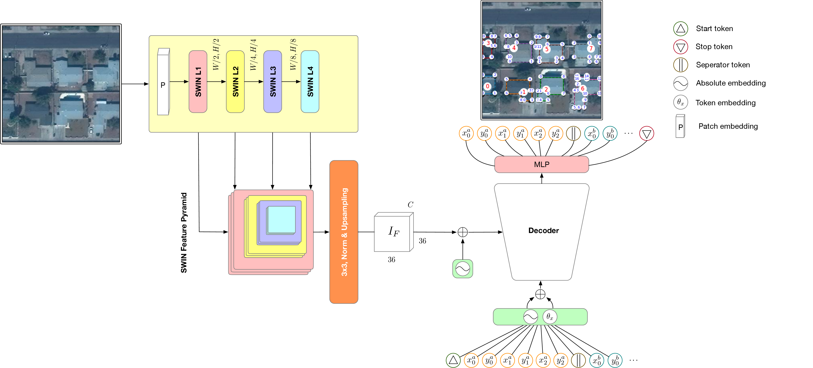

# GeoFormer:  A Multi-Polygon Segmentation Transformer

This is the official repository for the paper: [GeoFormer: A Multi-Polygon Segmentation Transformer](https://arxiv.org/abs/2411.16616) presented at the [British Machine Vision Conference 2024](https://bmvc2024.org/) in Glasgow.  

[[arxiv](https://arxiv.org/abs/2411.16616)][[paper](https://bmva-archive.org.uk/bmvc/2024/papers/Paper_217/paper.pdf)][[poster](https://bmva-archive.org.uk/bmvc/2024/papers/Paper_217/poster.pdf)]  

GeoFormer is designed to predict the set of vertices that encapsulate buildings in an image, eliminating the need for additional post-processing by directly modeling the polygon vertices.

## Getting setup

*Developed with Python 3.8.6*

1. `pip install -r requirements.txt`
2. We rely on [Weights &amp; Biases](https://wandb.ai/) for logging purposes, ensure to `wandb login` prior running the training or inference scripts.

## Training the model

Download the [AiCrowd Mapping Challenge](https://www.aicrowd.com/challenges/mapping-challenge) dataset, and extract to the folder `./data/aicrowd_mapping_challenge/<train|val>`. Alternatively modify the data paths found in `./config/dataset/aicrowd.yaml`

Then simply run:
`python train.py`

## Inference

Adapt relevant arguments in `./config/inference.yaml` if necessary and run:

1. To generate inference samples: `python inference.py meta.task='produce_inference_samples'`
2. Compute COCO evals: `python inference.py meta.task='compute_metrics'`

## Pre-trained checkpoints
The trained model checkpoint, along with an accompanying notebook, will be available soon.

## Acknowledgements
We would like to thank the authors of the influential prior work upon which this work is built, including: [HEAT: Holistic Edge Attention Transformer for Structured Reconstruction](https://github.com/woodfrog/heat), [PolygonRNN++](https://github.com/fidler-lab/polyrnn-pp) as well as the frameworks of [x-transformers](https://github.com/lucidrains/x-transformers) and [pytorch image models](https://github.com/huggingface/pytorch-image-models).
